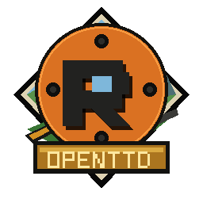

# openttdrs

<p align="center">
  
</p>

[](https://github.com/cavazquez/openttdrs/actions/workflows/ci.yml)
[](https://codecov.io/gh/cavazquez/openttdrs)
[](LICENSE)
[](https://doc.rust-lang.org/stable/releases.html)
[](https://bevyengine.org/)
[](https://www.openttd.org/)

Simulador de transporte inspirado en [OpenTTD](https://www.openttd.org/), escrito en **Rust** con cliente [Bevy](https://bevyengine.org/). El desarrollo es **incremental**: siempre hay algo jugable; la paridad total (NewGRF completo, red, saves idénticos al original) se aborda por cortes documentados, no de golpe.

> Compilar Bevy puede saturar CPU/RAM. Si hace falta: `cargo build -j 1`, o dejá que [CI](.github/workflows/ci.yml) valide el build. Las ejecuciones repetidas de `./scripts/check.sh` aprovechan `sccache` automáticamente cuando está instalado.

**Gobierno:** [CONTRIBUTING.md](CONTRIBUTING.md) · [SECURITY.md](SECURITY.md) · [docs/ARCHITECTURE.md](docs/ARCHITECTURE.md) · [ADRs](docs/adr/)

**Última actualización:** 2026-08-14

---

## Estado del proyecto

| Capa | Qué hay |
|------|---------|
| **Core** (`openttdrs-core`) | Mapa, tick, comandos, simulación road/rail, señales/PBS parcial, economía, saves JSON + import/export `.sav` / `.ottdmap`; alcance `.sav` en la [matriz canónica](docs/parity/sav-compatibility.md) |
| **Cliente** (`openttdrs-client`) | Vista isométrica OpenGFX, menú de inicio, toolbar, listas UI, noticias; `--server` / `--client` (I8) |
| **Red** (`openttdrs-net`) | TCP lockstep + bin `openttdrs-dedicated` ([ADR 0001](docs/adr/0001-multiplayer-v1.md)) |
| **NewGRF** | Catálogos Action0/3/5 y runtime parcial; las matrices de [propiedades](docs/parity/newgrf-action0-matrix.md) y [callbacks](docs/parity/newgrf-callback-matrix.md) distinguen parseado, almacenado y ejecutado |
| **Hito 0.1** | `0.1.0-alpha.1` preparada; solitario jugable. **I8 red** MVP ([#21](https://github.com/cavazquez/openttdrs/issues/21) ✅) + host migration ([#171](https://github.com/cavazquez/openttdrs/issues/171), [ADR 0004](docs/adr/0004-host-migration-post-v1.md)) |

**Trabajo reciente (jul 2026):** Action2 variational (trains/stations/road), procedure `7E` / `\2psto`, vars de vehículo y de tesela al dibujar. Issues de backlog: [issues abiertas](https://github.com/cavazquez/openttdrs/issues).

**Siguiente corte (roadmap):** paridad UI / pulido — ver [PLANIFICACION.md](docs/PLANIFICACION.md#paridad-ui-global). Editor #42 ✅ · GameScript-lite #43 ✅ · IA TransCargo ✅ (Squirrel OOS).

---

## Arranque rápido

```bash
# 0) Diagnóstico de entorno (no adivinar qué falta)
./scripts/doctor.sh
# Si hay FAIL: ./scripts/doctor.sh --fix

# 1) Gráficos (obligatorio la primera vez; audio ya viene en git)
./scripts/descargar_assets.sh graficos --32bpp

# 2) Cliente (menú: Nueva partida / Cargar / Demo / Salir)
cargo run -p openttdrs-client
```

### Dependencias (máquina nueva)

`./scripts/doctor.sh` chequea toolchain Rust, paquetes APT (misma lista que CI en [`.github/apt-packages.txt`](.github/apt-packages.txt)), `grfcodec`, Python (`numpy` / `Pillow`) y assets. Con `--fix` imprime los comandos a correr. **pip no es obligatorio**: solo es alternativa si no usás paquetes del sistema.

```bash
# Libs Bevy (X11 / Wayland / ALSA / …) — misma lista que CI
sudo apt-get update
sudo apt-get install -y $(grep -v '^#' .github/apt-packages.txt | grep -v '^[[:space:]]*$')

# Decodificar OpenGFX + post-proceso de sprites (preferido en Ubuntu/Debian)
sudo apt-get install -y grfcodec python3-numpy python3-pil

# Alternativa sin APT (otras distros): pip + requirements
# python3 -m pip install --user -r scripts/requirements-assets.txt
```

`descargar_graficos.sh` valida `numpy` y `Pillow` **antes** de borrar/descargar, para no fallar al final del pipeline.

| Asset | ¿En el repo? | Notas |
|-------|----------------|-------|
| Sonidos / música | Sí (`assets/sounds`, `assets/music`) | No hace falta regenerar para jugar |
| Gráficos OpenGFX | No | Una vez: script de arriba |
| Fuente UI | Sí (`static/fonts/`) | Fuera de `assets/` (ignorado por git) |

Otras formas de arrancar:

```bash
# Mapa desde fixture / save convertido
OTTDMAP_FILE=crates/openttdrs-core/tests/fixtures/p6_p4_showcase.ottdmap cargo run -p openttdrs-client

# Partida JSON
OTTDJSON_LOAD=save/openttdrs_sim.json cargo run -p openttdrs-client

# Mundo procedural headless (sin menú)
OPENTTDRS_WORLD_GEN=1 OPENTTDRS_WORLD_ISLAND=1 OPENTTDRS_WORLD_SEED=42 cargo run -p openttdrs-client
```

En juego: **F5** guardar · **F9** cargar · pausa/velocidad en toolbar · preferencias en `~/.config/com.github.cavazquez.openttdrs/`.

---

## Desarrollo

Flujo de PRs y DoD: [CONTRIBUTING.md](CONTRIBUTING.md). Capas: [docs/ARCHITECTURE.md](docs/ARCHITECTURE.md).

```bash
./scripts/doctor.sh         # deps de sistema + toolchain + assets (antes de adivinar)
./scripts/check.sh          # fmt + clippy + tests (día a día)
./scripts/check.sh ci       # núcleo compartido con ci.yml (ver excepciones GHA en check.sh)
./scripts/check.sh ci-python  # solo goldens/py del manifiesto scripts/ci_python_manifest.json
./scripts/check.sh cov      # cobertura → lcov.info (cargo-llvm-cov)
cargo test --workspace

# Entradas no confiables (requiere nightly + cargo-fuzz)
cargo +nightly fuzz run sav_load
cargo +nightly fuzz run newgrf_parse
cargo +nightly fuzz run net_message
FUZZ_TOOLCHAIN=nightly-2026-07-31 ./scripts/replay_fuzz_regressions.sh  # corpus de PR

# Verificar un paquete extraído sin abrir la ventana
./openttdrs-client --check-assets

# Validar documentación (enlaces rustdoc, code fences)
RUSTDOCFLAGS="-D warnings" cargo doc --workspace --all-features --no-deps

# Auditoría de seguridad y licencias (cargo-audit 0.22.1, cargo-deny 0.20.2)
cargo install cargo-audit --version 0.22.1 --locked  # una vez
cargo install cargo-deny --version 0.20.2 --locked   # una vez
cargo audit            # vulnerabilidades RustSec
cargo deny check       # licencias + advisories + sources + bans (deny.toml)
# Actualizar excepciones: editar deny.toml [advisories].ignore con justificación
```

### Caché de compilación (`sccache`)

GitHub Actions activa `sccache` con el backend de caché de Actions en todos los
jobs que compilan Rust. En local es opcional: `./scripts/check.sh` lo detecta y
lo usa automáticamente, sin hacer que `cargo` directo dependa de una herramienta
extra. Para activarlo también en un comando directo:

```bash
cargo install sccache --locked       # una vez
RUSTC_WRAPPER=sccache cargo build
sccache --show-stats
```

En PowerShell el equivalente es
`$env:RUSTC_WRAPPER = 'sccache'; cargo build`. La caché local queda fuera del
repositorio (por defecto bajo la caché de usuario); CI no comparte artefactos
nativos entre plataformas ni entre compilaciones instrumentadas de cobertura.

| Ruta | Responsabilidad |
|------|-----------------|
| `crates/openttdrs-core/` | Simulación, mapa, comandos, NewGRF parse, save/sav |
| `crates/openttdrs-client/` | Bevy, render, UI, bootstrap |
| `docs/` | Roadmaps e informes — índice: [docs/README.md](docs/README.md) |
| `scripts/` | Assets, `doctor.sh`, `check.sh`, `parse_sav.py`, referencia OpenTTD |
| `tests/fixtures/` | `.sav` + goldens versionados |

**Convención:** lógica de juego en core vía `Command` / `apply_command`; el cliente no mutea el mundo por su cuenta.

Referencia OpenTTD (clon local, no versionado; commit fijado en manifiesto #109):

```bash
./scripts/fetch-openttd-reference.sh   # → reference/openttd-upstream/ @ docs/parity/openttd-reference.json
```

Detalle: [docs/PARIDAD.md](docs/PARIDAD.md).

---

## CI y calidad

Un job en [.github/workflows/ci.yml](.github/workflows/ci.yml) (sccache + caché Cargo + APT):

| Paso | Contenido |
|------|-----------|
| `rustfmt` | `cargo fmt --all -- --check` |
| `clippy` | workspace, `-D warnings`, perfil `ci` |
| `rustdoc` | `cargo doc` con `-D warnings` (validar enlaces intra-doc) |
| `cargo audit` | Vulnerabilidades RustSec, incluido el lockfile de fuzz (pinned 0.22.1) |
| `cargo deny` | Licencias + advisories + sources + bans, también para fuzz (pinned 0.20.2, `deny.toml`) |
| tests | PRs: `nextest`; push a `main`: `llvm-cov nextest` → Codecov, piso 68% de líneas |
| extras | `tnbp` + `ci-python` (#120) + `generated-tables-ci` (#119) |
| plataformas | `cargo check` en macOS y Windows |
| fuzz | replay determinista en PR + exploración semanal de `.sav`, NewGRF y frames de red |
| release | tag SemVer exacto → Linux x86_64, Windows x86_64 y macOS arm64 + SHA-256 |

`check.sh ci` replica fmt/clippy/rustdoc/tests/TNBP/Python/tablas (hash; regen si hay upstream). Solo en GHA: audit, deny, cobertura en `main` y fetch OpenTTD para regen.

Cobertura manual: [.github/workflows/coverage.yml](.github/workflows/coverage.yml) (`workflow_dispatch`) o `./scripts/check.sh cov`.

### Release alpha

El workflow [release.yml](.github/workflows/release.yml) se puede ejecutar manualmente
para probar artefactos sin publicar. Un tag que coincida exactamente con la versión
del workspace (actualmente `v0.1.0-alpha.1`) crea una prerelease con binarios,
assets libres, servidor dedicado y checksums SHA-256. El empaquetado local equivalente:

```bash
cargo build --locked --release \
  -p openttdrs-client --bin openttdrs-client \
  -p openttdrs-net --bin openttdrs-dedicated
./scripts/package_release.sh \
  0.1.0-alpha.1 x86_64-unknown-linux-gnu linux-x86_64 tar.gz
```

Notas: [CHANGELOG.md](CHANGELOG.md) · [RELEASE_NOTES.md](RELEASE_NOTES.md) ·
[atribuciones de assets](THIRD_PARTY_ASSETS.md).

---

## Qué está hecho / qué falta (resumen)

Leyenda: ✅ hecho · 🟡 parcial · ❌ / 🔮 backlog (issues en GitHub)

| Área | Estado | Notas |
|------|--------|-------|
| Construcción road + rail + terraform | ✅ | Waypoints, señales, `RailConvert` (tipo seleccionado) |
| PBS / path signals | 🟡 | Implementado para escenarios acotados; fidelidad global en [PARIDAD.md](docs/PARIDAD.md#estado-canónico-actual) |
| Economía + 11 cargas temperate + packets | 🟡 | CargoDist MCF, transfer/deliver y ratings; climas/NewGRF incompletos |
| Import/export `.sav` | 🟡 | Subconjunto interoperable; matriz única de import vs export en [sav-compatibility.md](docs/parity/sav-compatibility.md) |
| Render OpenGFX vanilla | 🟠 | Cobertura amplia, pero la composición raster global no tiene paridad demostrada; baseline y límites en [PARIDAD.md](docs/PARIDAD.md#evidencia-visual-raster-vigente) |
| UI solitario (menús, listas, noticias) | 🟡 | Jugable; varias opciones del core todavía no están expuestas |
| Multi-compañía | 🟡 | Mínima + ownership; segunda humana OOS |
| NewGRF | 🟡 | Estado por propiedad en la [matriz Action0/3/5](docs/parity/newgrf-action0-matrix.md) y ejecución real en la [matriz de callbacks](docs/parity/newgrf-callback-matrix.md) |
| Barcos | 🟡 | Depósitos, docks, boyas, locks y A*; movimiento/órdenes simplificados |
| Aviones | 🟡 | Airport FTA, compra/vuelo/ruido/crash; render y casos límite incompletos |
| Multijugador (I8) | 🟡 | MVP lockstep + dedicated + host migration; desync/UI OOS |
| IA rivales / GameScript / editor | 🟡 | TransCargo + editor #42 ✅; GS-lite #43 ✅; Squirrel OOS |

Backlog vivo: [issues del repo](https://github.com/cavazquez/openttdrs/issues) (generadas desde los ROADMAP, jul 2026).

---

## Documentación

| Documento | Uso |
|-----------|-----|
| [docs/README.md](docs/README.md) | Índice (un archivo por temática) |
| [docs/PLANIFICACION.md](docs/PLANIFICACION.md) | Roadmaps, sprints y guías de implementación |
| [docs/PARIDAD.md](docs/PARIDAD.md) | Madurez vigente, mapeos, road/rail y oráculos |
| [docs/parity/sav-compatibility.md](docs/parity/sav-compatibility.md) | Fuente única de compatibilidad `.sav` import/export |
| [docs/MAPA_Y_FERROCARRIL.md](docs/MAPA_Y_FERROCARRIL.md) | Formato de mapa, `.ottdmap`, tiles y señales |
| [docs/ARCHITECTURE.md](docs/ARCHITECTURE.md) | Capas + diseño I0–I8 |
| [docs/GRAFICOS.md](docs/GRAFICOS.md) | OpenGFX |
| [docs/RENDIMIENTO.md](docs/RENDIMIENTO.md) | Benches y mapas grandes |

Saves OpenTTD → mapa del cliente:

```bash
python3 scripts/parse_sav.py partida.sav salida.ottdmap
OTTDMAP_FILE=salida.ottdmap cargo run -p openttdrs-client
```

Detalle de planos/chunks: [docs/MAPA_Y_FERROCARRIL.md](docs/MAPA_Y_FERROCARRIL.md#formato-ottdmap). Regenerar assets: `./scripts/descargar_assets.sh --help`.

---

## Stack

| Tecnología | Rol |
|------------|-----|
| Rust 2024 (MSRV **1.97**) | Workspace `openttdrs-core` + `openttdrs-client` + `openttdrs-net` |
| Bevy **0.19** | ECS, ventana, render 2D, UI |
| serde / JSON | Save/load del core |
| Python 3 + Pillow | `parse_sav`, goldens, recorte OpenGFX |
| OpenGFX / OpenSFX / OpenMSX | Arte, SFX y música |
| GitHub Actions + Dependabot | CI y deps mensuales |

---

## Estructura del repo

```
Cargo.toml                 # Workspace
crates/openttdrs-core/     # Simulación sin Bevy
crates/openttdrs-client/   # Binario Bevy (--server / --client)
crates/openttdrs-net/      # TCP I8 + openttdrs-dedicated
docs/                      # Roadmaps e informes
scripts/                   # check, assets, parse_sav, fetch upstream
tests/fixtures/            # .sav + goldens
.github/                   # CI + Dependabot
reference/                 # Clon OpenTTD (gitignored)
```

---

## Licencia

**GPL-2.0-only** (ver `LICENSE`). El código de OpenTTD usado como referencia conserva su propia licencia y copyright.
