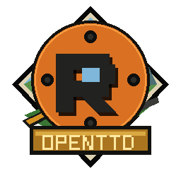
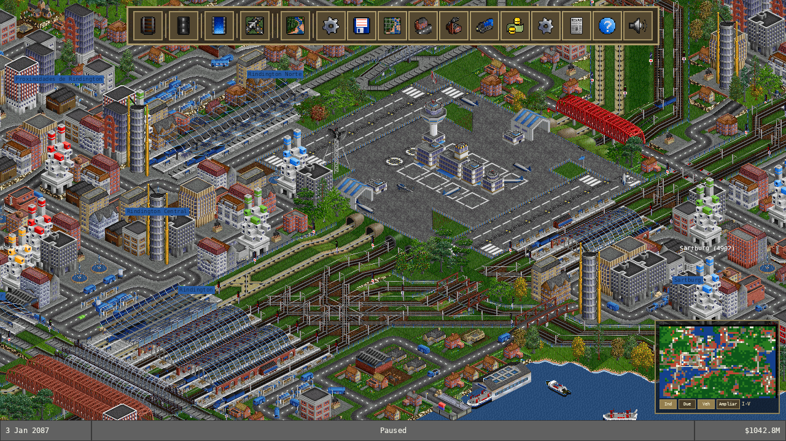

# openttdrs

[English](README.md) | [Español](README.es.md)

  
   
  

An independent isometric transport simulation inspired by [OpenTTD](https://www.openttd.org/), built with **Rust** and [Bevy](https://bevyengine.org/). It is an early, playable alpha: expect rough edges and incomplete OpenTTD compatibility.

**AI disclosure:** all code in this repository is AI-generated. I guide the project, make the design decisions, review changes, and run builds and tests.

## Gameplay

Captured from Kale_TitleGame.sav, a large OpenTTD save used for the project’s rendering work. The save contains 3,293 vehicles, 245 stations, and 59 industries.

▶ [Watch a 12-second in-game capture](docs/showcase/gameplay.mp4) (the reference save is loaded paused).

## What you can do

- Generate a procedural world and choose or edit its seed.
- Build roads and railways, place stations, and operate transport routes.
- Run buses, trucks, trains, ships, and aircraft; deliver cargo and earn money.
- Save and resume games, load scenarios or heightmaps, and use the scenario editor.
- Try experimental multiplayer with the project’s own TCP lockstep protocol and dedicated server.

The current alpha focuses on a playable single-player experience. Multiplayer, NewGRF support, save compatibility, and several simulation systems are still partial. This is not a drop-in OpenTTD replacement and does not use OpenTTD’s multiplayer protocol.

## Download the alpha

The current release is **[0.1.0-alpha.5](https://github.com/cavazquez/openttdrs/releases/tag/v0.1.0-alpha.5)**. It is a test release, not a stability promise.

### Linux Snap

The strict Snap is available on the **latest/edge** channel:

~~~bash
sudo snap install openttdrs --channel=latest/edge
openttdrs
~~~

To update an existing installation:

~~~bash
sudo snap refresh openttdrs --channel=latest/edge
~~~

The Snap includes the required free assets. Its default save directory is ~/snap/openttdrs/common/save/. The dedicated server is available as openttdrs.dedicated.

### Other platforms

Linux x86_64, Windows x86_64, and macOS arm64 packages and SHA-256 checksums are published on the [GitHub alpha release](https://github.com/cavazquez/openttdrs/releases/tag/v0.1.0-alpha.5).

## Run from source

You need Rust **1.98 or newer** and the native window/audio libraries required by Bevy. On Ubuntu and Debian, the project’s CI dependency list is in [.github/apt-packages.txt](.github/apt-packages.txt).

~~~bash
git clone https://github.com/cavazquez/openttdrs.git
cd openttdrs
cargo run
~~~

The first launch opens the main menu. OpenGFX graphics, fonts, sounds, and music are included; the client derives the UI images it needs locally. No manual asset download or preparation step is required.

Bevy builds can use substantial CPU and memory. To limit build parallelism, run cargo build -j 1.

In game, **F5** saves and **F9** loads. Pause and speed controls are available in the toolbar. Preferences from a source checkout are stored under ~/.config/com.github.cavazquez.openttdrs/.

## Development

~~~bash
./scripts/doctor.sh
./scripts/check.sh
cargo test --workspace
~~~

./scripts/check.sh runs the project’s formatting, lint, and test checks. See [CONTRIBUTING.md](CONTRIBUTING.md) for the contribution workflow.

## Architecture

- **openttdrs-core:** simulation, world map, commands, economy, and save handling; independent of Bevy.
- **openttdrs-client:** Bevy renderer, interface, input, and desktop client.
- **openttdrs-net:** experimental TCP multiplayer and the openttdrs-dedicated server.

The alpha also includes partial Action0/3/5 and callback support for NewGRFs, an in-game scenario editor, and project-specific rival AIs and GameScript-lite features. These are independent implementations, not compatibility with OpenTTD’s NoAI or GameScript runtimes.

## Project status and documentation

The current alpha has a playable solo mode, procedural maps, road and rail construction, vehicle operation, cargo delivery, an economy, and save/load. The project also has an experimental networked mode and desktop packages for Linux, Windows, and macOS.

OpenTTD parity remains incomplete. In particular, .sav support covers a documented subset, NewGRF behavior is partial, and broader simulation/rendering differences remain. The [parity matrices](docs/PARIDAD.md) and [continuous work plan](docs/parity/continuous-work-plan.md) describe scope, evidence, and known gaps.

The Spanish README retains the detailed status tables and project overview: [README.es.md](README.es.md).

Other references:

- [Architecture](docs/ARCHITECTURE.md)
- [Documentation index](docs/README.md)
- [Save compatibility](docs/parity/sav-compatibility.md)
- [Changelog](CHANGELOG.md) and [release notes](RELEASE_NOTES.md)
- [Third-party asset attributions](THIRD_PARTY_ASSETS.md)
- [Contributing](CONTRIBUTING.md) · [Security](SECURITY.md)

## License

The project is licensed under **GPL-2.0-only**; see [LICENSE](LICENSE). OpenTTD source code used as a reference retains its own license and copyright.
