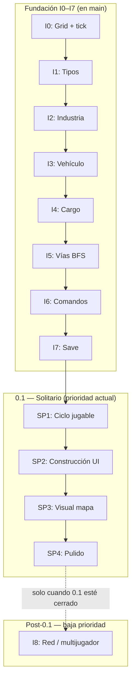

# Arquitectura

Contrato del repo: capas, reglas duras, diseño incremental, inventarios de determinismo/mutaciones y mapa de la arquitectura upstream OpenTTD. Planificación y paridad: [PLANIFICACION.md](PLANIFICACION.md), [PARIDAD.md](PARIDAD.md).

## Índice

- [Capas y reglas](#capas)
- [Diseño incremental](#diseño-incremental-i0i8)
- [Mutaciones del cliente](#mutaciones-del-cliente)
- [Inventario HashMap](#inventario-hashmap-y-determinismo)
- [Arquitectura upstream](#informe-de-arquitectura-openttd-upstream)
- [ADRs](#adrs)

---

## Capas

```text
┌─────────────────────────────────────────┐
│  openttdrs-client (Bevy)                │  presentación, input, assets
│  — UI, render, bootstrap, --server/--client
└─────────────────┬───────────────────────┘
                  │ Command / apply_command_log / tick
┌─────────────────▼───────────────────────┐
│  openttdrs-core                         │  simulación pura
│  — mapa, vehículos, economía, saves, hash
└─────────────────┬───────────────────────┘
                  │
┌─────────────────▼───────────────────────┐
│  openttdrs-net (+ bin dedicated)        │  transporte TCP lockstep
└─────────────────────────────────────────┘
```

| Crate | Rol |
|-------|-----|
| `openttdrs-core` | Estado de partida, `Command`, `GameState::step`, `canonical_hash`, import/export |
| `openttdrs-client` | Adaptador Bevy: no es fuente de verdad del mundo |
| `openttdrs-net` | Framing del log de comandos; listen-server / cliente / dedicated |

## Reglas duras

1. **Mutación de partida** → `Command` (o load/tick orquestado). Detalle: [Mutaciones del cliente](#mutaciones-del-cliente).
2. **Determinismo** → mismo seed + mismos comandos + mismos ticks ⇒ mismo `canonical_hash` ([ADR 0002](adr/0002-determinismo-tick-referencia.md)). HashMap: [Inventario HashMap](#inventario-hashmap-y-determinismo).
3. **Referencia OpenTTD** → commit fijado en [parity/openttd-reference.json](parity/openttd-reference.json); no clonar `master` móvil.
4. **Red** → lockstep TCP ([ADR 0001](adr/0001-multiplayer-v1.md)); host migration listen-server post-v1 ([ADR 0004](adr/0004-host-migration-post-v1.md)). Tick ~37 Hz: [ADR 0003](adr/0003-tick-37hz-openttd.md).

## Dónde va código nuevo

| Quiero… | Va en… |
|---------|--------|
| Regla de simulación / save / paridad headless | `openttdrs-core` |
| Ventana, sprite, input, menú | `openttdrs-client` |
| Protocolo / dedicated | `openttdrs-net` / bin dedicated |
| Decisión con trade-off | [`docs/adr/`](adr/) |

## ADRs

Índice y plantilla: [`adr/README.md`](adr/README.md). No reescribir ADRs aceptadas: superseder con una nueva.

## Diseño incremental (I0–I8)

<!-- fuente: DISENO_INCREMENTAL.md -->

### Por qué incremental y no por fases

El plan original organizaba el trabajo en **fases secuenciales** (mapa → economía → pathfinding → vehículos → …). Eso tiene un problema grave: **no hay nada jugable ni observable hasta muy tarde**, y las decisiones de diseño de las capas inferiores se toman sin retroalimentación real de las capas superiores.

El diseño incremental resuelve esto con una idea simple:

> Cada incremento entrega una rebanada delgada que atraviesa **todas las capas** (tipos en core, lógica de simulación, test, representación en Bevy) y deja el sistema en un estado completamente funcional y observable.

Esto significa:

- Siempre hay algo que corre y muestra progreso.
- Los errores de diseño aparecen pronto, cuando el coste de cambiarlos es bajo.
- Cada incremento es un PR razonable, pequeño y revisable.
- No hay "trabajo de infraestructura invisible" que dure semanas.

---

### Relación con OpenTTD upstream

El [informe de arquitectura](#informe-de-arquitectura-openttd-upstream) resume el código de `reference/openttd-upstream/` (Clases tile bit-packed, `TimerGameTick`, `CargoPacket`, YAPF, comandos, saveload, red). Estos incrementos **no copian** el upstream línea a línea; la tabla siguiente enlaza conceptos para cuando conviene mirar el original:

| Concepto upstream | Dónde en OpenTTD | Cómo se traduce aquí |
|-------------------|------------------|----------------------|
| `TileBase` + `TileExtended` (~10 B/tile), accessor `Tile` | `map_func.h` | MVP: `Vec<Tile>` o equivalente simple; optimización tipo SoA si el profiler lo pide. |
| `TileType` (11 variantes en 4 bits) | `tile_type.h` | **I1:** `TileKind` propio con subset jugable; no replicar todos los tipos C++ de entrada. |
| `TimerGameTick`, constantes `Ticks::*` | `timer/timer_game_tick.h` | **I0:** `GameTick`; **I2:** usar **`INDUSTRY_PRODUCE_TICKS = 256`** como periodo por defecto de producción (literal del upstream). `DAY_TICKS = 74` si más adelante se calibra UI “por día”. |
| Industria `ProducedCargo` / `AcceptedCargo`, `PRODLEVEL_*` | `industry.h` | **I2:** MVP con `stock` y tasas fijas; historia mensual y cierre por abandono después. |
| `CargoPacket` (origen, `periods_in_transit`, …) | `cargopacket.h` | **I4:** balances `u32` bastan para el primer ciclo; packets completos cuando importe rating/pago realista. |
| Jerarquía `Vehicle`, movimiento sub-tile | `vehicle_base.h` | **I3:** salto tesela a tesela; `progress` y distancias axiales (`TILE_AXIAL_DISTANCE`) cuando el MVP lo exija. |
| Órdenes `Order`, listas compartidas | `order_base.h` | **I4:** cola mínima “ir a estación”; órdenes compartidas más tarde. |
| YAPF (siguiente tramo, cachés, regiones agua) | `pathfinder/yapf/` | **I5:** BFS que devuelve **`Vec` de teselas** es deliberado y más simple; migrar a heurística tipo A* si el mapa crece. |
| Registro masivo de comandos `*_cmd` | `command.cpp` | **I6:** mismo patrón abstracto (`Command` + `apply`), sin el árbol enorme del upstream. |
| `SaveLoadVersion` (`SLV_*`) | `saveload/saveload.h` | **I7:** formato propio versionado; **parcial:** `scripts/parse_sav.py` lee `.sav` → `.ottdmap` (solo mapa, no economía). |
| Red = replay de comandos + hash estado | `network/` / `openttdrs-net` | **I8 MVP (jul 2026):** lockstep TCP, dedicated, host migration — [ADR 0001](adr/0001-multiplayer-v1.md), [ADR 0004](adr/0004-host-migration-post-v1.md). |

---

### Estado actual del código (jul 2026)

Los incrementos **I0–I7** y el **MVP de I8** están en `main`. El hito **0.1** = partida en solitario jugable; la red ya no bloquea ese cierre.

| Capa | Qué hay hoy |
|------|-------------|
| `openttdrs-core` | Mapa TNBP/JGR, comandos road/rail, PBS/YAPF parcial, economía multi-compañía, NewGRF parse/Action2, IA TransCargo, save JSON + `.sav` parcial. |
| `openttdrs-client` | Vista isométrica OpenGFX, toolbar, menús, noticias, `--server` / `--client`. |
| `openttdrs-net` | TCP lockstep + `openttdrs-dedicated`. |
| Scripts | `parse_sav.py`, `descargar_assets.sh`, `doctor.sh`, validación TNBP en CI. |
| Docs | [docs/README.md](README.md), [SIGUIENTES_PASOS.md](PLANIFICACION.md#siguientes-pasos--hallazgos), [PARIDAD_OPENTTD.md](PLANIFICACION.md#vista-corta-de-gaps). |

**Carreteras en mapas reales:** orientación desde `mapt` + `m5` (normal, cruce a nivel,
depósito, túnel/puente carretera). Los PNG `road_tx` / `road_ty` se asignan **cruzados**
respecto a `RoadDir` para alinear la textura con la proyección del cliente (~90° respecto
a “nombre de archivo = eje”); validado en pantalla.

Detalle operativo y hallazgos: [SIGUIENTES_PASOS.md](PLANIFICACION.md#siguientes-pasos--hallazgos). Gaps: [PARIDAD_OPENTTD.md](PLANIFICACION.md#vista-corta-de-gaps).

---

### Roadmap y prioridades

#### Principio

1. **Solitario jugable** (construir, simular, guardar/cargar) — prioridad de producto del 0.1.
2. **I8 red** — MVP ya mergeado; pulido desync/UI es trabajo posterior, no bloquea el 0.1.

#### Hito 0.1 — vertical slice en solitario

| Fase | Objetivo | Ejemplos de trabajo |
|------|----------|---------------------|
| **SP1 — Ciclo jugable** | Partida local con bucle claro: industria → estación → vehículo → carga/entrega → economía visible | Feedback HUD (sin ruta, dinero, órdenes), coherencia estación en mapa vs `state.stations`, pausa/velocidad, pruebas de integración comando↔sim |
| **SP2 — Construcción y herramientas** | **Cerrado** (SP2.6 manual 2026-05-22) — [archive/SP2_CHECKLIST.md](archive/SP2_CHECKLIST.md) | Mensajes HUD, preview, transporte, paradas, tren, industria, órdenes |
| **SP3 — Presentación del mapa** | Que el mapa **se lea** como OpenTTD, sin exigir paridad total | ✅ S3 cerrado (jul 2026): slope/junctions, culling, industrias 0–174 — [archive/ROADMAP_PARIDAD_VISUAL.md](archive/ROADMAP_PARIDAD_VISUAL.md) |
| **SP4 — Pulido y deuda** | Estabilidad antes de abrir nuevas grandes features | Migraciones de save si hace falta, `check.sh` alineado con CI, bootstrap demo sin inconsistencias tile/estación, documentación al día |

**Criterio de “0.1 hecho”:** una sesión en solitario de ~15–30 minutos donde se puede **construir red y estaciones**, **asignar órdenes**, **ver vehículos y economía evolucionar**, **guardar y reanudar** sin pasos manuales raros — sin necesidad de red ni segundo cliente.

#### I8 Red — MVP hecho (jul 2026)

| Incremento | Estado | Notas |
|------------|--------|--------|
| **I8** | ✅ MVP | TCP lockstep, dedicated, `--server` / `--client`, host migration (#171). Spec histórica en [§ Incremento 8](#incremento-8--dos-instancias-comparten-el-mundo-backlog). Pendiente: UX desync / lobby. |

Cadena técnica [#14](https://github.com/cavazquez/openttdrs/issues/14)–[#21](https://github.com/cavazquez/openttdrs/issues/21): **I0–I8 MVP hechos**. Priorizar SP / UI / gaps en [PARIDAD_OPENTTD.md](PLANIFICACION.md#vista-corta-de-gaps).

---

### Los incrementos

Cada incremento tiene esta estructura:

- **Qué añade al core**: tipos nuevos o extensiones de los existentes (sin romper tests previos).
- **Qué añade a los tests**: invariantes nuevas sobre lo que se agrega.
- **Qué muestra el cliente**: cambio visible en la ventana de Bevy.
- **Frontera clara**: qué queda explícitamente fuera de ese incremento.

---

#### Incremento 1 — "Una tesela tiene tipo"

**Objetivo**: el mapa deja de ser solo alturas y adquiere semántica mínima.

**Core — qué añadir:**

```
map.rs
  Tile { height: u8, kind: TileKind }

  enum TileKind {
      Grass,
      Water,
      Forest,
      CoalField,
  }
```

`Map::new_flat` produce un mapa de `TileKind::Grass`. Métodos `set_kind` / `get_kind` simétricos a `set_height`.

**Tests:**
- `tile_kind_default_is_grass()`
- `tile_kind_roundtrip()`
- La altura sigue siendo independiente del tipo.

**Cliente Bevy:**
- Color de cada tesela depende de `TileKind` (verde → bosque, azul → agua, gris oscuro → carbón, verde claro → prado).
- Semilla pseudoaleatoria fija para distribuir tipos en la carga inicial (solo visual, sin RNG en core).

**Fuera de este incremento:** industrias, producción, vehículos, comandos del jugador.

**Referencia upstream:** `TileType` enum en `tile_type.h` (Clear, Railway, Road, House, Trees, Station, Water, Void, Industry, TunnelBridge, Object). Aquí los nombres y la granularidad son deliberadamente más simples para el MVP.

---

#### Incremento 2 — "Una industria existe en el mapa"

**Objetivo**: introducir el primer objeto de simulación encima del mapa.

**Core — qué añadir:**

```
industry.rs
  enum IndustryKind { CoalMine, Forest }

  struct Industry {
      pos:   TileCoord,
      kind:  IndustryKind,
      stock: u32,   // unidades de cargo en almacén
  }

GameState {
    map:        Map,
    tick:       GameTick,
    industries: Vec<Industry>,   // ← nuevo
}
```

`GameState::step()` llama a `Industry::produce(&mut self, tick)` cada **256 ticks** (`INDUSTRY_PRODUCE_TICKS` en el upstream) incrementando `stock` en cantidad fija. Determinista, sin RNG.

**Tests:**
- `industry_produces_on_schedule()` — después de N ticks el stock aumenta la cantidad esperada.
- `industry_does_not_exceed_capacity()` — stock tiene tope configurable.
- Paso de dos mundos con misma seed → mismo stock (determinismo).

**Cliente Bevy:**
- Las industrias se dibujan como un punto o cuadrado de color sobre la tesela correspondiente.
- Texto o color de intensidad que refleja `stock` actual.

**Fuera:** transporte de cargo, estaciones, jugador.

**Referencia upstream:** struct `Industry` con `ProducedCargo` / `AcceptedCargo`, niveles `PRODLEVEL_*`, abandono tras años económicos (`industry.h`). MVP: solo producción periódica y tope de stock.

---

#### Incremento 3 — "Un vehículo existe y se desplaza"

**Objetivo**: el primer objeto móvil, sin pathfinding real todavía.

**Core — qué añadir:**

```
vehicle.rs
  enum VehicleKind { Truck }

  struct Vehicle {
      id:       u32,
      kind:     VehicleKind,
      pos:      TileCoord,
      dest:     TileCoord,
      cargo:    u32,
  }

GameState {
    ...
    vehicles: Vec<Vehicle>,   // ← nuevo
}
```

Movimiento por pasos: cada tick el vehículo avanza **una tesela** en la dirección cardinal que reduce la distancia Manhattan al destino (sin buscar camino). Si llega, invierte destino. Sin colisiones por ahora.

**Tests:**
- `vehicle_moves_toward_dest()` — después de N ticks está más cerca.
- `vehicle_inverts_on_arrival()` — llega al destino, gira.
- Paso de dos mundos idénticos → misma posición en tick T (determinismo).

**Cliente Bevy:**
- Los vehículos se dibujan como puntos blancos en movimiento sobre el mapa.

**Fuera:** pathfinding real, vías, carga/descarga, estaciones.

**Referencia upstream:** pool global `_vehicle_pool`, campos `tile`, órdenes, `VehicleCargoList` (`vehicle_base.h`). MVP: vector simple y movimiento Manhattan sin sub-tile.

---

#### Incremento 4 — "Un vehículo recoge y entrega cargo"

**Objetivo**: primer ciclo económico completo, aunque primitivo.

**Core — qué añadir:**

```
station.rs
  struct Station {
      pos:   TileCoord,
      stock: u32,
  }

GameState {
    ...
    stations: Vec<Station>,   // ← nuevo
}
```

Reglas de `step()`:
- Si un vehículo llega a la posición de una industria y `cargo == 0`: toma `min(stock_industria, capacidad_vehiculo)` de carga.
- Si un vehículo llega a la posición de una estación y `cargo > 0`: entrega toda la carga, la estación acumula `income` (simple contador).
- Vehículo invierte destino tras cada operación.

**Tests:**
- `vehicle_loads_from_industry()`.
- `vehicle_delivers_to_station()`.
- `economic_cycle_roundtrip()` — tras N ciclos el income de la estación es el esperado.

**Cliente Bevy:**
- Estaciones: cuadrado de color distinto.
- `income` de la estación visible como número flotante o intensidad.

**Fuera:** dinero del jugador, costes, UI de construcción.

**Referencia upstream:** `CargoPacket` con origen y envejecimiento (`cargopacket.h`); pagos con inflación (`economy_type.h`). MVP: contadores `u32` y `income`; sin rating ni feeder_share hasta que el modelo lo requiera.

---

#### Incremento 5 — "El mapa tiene vías y el vehículo las sigue"

**Objetivo**: primer pathfinding real, acotado a grafos pequeños.

**Core — qué añadir / cambiar:**

```
map.rs
  TileKind añade: Road, Rail

pathfinder.rs
  fn find_path(map: &Map, from: TileCoord, to: TileCoord) -> Option<Vec<TileCoord>>
```

BFS sobre teselas adyacentes con `TileKind::Road` o `Rail`. El vehículo sigue el camino resultante tesela a tesela. Si no hay camino, se detiene.

**Tests:**
- `bfs_finds_path_on_straight_road()`.
- `bfs_returns_none_when_blocked()`.
- `vehicle_follows_path()` — posición en cada tick coincide con el camino devuelto.
- Benchmarks básicos con mapas de distinto tamaño (solo `#[bench]` o inline en test).

**Cliente Bevy:**
- Las vías se dibujan en la rejilla (color diferente).
- El vehículo solo se mueve si hay camino trazado.

**Fuera:** construcción de vías por el jugador, señales, múltiples modos de transporte.

**Referencia upstream:** YAPF elige **solo el siguiente tramo** (`yapf.h`, plantillas en `yapf_*.cpp`); barcos usan regiones de agua (`water_regions.*`). Aquí BFS devuelve una ruta explícita por simplicidad en mapas pequeños.

---

#### Incremento 6 — "El jugador construye vías"

**Objetivo**: primer input del jugador que modifica el estado del core.

**Core — qué añadir:**

```
command.rs
  enum Command {
      PlaceRoad(TileCoord),
      PlaceStation(TileCoord),
  }

  fn apply(state: &mut GameState, cmd: Command) -> Result<(), CommandError>
```

`Command` es un tipo de datos **serializable** (sin dependencia de Bevy). `apply` valida (no se puede poner vía en agua, etc.) y muta el `GameState`.

**Tests:**
- `place_road_mutates_tile_kind()`.
- `place_road_on_water_returns_error()`.
- `command_sequence_is_deterministic()` — la misma lista de comandos produce el mismo estado.

**Cliente Bevy:**
- Click izquierdo sobre una tesela lanza `Command::PlaceRoad`.
- Click derecho: `Command::PlaceStation`.
- El mapa se actualiza en pantalla en el siguiente frame.

**Fuera:** coste económico del comando, deshacer, red.

**Referencia upstream:** `command.cpp` enlaza cientos de handlers `*_cmd`; flags offline/servidor (`command_func.h`). MVP: serialización + validación local como base para red posterior.

---

#### Incremento 7 — "El estado persiste en disco"

**Objetivo**: save/load sin perder nada del estado actual.

**Core — qué añadir:**

Dependencia opcional: `serde` + `serde_json` (o `bincode`) solo en feature `save`.

```
save.rs
  fn save(state: &GameState, path: &Path) -> Result<(), SaveError>
  fn load(path: &Path)          -> Result<GameState, SaveError>
```

`GameState`, `Map`, `Industry`, `Vehicle`, `Station` derivan `Serialize` / `Deserialize`.

**Tests:**
- `save_load_roundtrip()` — estado antes y después de save/load es idéntico.
- `save_load_after_N_steps()` — determinismo no se rompe al reanudar.

**Cliente Bevy:**
- **Hecho:** `F5` / **Ctrl+S** guardan y `F9` / **Ctrl+L** cargan (ruta configurable); formato versionado en `openttdrs_core::save`.

**Fuera:** migraciones entre versiones de save; compatibilidad con `.sav` OpenTTD (sigue siendo `parse_sav` → `.ottdmap`).

**Referencia upstream:** `SaveLoadVersion` inmutable y tablas por subsistema (`saveload/saveload.h`, `*_sl.cpp`). MVP: campo `version` en el JSON del envoltorio (`save.rs`).

---

#### Incremento 8 — "Dos instancias comparten el mundo" (backlog)

> **Prioridad:** la más baja del proyecto hasta cerrar el hito **0.1 en solitario** (fases SP arriba). No bloquea guardados, construcción ni simulación local.

**Arquitectura v1 (ADR):** [adr/0001-multiplayer-v1.md](adr/0001-multiplayer-v1.md) — lockstep de comandos, listen-server + dedicated headless; **sin host migration** en v1 (recuperación por save/restart o dedicated).

**Objetivo**: multijugador mínimo basado en replicación de comandos.

**Core — qué añadir / verificar:**

- `Command` ya es serializable (Incremento 6).
- ✅ `GameState::apply_command_log(cmds: &[Command])` — reproduce una lista (ticks aparte vía `step`).
- ✅ `GameState::canonical_hash()` — fingerprint persistido (#108).
- RNG del core debe ser semillado explícitamente si se introduce (hoy CargoDist RNG persistido #107).

**Infraestructura:**
- ✅ Crate `openttdrs-net` — TCP length-prefixed JSON, `ListenServer` / `ClientSession`.
- ✅ Bin `openttdrs-dedicated` — headless (`--bind HOST:PORT`).
```
TCP: servidor envía Commit / AdvanceTicks / HashCheck;
clientes aplican el log y avanzan ticks sincrónicos.
```

**Tests:**
- ✅ `two_worlds_same_log_same_state()` / `desync_detected_on_hash_mismatch()` en `tests/command_log_desync.rs`.
- ✅ `tests/tcp_lockstep.rs` en `openttdrs-net`.

**Cliente Bevy:**
- ✅ Args `--server [bind]` / `--client <addr>` (`network::parse_net_cli`).

**Fuera:** seguridad, cheating, latencia, reconexión, host migration (ADR 0001).

**Referencia upstream:** los clientes aplican la misma secuencia de comandos que el servidor; desync por divergencia de estado (`network_*`). MVP: misma disciplina determinista + hash opcional del `GameState`.

---

### Resumen visual



La cadena **I0→I7** es la base técnica ya mergeada: cada incremento extiende los tipos anteriores. El trabajo **actual** avanza por **SP1→SP4** en paralelo donde tenga sentido (visual y gameplay no son estrictamente secuenciales). **I8** no forma parte del cierre del 0.1.

---

### Reglas de trabajo

1. **Un incremento = un PR** (o varios commits en la misma rama). Nunca mezclar dos incrementos.
2. **Los tests del incremento anterior no pueden romperse.** Si hay que cambiar un tipo, el cambio va en el mismo PR con la migración.
3. **Cada PR deja el cliente Bevy en un estado observable**, aunque sea solo con gizmos o texto en pantalla.
4. **No se diseña el incremento N+2** hasta que N está mergeado. El diseño concreto de cada módulo emerge del código que existe, no de la especificación.
5. La sección de cada incremento en este documento es la **spec mínima**; el código puede ser más simple si los tests pasan.

## Mutaciones del cliente

<!-- fuente: INVENTARIO_MUTACIONES_CLIENTE.md -->

Fecha: 2026-07-16. Crate: `openttdrs-client`. ADR red: [adr/0001-multiplayer-v1.md](adr/0001-multiplayer-v1.md).

### Resumen

- ~40 archivos con `ResMut<SimWorld>`; ~138 usos de `apply_command` (UI mayormente canalizada).
- **~25–30 archivos productivos** con mutación directa (~45–65 sitios).
- DoD de este issue: **inventario clasificado**. Migrar a `Command` es deuda I8 (hijos / follow-up).

### Clasificación

#### Legítimo (no debe ser `Command`)

| Grupo | Archivos representativos | Motivo |
|-------|--------------------------|--------|
| Tick de sim | `simulation.rs` → `sim.state.step()` | Reloj de partida; en red lo dispara el protocolo |
| Persistencia | `persistence.rs` → `sim.state = loaded` | Reemplazo de mundo al cargar |
| Drenaje UI runtime | `ui/statusbar/sync.rs` (news/display) | Colas efímeras de `runtime` |
| Bootstrap pre-partida | `state/bootstrap/*`, población procedural | Antes de que exista log de red |

#### Migrado a `Command` (I8 settings)

| Grupo | Archivos | Comando |
|-------|----------|---------|
| Pathfinding / PBS UI | `ui/pathfinding_settings_window.rs` | `SetPathfindingSettings` |
| CargoDist UI | `ui/cargo_dist_settings_window.rs` | `SetCargoDistDistribution` |
| Color compañía | `ui/toolbar/settings.rs` | `SetCompanyColour` |
| Selectores vía/road/tram | `rail_type_selector`, `road_type_selector` | `SetCurrentRailType` / `Road` / `Tram` |
| Estación / aeropuerto | `rail_station_window`, `airport_picker_window` | `SetCurrentStation*` / `Airport*` |
| AI TransCargo | `ui/ai_settings_window.rs` | `SetAiSettings` |
| Drag carretera | `ui/toolbar/build_input/drag.rs` | `FinalizeRoadDragLine` |
| Editor GenLand | `ui/genland_window.rs` / `editor_session` | `RegenerateLandscape` |
| Editor sandbox cheats | `apply_editor_sandbox` | `CheatSetEnabled` / toggles |

#### Estado local (no debe ser `Command`)

| Grupo | Archivos | Motivo |
|-------|----------|--------|
| Story page nav | `ui/story_window.rs` → `StoryWindowState.page_index` | Navegación por cliente; no afecta sim |

#### Deuda I8 restante

Ninguna mutación productiva pendiente del inventario #114 (tick/load/bootstrap siguen legítimos).

#### Neutro / revisar

- Helpers que envuelven `apply_command` (p.ej. `apply_order_edit`) → **no** cuentan como violación.
- Tests del cliente con mutación directa → fuera del inventario prod.

### Impacto en #21

Para listen-server / cliente-only, todo lo marcado **Deuda I8** que altere estado persistido debe pasar por el log de comandos (o prohibirse en cliente remoto). Lo **legítimo** permanece local o se orquesta por el host (step/load).

### Follow-up sugeridos (no bloquean cierre de #114)

1. ~~Commands settings / selectores / color / AI.~~ Hecho.
2. ~~Editor GenLand + sandbox cheats vía Command.~~ Hecho.
3. ~~`FinalizeRoadDragLine` en el log (no solo local).~~ Hecho.
4. ~~`story_index` → `StoryWindowState.page_index` local.~~ Hecho.

## Inventario HashMap y determinismo

<!-- fuente: INVENTARIO_HASHMAP_DETERMINISMO.md -->

Fecha: 2026-07-16. Depende de [#108](https://github.com/cavazquez/openttdrs/issues/108) (`GameState::canonical_hash`).

### Criterio

- **No** migrar todo a `BTreeMap`.
- El hash canónico (#108) **ordena claves** de objetos JSON; el orden de iteración de `HashMap` en estado persistido **no** afecta el fingerprint.
- Estabilizar iteración en simulación solo si un test de repetibilidad falla por orden de visita.
- Estado en `SimulationRuntime` queda **fuera** del hash.

### Hallazgos (core)

| Área | Uso | Persistido | Riesgo actual |
|------|-----|------------|---------------|
| `game_state/runtime.rs` | `HashSet` señales/PBS/news | No (`runtime`) | Bajo — excluido del hash; PBS se reconstruye |
| `vehicle/model.rs` | `newgrf_persistent_regs: HashMap<u8,u32>` | Sí | Bajo — hash ordena claves |
| `cargodist/legacy/flow_stat.rs` | `by_origin` / `by_cargo` / `by_station` | Sí (vía `station_flows` / settings) | Medio si MCF itera y el orden cambia resultados |
| `cargodist/legacy/mcf.rs` | índices y agrupación temporales | No (locales) | Medio — revisar si fallan tests CargoDist |
| `cargodist/legacy/link_graph.rs` | `edges: HashMap` | Parcial (link graph stats) | Medio — mismo criterio MCF |
| `rail_pbs/*` | reservas, A*, sync mapa | Mayormente runtime / locales | Bajo si parity rail ya es determinista |
| `rail_signals/*` | topología / updates | Locales + mapa | Bajo — goldens/parity existentes |
| `pathfinder/*` | caches / A* | Cache en runtime | Bajo — fuera del hash |
| `command/terraform.rs` | heights/dirty locales | No | Nulo |
| `sav/*` | índices al cargar `.sav` | No (pipeline load) | Nulo para sim en curso |
| `train_collision.rs` | `HashSet` doomed | Local | Nulo |

### Verificación 2026-07-16

Tras #108:

- `canonical_hash` tests (truck_bay ×120 ticks, save/load mid-run) **pasan**.
- No se requirió cambiar contenedores a `BTreeMap`.

### Seguimiento

Si aparece flaky determinismo en CargoDist/MCF o PBS:

1. Reproducir con dos mundos + `canonical_hash` / parity trace.
2. Sustituir solo el mapa culpable por iteración ordenada (`BTreeMap` o `sort` antes del fold).
3. Documentar aquí el fix.

Arquitectura red: [adr/0001-multiplayer-v1.md](adr/0001-multiplayer-v1.md).

## Informe de arquitectura OpenTTD (upstream)

Referencia del clon C++; no describe el código de openttdrs.

<!-- fuente: INFORME_ARQUITECTURA_OPENTTD.md -->

> Basado en análisis directo del código fuente en `reference/openttd-upstream/`.
> Referencia fijada (#109): manifiesto [`parity/openttd-reference.json`](parity/openttd-reference.json)
> (tag **15.3**, commit `14ec60f248547d4d062a1160f0fc26d742319888`). Ver [`parity/OPENTTD_REFERENCE.md`](PARIDAD.md#referencia-openttd-clonpin).  

> Licencia upstream: GPL-2.0 (`COPYING.md`). Ver advertencias de licencia al final.

El **plan de trabajo del port** (incrementos I0–I8 y fases SP de solitario) está en [DISENO_INCREMENTAL.md](#diseño-incremental-i0i8), enlazado con este informe por tabla y referencias por incremento. **Prioridad actual:** cerrar 0.1 en un jugador; **I8 (red)** solo después.

---

### 1. Visión general

OpenTTD es un motor de simulación **monolítico en C++** con build CMake. Los pilares son:

1. Un **mapa discreto de teselas** con layout en memoria muy comprimido.
2. Un **bucle de tick determinista** sobre el que se ejecutan todos los subsistemas.
3. Un **sistema de comandos** serializable que es la única fuente de cambios al estado del mundo (y la base del multijugador).
4. Una capa de **NewGRF** que extiende casi todos los aspectos del juego.
5. Un sistema de **saveload** fuertemente versionado con compatibilidad hacia atrás desde v0.1.

---

### 2. El mapa y las teselas (`src/map_func.h`, `src/tile_type.h`, `src/map.cpp`, `src/tile_map.h`)

#### 2.1 Representación en memoria

Cada tesela está representada por **10 bytes** divididos en dos arrays paralelos de tamaño `Map::size`:

```
TileBase (8 bytes):
  type    u8  — bits 4-7: TileType (4 bits), bits 2-3: puentes, bits 0-1: zona trópico
  height  u8  — altura de la esquina norte (0-255)
  m1      u8  — principalmente propiedad (owner)
  m2     u16  — índice a town, industry o station según tipo
  m3      u8  — uso general
  m4      u8  — uso general
  m5      u8  — uso general

TileExtended (4 bytes):
  m6      u8  — uso general
  m7      u8  — principalmente soporte NewGRF
  m8     u16  — uso general
```

Hay **un solo** array por el mundo; no hay objetos `Tile` heap-allocated. `class Tile` es un **wrapper sin datos propios** que recibe un `TileIndex` y accede los arrays globales estáticos. El compilador lo elimina completamente en builds optimizados.

#### 2.2 `TileType` — tipos de tesela reales

```cpp
enum class TileType : uint8_t {
    Clear,        // pasto, rocas, campos de granja
    Railway,      // vía férrea
    Road,         // carretera y/o tranvía
    House,        // edificio de pueblo
    Trees,        // árboles
    Station,      // estación o aeropuerto
    Water,        // agua
    Void,         // borde invisible del mapa
    Industry,     // parte de una industria
    TunnelBridge, // entrada de túnel o cabeza de puente
    Object,       // objetos: transmisores, tierra propia
};
```

Los 4 bits del tipo permiten hasta 16 tipos; hay 11 activos más `End` como marcador.

#### 2.3 Dimensiones del mapa

- Mínimo: 64×64 (`2^6`), Máximo: 4096×4096 (`2^12`).
- Las dimensiones **deben ser potencias de 2**: el índice lineal se calcula con shift en lugar de multiplicación para máxima velocidad.
- El índice de una tesela en `(x, y)` es `y * Map::SizeX() + x`.
- Hay `TileAddWrap` para detectar cuando un desplazamiento cruza el borde del mapa (devuelve `INVALID_TILE`).
- La altura máxima es 255 niveles; cada nivel equivale a 8 píxeles en el render base.

#### 2.4 Consecuencias para openttdrs

- La clase `Tile` en Rust puede ser un struct de valor; lo que OpenTTD llama `m1..m8` en Rust conviene modelar como campos con nombre según el subsistema.
- El mapa actual de openttdrs (`Vec<Tile>` de structs) es correcto; para escala real habría que medir si el layout comprimido (SoA en lugar de AoS) importa en rendimiento.
- **Los bits del tipo son 4 en OpenTTD** (usa `(tile.type() >> 4) & 0xF`); en Rust un `enum TileKind` con `u8` o `repr(u8)` modela esto limpiamente.

---

### 3. El reloj de tick (`src/timer/timer_game_tick.h`)

```cpp
class TimerGameTick {
    using TickCounter = uint64_t;  // monotónico global
    static TickCounter counter;
};
```

Constantes **literales del código**:

| Constante | Valor | Significado |
|-----------|-------|-------------|
| `DAY_TICKS` | 74 | Ticks por día de juego |
| `TICKS_PER_SECOND` | ~37 | Ticks por segundo real |
| `INDUSTRY_PRODUCE_TICKS` | 256 | Cada cuántos ticks producen las industrias |
| `STATION_RATING_TICKS` | 185 | Ciclo de rating de estación |
| `CARGO_AGING_TICKS` | 185 | Ciclo de envejecimiento de carga |
| `TOWN_GROWTH_TICKS` | 70 | Ciclo de crecimiento de pueblos |

El reloj tiene además `TimerGameCalendar` (fecha legible para el jugador) y `TimerGameEconomy` (año económico, más lento), separados del tick puro.

#### Para openttdrs

- `GameTick(u64)` ya modela el contador monotónico correctamente.
- Para Incremento 2 (industrias): producir cada **256 ticks** es la referencia directa del upstream.

---

### 4. Los comandos (`src/command.cpp`, `src/command_func.h`)

Uno de los patrones de diseño más importantes de OpenTTD. `command.cpp` importa **todos** los `*_cmd.h` del juego y los registra. Cada acción del jugador es un `Command` con:

- Un `CommandType` (enum).
- Parámetros serializados en un `EndianBuffer`.
- `CommandFlags` que indican si es válido offline, si lo ejecuta el servidor, etc.
- Un resultado: `CommandCost` (el coste en dinero y si fue exitoso).

El servidor retransmite comandos a todos los clientes; cada cliente los ejecuta independientemente sobre su copia del estado. Esto garantiza sincronización sin enviar el estado completo.

#### Comandos existentes (lista parcial de `command.cpp`)

`rail_cmd`, `road_cmd`, `train_cmd`, `roadveh_cmd`, `water_cmd`, `station_cmd`, `town_cmd`, `industry_cmd`, `terraform_cmd`, `tunnelbridge_cmd`, `order_cmd`, `timetable_cmd`, `vehicle_cmd`, `engine_cmd`, `group_cmd`, `company_cmd`, `settings_cmd`, `object_cmd`, `waypoint_cmd`, `depot_cmd`, `goal_cmd`, `story_cmd`, `subsidy_cmd`, `signs_cmd`, `news_cmd`, `misc_cmd`, etc.

#### Para openttdrs

- El patrón `enum Command + fn apply(state, cmd) -> Result<Cost, Error>` en Rust es un **mapeo directo** del sistema de comandos de OpenTTD.
- Que los comandos sean datos serializables es lo que habilita el multijugador (Incremento 8) y el replay/undo.

---

### 5. Economía y carga (`src/economy_type.h`, `src/cargo_type.h`, `src/cargopacket.h`)

#### 5.1 `Money` y precios

```cpp
typedef OverflowSafeInt64 Money;
```

OpenTTD tiene 64 tipos de precio (`enum Price`): construcción de vías, edificación de puentes, costes de corrida de vehículos, terraforming, etc. Hay inflación acumulada con parte fraccional de 16 bits.

#### 5.2 Tipos de carga

`CargoType` es un `uint8_t`. Los tipos **originales** (Temperate) son:

`PASS`, `COAL`, `MAIL`, `OIL`, `LVST`, `GOOD`, `GRAI`, `WOOD`, `IORE`, `STEL`, `VALU` (11 tipos, más hasta 64 con NewGRF). Los climas Arctic, Tropic y Toyland añaden tipos alternativos.

Los **labels son 4 bytes ASCII** (FourCC): `'COAL'`, `'WOOD'`, etc.

#### 5.3 `CargoPacket` — la unidad de transporte

```cpp
struct CargoPacket {
    uint16_t count;             // unidades de carga
    uint16_t periods_in_transit;// envejecimiento
    Money    feeder_share;      // parte del pago a feeder
    TileIndex source_xy;        // origen geográfico
    Source source;              // industria o pueblo origen
    StationID first_station;    // primera estación de paso
    StationID next_hop;         // próximo destino
};
```

Un `CargoPacket` guarda el **origen y tiempo de tránsito** de un lote de carga. Esto determina el pago: cuanto más rápido llega, más paga (la función de pago de OpenTTD penaliza el envejecimiento). Hay dos listas: `VehicleCargoList` (en el vehículo) y `StationCargoList` (en la estación).

#### 5.4 Tipos de economía

```cpp
enum class EconomyType {
    Original, // imita TT original: cambios bruscos
    Smooth,   // cambios más frecuentes y pequeños
    Frozen,   // sin cambios: para scenarios controlados
};
```

#### 5.5 Para openttdrs

- En el Incremento 2, una industria puede producir N unidades de un cargo por cada 256 ticks: número exacto del upstream.
- El envejecimiento del `CargoPacket` (`periods_in_transit`) en Rust sería un campo `u16` en la entidad de carga que crece cada N ticks.
- Para el Incremento 4 (ciclo económico mínimo), el pago simplificado puede ser: `income = count` sin envejecimiento; se puede sofisticar después.

---

### 6. Industrias (`src/industry.h`)

#### 6.1 Estructura real

```cpp
struct Industry {
    struct ProducedCargo {
        CargoType cargo;      // tipo de cargo producido
        uint16_t  waiting;    // stock esperando ser recogido
        uint8_t   rate;       // tasa de producción
        HistoryData<ProducedHistory> history; // historial 24 meses
    };
    struct AcceptedCargo {
        CargoType cargo;      // cargo que acepta (insumo)
        uint16_t  waiting;    // stock esperando ser procesado
        Date      last_accepted;
    };

    TileArea  location;      // área de teselas que ocupa
    Town*     town;          // pueblo asociado
    uint8_t   prod_level;    // PRODLEVEL 0x00-0x80
    IndustryControlFlags control_flags; // control por GameScript
};
```

Constantes clave:

| Constante | Valor | Descripción |
|-----------|-------|-------------|
| `PRODLEVEL_MINIMUM` | 0x04 | Por debajo: la industria se cierra |
| `PRODLEVEL_DEFAULT` | 0x10 | Nivel al crearse |
| `PRODLEVEL_MAXIMUM` | 0x80 | Producción plena |
| `PROCESSING_INDUSTRY_ABANDONMENT_YEARS` | 5 | Años sin producir → cierre |

Una industria puede **producir Y aceptar** cargos (ejemplo: una acería acepta mineral de hierro y produce acero).

#### 6.2 Para openttdrs (Incremento 2)

- El struct mínimo útil en Rust es `Industry { pos: TileCoord, kind: IndustryKind, produced: [(CargoKind, u32)], accepted: [(CargoKind, u32)] }`.
- `rate` en OpenTTD es `u8` (0–255); en un MVP basta con tasa fija hardcodeada por tipo.
- La producción cada 256 ticks se puede implementar como `if tick.get() % 256 == 0 { stock += rate }`.

---

### 7. Vehículos (`src/vehicle_base.h`)

#### 7.1 Jerarquía

OpenTTD tiene una jerarquía de herencia en C++:

```
Vehicle (base)
├── GroundVehicle
│   ├── Train (consta de wagons articulados)
│   └── RoadVehicle
├── Aircraft
└── Ship
```

El `Vehicle` base tiene más de 1200 líneas de definición con campos como:

```cpp
VehicleID   index;         // ID único en el pool
VehicleType type;          // Train, Road, Air, Ship
Order       current_order; // orden actual ejecutada
OrderList  *orders;        // lista de órdenes
TileIndex   tile;          // posición en el mapa
uint8_t     x_pos, y_pos;  // coordenadas sub-tile
Direction   direction;     // dirección de movimiento
uint8_t     progress;      // progreso dentro de un tile (0-255)
VehicleCargoList cargo;    // lote de carga a bordo
uint8_t     cargo_cap;     // capacidad máxima
VehStates   vehstatus;     // estado (parado, oculto, chocado…)
```

#### 7.2 Movimiento sub-tile

Los vehículos no saltan de tesela a tesela: tienen `progress` (0-255) dentro de cada tesela, incrementado por velocidad. `TILE_AXIAL_DISTANCE = 192` es la distancia lógica de cruzar una tesela en diagonal.

#### 7.3 Para openttdrs (Incrementos 3-4)

- Para el Incremento 3 (movimiento naive), basta con saltar de tesela a tesela por tick; el `progress` sub-tile se puede agregar después.
- Para el Incremento 4 (carga/descarga), la regla real es: el vehículo llega a la `TileIndex` de la estación, transfiere `CargoPacket`s entre `VehicleCargoList` y `StationCargoList`.

---

### 8. Órdenes (`src/order_base.h`)

```cpp
struct Order {
    uint8_t   type;          // tipo de orden (GoToStation, GoToDepot, etc.)
    uint8_t   flags;         // load/unload, non-stop, etc.
    DestinationID dest;      // ID de la estación/depot/waypoint
    CargoType refit_cargo;   // refit automático
    uint16_t  wait_time;     // cuánto esperar (ticks)
    uint16_t  travel_time;   // tiempo estimado de viaje (ticks)
};
```

Las órdenes se agrupan en `OrderList` con back-references a todos los vehículos que comparten la misma lista (para edición masiva). El vehículo itera la lista cíclicamente.

#### Para openttdrs (Incremento 4)

- Una orden mínima: `GoTo(StationId)`. Lista como `Vec<Order>` con un índice actual.
- El sistema de **órdenes compartidas** se puede diferir hasta el Incremento 9+.

---

### 9. Pathfinding — YAPF (`src/pathfinder/yapf/`)

#### 9.1 Arquitectura YAPF

YAPF (Yet Another Pathfinder) es un **A\*** genérico parametrizado por plantillas C++. Los componentes son:

```
yapf_base.hpp      — bucle principal A*, gestión de nodos
yapf_costbase.hpp  — función heurística base
yapf_costrail.hpp  — costes específicos de vía férrea (señales, pendientes, curvas)
yapf_costcache.hpp — cachés de segmentos de vía para evitar recalcular rutas
yapf_node.hpp      — nodo del grafo con key+parent
yapf_node_rail.hpp / _road.hpp / _ship.hpp — nodos especializados
yapf_rail.cpp      — punto de entrada tren
yapf_road.cpp      — punto de entrada vehículo de carretera
yapf_ship.cpp      — punto de entrada barco
```

La API hacia el resto del juego (en `yapf.h`) es por funciones libres:

```cpp
Track YapfTrainChooseTrack(...);     // devuelve el siguiente track del tren
Trackdir YapfRoadVehicleChooseTrack(...);  // devuelve el siguiente trackdir del RV
Track YapfShipChooseTrack(...);      // devuelve el siguiente track del barco
```

El resultado **no es una ruta completa** sino **la siguiente dirección a tomar**. YAPF recalcula en cada intersección o cuando es necesario, con cachés de segmentos que se invalidan al cambiar el mapa.

#### 9.2 Agua y regiones

Los barcos usan un sistema extra de `WaterRegion` (bloques de 16×16 teselas) para pathfinding de largo alcance, ya que el grafo de agua es mucho menos estructurado que las vías.

#### 9.3 Para openttdrs (Incremento 5)

- YAPF no devuelve rutas completas; el Incremento 5 sí puede devolver `Vec<TileCoord>` completo (BFS simple) porque los mapas del MVP serán pequeños.
- Para escala real, habría que migrar a un A* con heurística Manhattan o similar, con cachés de segmentos.
- `follow_track.hpp` es la parte que sabe qué teselas son accesibles desde una dada en una dirección; en Rust sería una función `neighbors(map, coord, kind) -> Vec<TileCoord>`.

---

### 10. Saveload (`src/saveload/saveload.h`)

La versión de saveload actual supera **SLV_300+** (cada PR que agrega un campo al estado sube la versión). El sistema es:

- Cada subsistema registra su descriptor (`SaveLoadTable`) con los campos a serializar.
- Hay archivos `*_sl.cpp` por subsistema: `map_sl`, `company_sl`, `engine_sl`, `vehicle_sl`, etc., más un directorio `compat/` con conversores de versiones antiguas.
- `afterload.cpp` tiene fixups para versiones muy antiguas que cambiaron semántica de campos.

La **cadena de versiones es un contrato inmutable**: jamás se reutiliza un número de versión ni se reordena el enum `SaveLoadVersion`.

#### Para openttdrs

- Compatibilidad binaria con OpenTTD es impráctica sin reimplementar el parseador completo.
- La estrategia sensata (Incremento 7): formato propio con `serde_json` o `bincode`, con **versión semántica** en el archivo.

---

### 11. Red (`src/network/`)

El diseño central: **solo se transmiten comandos, no el estado**. Cada cliente arranca desde el mismo estado inicial y aplica la misma secuencia de comandos, produciendo el mismo resultado.

Archivos clave:

| Archivo | Rol |
|---------|-----|
| `network_server.*` | Acepta clientes, distribuye `CommandPacket` |
| `network_client.*` | Recibe comandos del servidor, los ejecuta |
| `network_command.cpp` | Serializa/deserializa comandos para la red |
| `network_coordinator.*` | Servidor central de coordinación (NAT traversal) |
| `network_crypto.*` | Handshake y autenticación |

El **desync** ocurre cuando dos instancias divergen. OpenTTD lo detecta comparando hashes del estado; cuando pasa, el cliente se desconecta. Las causas históricas de desync incluyen: uso de floats, iteración sobre containers no deterministas, dependencias de puntero.

#### Para openttdrs (Incremento 8)

- El hash de estado en Rust puede ser un `u64` derivado de `std::hash::Hasher` sobre campos deterministas del `GameState`.
- El primer protocolo puede ser tan simple como: servidor → `Vec<Command>` serializado como JSON; cliente → aplica, avanza ticks.

---

### 12. Vista y render (`src/viewport.cpp`, `src/video/`, `src/blitter/`)

En OpenTTD el render **no está separado del estado**. Los objetos del juego tienen campos de sprite directamente en `Vehicle`, `Station`, etc. El viewport ordena sprites por capa (suelo → estructuras → vehículos → efectos visuales) usando una k-d tree para culling.

Los `blitter/` son implementaciones de composición de píxeles en distintos modos (8bpp paleta, 32bpp RGBA, acelerado OpenGL).

#### Para openttdrs

- Bevy **sí separa** render de simulación. Los sistemas de Bevy leen el `GameState` y producen entidades/sprites. Esto es mucho más limpio que el enfoque de OpenTTD.
- No hay nada del render de OpenTTD que valga copiar: la separación ECS de Bevy es superior.

---

### 13. Tabla completa: OpenTTD → openttdrs

| Subsistema upstream | Archivos clave | Incremento openttdrs | Complejidad de port |
|---------------------|---------------|---------------------|---------------------|
| Layout de mapa / teselas | `map_func.h`, `tile_type.h`, `tile_map.h` | I1 | Baja — ya hay base |
| Reloj de tick | `timer_game_tick.h` | I0 (hecho) | Baja — ya hecho |
| Tipos de carga | `cargo_type.h` | I2 | Baja — solo enums |
| Industrias | `industry.h`, `industry_cmd.*` | I2 | Media — producción + rate |
| Vehículos (base) | `vehicle_base.h` | I3–I4 | Alta — sub-tile, sprites, pool |
| Órdenes | `order_base.h` | I4 | Media — lista cíclica |
| Estaciones | `station_base.h` | I4 | Media — GoodsEntry, rating |
| Comandos | `command.cpp`, `*_cmd.*` | I6 | Media — patrón es directo |
| Pathfinding (BFS) | `pathfinder/yapf/yapf_base.hpp` | I5 | Media — YAPF es A*, overkill para MVP |
| Saveload | `saveload/saveload.h`, `*_sl.cpp` | I7 | Alta — versionado extenso |
| Red | `network_*` | I8 (backlog) | Post-0.1 — determinismo estricto; no prioritaria frente a solitario |
| NewGRF | `newgrf*.cpp` | Pospuesto | Muy alta — spec binaria 20+ años |
| Render / viewport | `viewport.*`, `video/`, `blitter/` | No portar | — Bevy lo reemplaza |

---

### 14. Advertencia de licencia

El upstream OpenTTD es **GPL-2.0**. Este informe cita diseños y constantes del código fuente con fines de documentación interna. Cualquier copia literal de código C++ en openttdrs requiere que el proyecto openttdrs mantenga compatibilidad con GPL-2.0 y cite el origen. Para tipos de datos, interfaces y algoritmos independientes reimplementados en Rust, la interpretación de la licencia es más permisiva (ideas no son copyrightables), pero conviene consultar si el alcance crece hacia compatibilidad binaria o copia extensiva.

---

### 15. Orden de lectura recomendado en el clon

Para cada incremento del diseño, el mapa de lectura es:

| Incremento | Leer en el clon |
|-----------|-----------------|
| I1 | `tile_type.h`, `tile_map.h`, `clear_map.h` |
| I2 | `industry.h`, `industrytype.h`, `timer_game_tick.h` (constantes) |
| I3 | `vehicle_base.h` (primeras 200 líneas), `transport_type.h` |
| I4 | `order_base.h`, `station_base.h`, `cargopacket.h` |
| I5 | `pathfinder/yapf/yapf.h`, `pathfinder/follow_track.hpp` |
| I6 | `command.cpp` (primeras 80 líneas), `command_type.h` |
| I7 | `saveload/saveload.h` (primeras 100 líneas), cualquier `*_sl.cpp` |
| I8 | `network/network_internal.h`, `network/network_command.cpp` |
