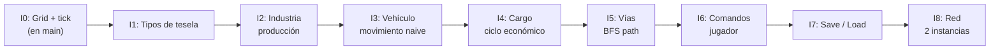

# Diseño incremental — openttdrs

## Por qué incremental y no por fases

El plan original organizaba el trabajo en **fases secuenciales** (mapa → economía → pathfinding → vehículos → …). Eso tiene un problema grave: **no hay nada jugable ni observable hasta muy tarde**, y las decisiones de diseño de las capas inferiores se toman sin retroalimentación real de las capas superiores.

El diseño incremental resuelve esto con una idea simple:

> Cada incremento entrega una rebanada delgada que atraviesa **todas las capas** (tipos en core, lógica de simulación, test, representación en Bevy) y deja el sistema en un estado completamente funcional y observable.

Esto significa:

- Siempre hay algo que corre y muestra progreso.
- Los errores de diseño aparecen pronto, cuando el coste de cambiarlos es bajo.
- Cada incremento es un PR razonable, pequeño y revisable.
- No hay "trabajo de infraestructura invisible" que dure semanas.

---

## Relación con OpenTTD upstream

El [informe de arquitectura](INFORME_ARQUITECTURA_OPENTTD.md) resume el código de `reference/openttd-upstream/` (Clases tile bit-packed, `TimerGameTick`, `CargoPacket`, YAPF, comandos, saveload, red). Estos incrementos **no copian** el upstream línea a línea; la tabla siguiente enlaza conceptos para cuando conviene mirar el original:

| Concepto upstream | Dónde en OpenTTD | Cómo se traduce aquí |
|-------------------|------------------|----------------------|
| `TileBase` + `TileExtended` (~10 B/tile), accessor `Tile` | `map_func.h` | MVP: `Vec<Tile>` o equivalente simple; optimización tipo SoA si el profiler lo pide. |
| `TileType` (11 variantes en 4 bits) | `tile_type.h` | **I1:** `TileKind` propio con subset jugable; no replicar todos los tipos C++ de entrada. |
| `TimerGameTick`, constantes `Ticks::*` | `timer/timer_game_tick.h` | **I0:** `GameTick`; **I2:** usar **`INDUSTRY_PRODUCE_TICKS = 256`** como periodo por defecto de producción (literal del upstream). `DAY_TICKS = 74` si más adelante se calibra UI “por día”. |
| Industria `ProducedCargo` / `AcceptedCargo`, `PRODLEVEL_*` | `industry.h` | **I2:** MVP con `stock` y tasas fijas; historia mensual y cierre por abandono después. |
| `CargoPacket` (origen, `periods_in_transit`, …) | `cargopacket.h` | **I4:** balances `u32` bastan para el primer ciclo; packets completos cuando importe rating/pago realista. |
| Jerarquía `Vehicle`, movimiento sub-tile | `vehicle_base.h` | **I3:** salto tesela a tesela; `progress` y distancias axiales (`TILE_AXIAL_DISTANCE`) cuando el MVP lo exija. |
| Órdenes `Order`, listas compartidas | `order_base.h` | **I4:** cola mínima “ir a estación”; órdenes compartidas más tarde. |
| YAPF (siguiente tramo, cachés, regiones agua) | `pathfinder/yapf/` | **I5:** BFS que devuelve **`Vec` de teselas** es deliberado y más simple; migrar a heurística tipo A* si el mapa crece. |
| Registro masivo de comandos `*_cmd` | `command.cpp` | **I6:** mismo patrón abstracto (`Command` + `apply`), sin el árbol enorme del upstream. |
| `SaveLoadVersion` (`SLV_*`) | `saveload/saveload.h` | **I7:** formato propio versionado; **parcial:** `scripts/parse_sav.py` lee `.sav` → `.ottdmap` (solo mapa, no economía). |
| Red = replay de comandos + hash estado | `network/` | **I8:** misma idea lógica; protocolo y seguridad mínimos. |

---

## Estado actual del código (abril 2026)

Los incrementos **I0–I5** están implementados en `main`. Además hay trabajo **visual y de
mapas** que no reemplaza I6–I8 pero sí el cliente y la documentación de referencia.

| Capa | Qué hay hoy |
|------|-------------|
| `openttdrs-core` | `Tile { height, kind, mapt, m5 }`, `TileKind` ampliado, `Map`, `Map::from_ottd_binary`, industrias, estaciones, vehículos, BFS `find_path`, tests (18). |
| `openttdrs-client` | Vista **isométrica**, sprites **OpenGFX** (suelo, agua, carreteras, árboles, camión, mina), gizmos, cámara con pan/zoom, carga opcional `OTTDMAP_FILE`. |
| Scripts | `parse_sav.py` (`.sav` → `.ottdmap`), `descargar_graficos.sh` / `descargar_sonidos.sh`. |
| Docs | [SPRITES_OPENGFX.md](SPRITES_OPENGFX.md), [TILES_Y_SAVEGAMES_OPENTTD.md](TILES_Y_SAVEGAMES_OPENTTD.md), [SIGUIENTES_PASOS.md](SIGUIENTES_PASOS.md). |

**Carreteras en mapas reales:** orientación desde `mapt` + `m5` (normal, cruce a nivel,
depósito, túnel/puente carretera). Los PNG `road_tx` / `road_ty` se asignan **cruzados**
respecto a `RoadDir` para alinear la textura con la proyección del cliente (~90° respecto
a “nombre de archivo = eje”); validado en pantalla.

Lo **pendiente** de la cadena incremental formal sigue siendo **I6–I8** (comandos, save/load
propio del `GameState`, red). Ver [SIGUIENTES_PASOS.md](SIGUIENTES_PASOS.md) para opciones
priorizadas.

---

## Los incrementos

Cada incremento tiene esta estructura:

- **Qué añade al core**: tipos nuevos o extensiones de los existentes (sin romper tests previos).
- **Qué añade a los tests**: invariantes nuevas sobre lo que se agrega.
- **Qué muestra el cliente**: cambio visible en la ventana de Bevy.
- **Frontera clara**: qué queda explícitamente fuera de ese incremento.

---

### Incremento 1 — "Una tesela tiene tipo"

**Objetivo**: el mapa deja de ser solo alturas y adquiere semántica mínima.

**Core — qué añadir:**

```
map.rs
  Tile { height: u8, kind: TileKind }

  enum TileKind {
      Grass,
      Water,
      Forest,
      CoalField,
  }
```

`Map::new_flat` produce un mapa de `TileKind::Grass`. Métodos `set_kind` / `get_kind` simétricos a `set_height`.

**Tests:**
- `tile_kind_default_is_grass()`
- `tile_kind_roundtrip()`
- La altura sigue siendo independiente del tipo.

**Cliente Bevy:**
- Color de cada tesela depende de `TileKind` (verde → bosque, azul → agua, gris oscuro → carbón, verde claro → prado).
- Semilla pseudoaleatoria fija para distribuir tipos en la carga inicial (solo visual, sin RNG en core).

**Fuera de este incremento:** industrias, producción, vehículos, comandos del jugador.

**Referencia upstream:** `TileType` enum en `tile_type.h` (Clear, Railway, Road, House, Trees, Station, Water, Void, Industry, TunnelBridge, Object). Aquí los nombres y la granularidad son deliberadamente más simples para el MVP.

---

### Incremento 2 — "Una industria existe en el mapa"

**Objetivo**: introducir el primer objeto de simulación encima del mapa.

**Core — qué añadir:**

```
industry.rs
  enum IndustryKind { CoalMine, Forest }

  struct Industry {
      pos:   TileCoord,
      kind:  IndustryKind,
      stock: u32,   // unidades de cargo en almacén
  }

GameState {
    map:        Map,
    tick:       GameTick,
    industries: Vec<Industry>,   // ← nuevo
}
```

`GameState::step()` llama a `Industry::produce(&mut self, tick)` cada **256 ticks** (`INDUSTRY_PRODUCE_TICKS` en el upstream) incrementando `stock` en cantidad fija. Determinista, sin RNG.

**Tests:**
- `industry_produces_on_schedule()` — después de N ticks el stock aumenta la cantidad esperada.
- `industry_does_not_exceed_capacity()` — stock tiene tope configurable.
- Paso de dos mundos con misma seed → mismo stock (determinismo).

**Cliente Bevy:**
- Las industrias se dibujan como un punto o cuadrado de color sobre la tesela correspondiente.
- Texto o color de intensidad que refleja `stock` actual.

**Fuera:** transporte de cargo, estaciones, jugador.

**Referencia upstream:** struct `Industry` con `ProducedCargo` / `AcceptedCargo`, niveles `PRODLEVEL_*`, abandono tras años económicos (`industry.h`). MVP: solo producción periódica y tope de stock.

---

### Incremento 3 — "Un vehículo existe y se desplaza"

**Objetivo**: el primer objeto móvil, sin pathfinding real todavía.

**Core — qué añadir:**

```
vehicle.rs
  enum VehicleKind { Truck }

  struct Vehicle {
      id:       u32,
      kind:     VehicleKind,
      pos:      TileCoord,
      dest:     TileCoord,
      cargo:    u32,
  }

GameState {
    ...
    vehicles: Vec<Vehicle>,   // ← nuevo
}
```

Movimiento por pasos: cada tick el vehículo avanza **una tesela** en la dirección cardinal que reduce la distancia Manhattan al destino (sin buscar camino). Si llega, invierte destino. Sin colisiones por ahora.

**Tests:**
- `vehicle_moves_toward_dest()` — después de N ticks está más cerca.
- `vehicle_inverts_on_arrival()` — llega al destino, gira.
- Paso de dos mundos idénticos → misma posición en tick T (determinismo).

**Cliente Bevy:**
- Los vehículos se dibujan como puntos blancos en movimiento sobre el mapa.

**Fuera:** pathfinding real, vías, carga/descarga, estaciones.

**Referencia upstream:** pool global `_vehicle_pool`, campos `tile`, órdenes, `VehicleCargoList` (`vehicle_base.h`). MVP: vector simple y movimiento Manhattan sin sub-tile.

---

### Incremento 4 — "Un vehículo recoge y entrega cargo"

**Objetivo**: primer ciclo económico completo, aunque primitivo.

**Core — qué añadir:**

```
station.rs
  struct Station {
      pos:   TileCoord,
      stock: u32,
  }

GameState {
    ...
    stations: Vec<Station>,   // ← nuevo
}
```

Reglas de `step()`:
- Si un vehículo llega a la posición de una industria y `cargo == 0`: toma `min(stock_industria, capacidad_vehiculo)` de carga.
- Si un vehículo llega a la posición de una estación y `cargo > 0`: entrega toda la carga, la estación acumula `income` (simple contador).
- Vehículo invierte destino tras cada operación.

**Tests:**
- `vehicle_loads_from_industry()`.
- `vehicle_delivers_to_station()`.
- `economic_cycle_roundtrip()` — tras N ciclos el income de la estación es el esperado.

**Cliente Bevy:**
- Estaciones: cuadrado de color distinto.
- `income` de la estación visible como número flotante o intensidad.

**Fuera:** dinero del jugador, costes, UI de construcción.

**Referencia upstream:** `CargoPacket` con origen y envejecimiento (`cargopacket.h`); pagos con inflación (`economy_type.h`). MVP: contadores `u32` y `income`; sin rating ni feeder_share hasta que el modelo lo requiera.

---

### Incremento 5 — "El mapa tiene vías y el vehículo las sigue"

**Objetivo**: primer pathfinding real, acotado a grafos pequeños.

**Core — qué añadir / cambiar:**

```
map.rs
  TileKind añade: Road, Rail

pathfinder.rs
  fn find_path(map: &Map, from: TileCoord, to: TileCoord) -> Option<Vec<TileCoord>>
```

BFS sobre teselas adyacentes con `TileKind::Road` o `Rail`. El vehículo sigue el camino resultante tesela a tesela. Si no hay camino, se detiene.

**Tests:**
- `bfs_finds_path_on_straight_road()`.
- `bfs_returns_none_when_blocked()`.
- `vehicle_follows_path()` — posición en cada tick coincide con el camino devuelto.
- Benchmarks básicos con mapas de distinto tamaño (solo `#[bench]` o inline en test).

**Cliente Bevy:**
- Las vías se dibujan en la rejilla (color diferente).
- El vehículo solo se mueve si hay camino trazado.

**Fuera:** construcción de vías por el jugador, señales, múltiples modos de transporte.

**Referencia upstream:** YAPF elige **solo el siguiente tramo** (`yapf.h`, plantillas en `yapf_*.cpp`); barcos usan regiones de agua (`water_regions.*`). Aquí BFS devuelve una ruta explícita por simplicidad en mapas pequeños.

---

### Incremento 6 — "El jugador construye vías"

**Objetivo**: primer input del jugador que modifica el estado del core.

**Core — qué añadir:**

```
command.rs
  enum Command {
      PlaceRoad(TileCoord),
      PlaceStation(TileCoord),
  }

  fn apply(state: &mut GameState, cmd: Command) -> Result<(), CommandError>
```

`Command` es un tipo de datos **serializable** (sin dependencia de Bevy). `apply` valida (no se puede poner vía en agua, etc.) y muta el `GameState`.

**Tests:**
- `place_road_mutates_tile_kind()`.
- `place_road_on_water_returns_error()`.
- `command_sequence_is_deterministic()` — la misma lista de comandos produce el mismo estado.

**Cliente Bevy:**
- Click izquierdo sobre una tesela lanza `Command::PlaceRoad`.
- Click derecho: `Command::PlaceStation`.
- El mapa se actualiza en pantalla en el siguiente frame.

**Fuera:** coste económico del comando, deshacer, red.

**Referencia upstream:** `command.cpp` enlaza cientos de handlers `*_cmd`; flags offline/servidor (`command_func.h`). MVP: serialización + validación local como base para red posterior.

---

### Incremento 7 — "El estado persiste en disco"

**Objetivo**: save/load sin perder nada del estado actual.

**Core — qué añadir:**

Dependencia opcional: `serde` + `serde_json` (o `bincode`) solo en feature `save`.

```
save.rs
  fn save(state: &GameState, path: &Path) -> Result<(), SaveError>
  fn load(path: &Path)          -> Result<GameState, SaveError>
```

`GameState`, `Map`, `Industry`, `Vehicle`, `Station` derivan `Serialize` / `Deserialize`.

**Tests:**
- `save_load_roundtrip()` — estado antes y después de save/load es idéntico.
- `save_load_after_N_steps()` — determinismo no se rompe al reanudar.

**Cliente Bevy:**
- Tecla `S` guarda en `save.json`, `L` carga.

**Fuera:** versionado de formato, migraciones, compatibilidad con OpenTTD.

**Referencia upstream:** `SaveLoadVersion` inmutable y tablas por subsistema (`saveload/saveload.h`, `*_sl.cpp`). MVP: un formato único con campo `version` en JSON/binario propio.

---

### Incremento 8 — "Dos instancias comparten el mundo"

**Objetivo**: multijugador mínimo basado en replicación de comandos.

**Core — qué añadir / verificar:**

- `Command` ya es serializable (Incremento 6).
- Añadir `GameState::apply_command_log(cmds: &[Command])` — reproduce una lista desde tick 0.
- RNG del core debe ser semillado explícitamente si se introduce (hoy no hay).

**Infraestructura (crate nuevo `openttdrs-net` o módulo del cliente):**
```
TCP simple: servidor envía CommandLog a clientes,
clientes aplican el log y avanzan ticks sincrónicos.
```

**Tests:**
- `two_worlds_same_log_same_state()` — prueba de determinismo con `apply_command_log`.
- `desync_detected_on_hash_mismatch()` — hash del estado se compara entre instancias.

**Cliente Bevy:**
- Arg `--server` / `--client <addr>` en el binario existente.

**Fuera:** seguridad, cheating, latencia, reconexión.

**Referencia upstream:** los clientes aplican la misma secuencia de comandos que el servidor; desync por divergencia de estado (`network_*`). MVP: misma disciplina determinista + hash opcional del `GameState`.

---

## Resumen visual



La cadena es lineal porque cada incremento **extiende** los tipos anteriores. No hay bloqueos opcionales: cada pieza construye sobre la anterior.

---

## Reglas de trabajo

1. **Un incremento = un PR** (o varios commits en la misma rama). Nunca mezclar dos incrementos.
2. **Los tests del incremento anterior no pueden romperse.** Si hay que cambiar un tipo, el cambio va en el mismo PR con la migración.
3. **Cada PR deja el cliente Bevy en un estado observable**, aunque sea solo con gizmos o texto en pantalla.
4. **No se diseña el incremento N+2** hasta que N está mergeado. El diseño concreto de cada módulo emerge del código que existe, no de la especificación.
5. La sección de cada incremento en este documento es la **spec mínima**; el código puede ser más simple si los tests pasan.
