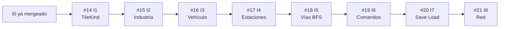

# Roadmap en GitHub Issues — diseño incremental

El roadmap usa **incrementos** en lugar de fases. Cada incremento es una rebanada delgada que cruza todas las capas (core, tests, cliente Bevy) y deja el sistema funcionando y observable. Ver [docs/DISENO_INCREMENTAL.md](DISENO_INCREMENTAL.md) para la spec detallada de cada uno.

## Hito [0.1 — vertical slice](https://github.com/cavazquez/openttdrs/milestone/1)

| # | Incremento | Qué hace | Dificultad | Estado |
|---|-----------|----------|------------|--------|
| I0 | — | Grid + tick + cliente Bevy debug | — | cerrado (#2–#6, ya en `main`) |
| [#14](https://github.com/cavazquez/openttdrs/issues/14) | I1 | Tipos de tesela (`TileKind`) | baja | abierto |
| [#15](https://github.com/cavazquez/openttdrs/issues/15) | I2 | Industria produce por tick | baja | abierto |
| [#16](https://github.com/cavazquez/openttdrs/issues/16) | I3 | Vehículo con movimiento naive | baja | abierto |
| [#17](https://github.com/cavazquez/openttdrs/issues/17) | I4 | Estaciones y ciclo económico | media | abierto |
| [#18](https://github.com/cavazquez/openttdrs/issues/18) | I5 | Vías y BFS pathfinding | media | abierto |
| [#19](https://github.com/cavazquez/openttdrs/issues/19) | I6 | Comandos del jugador | media | abierto |
| [#20](https://github.com/cavazquez/openttdrs/issues/20) | I7 | Save / Load del estado | media | abierto |
| [#21](https://github.com/cavazquez/openttdrs/issues/21) | I8 | Red — dos instancias | alta | abierto |

> Los issues de fase #7–#13 (plan anterior) están **cerrados como reemplazados**.

## Grafo de dependencias

La cadena es lineal: cada incremento extiende los tipos del anterior.



## Reglas de trabajo

1. Un incremento = un PR. Nunca mezclar dos incrementos.
2. Los tests del incremento anterior no pueden romperse.
3. Cada PR deja el cliente Bevy en un estado observable.
4. No se diseña el incremento N+2 hasta que N está mergeado.

## Script de recreación

Para otro repositorio o fork nuevo (no re-ejecutar en `cavazquez/openttdrs`):

```bash
./.github/scripts/create-plan-issues.sh
```
