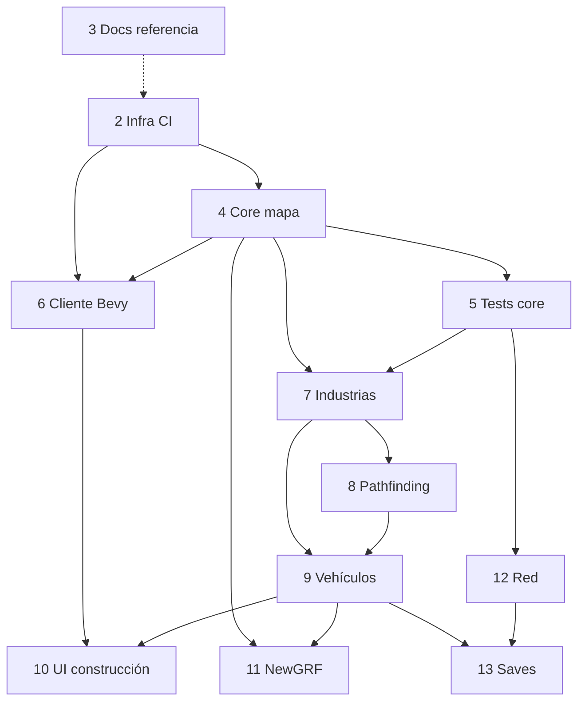

# Roadmap en GitHub Issues

Los issues del plan de implementación están creados en el repositorio. Números actuales (rama `main`, abril 2026):

## Hito **0.1 — vertical slice**

Todos los issues del roadmap están agrupados en el hito [0.1 — vertical slice](https://github.com/cavazquez/openttdrs/milestone/1). Los **#2–#6** quedaron **cerrados** como bootstrap ya mergeado en `main`; el trabajo pendiente del corte 0.1 sigue en **#7–#13** (abiertos).

| # | Título | Dificultad | Estado |
|---|--------|------------|--------|
| [2](https://github.com/cavazquez/openttdrs/issues/2) | Infra: workspace Rust 2024, CI y Dependabot | baja | cerrado |
| [3](https://github.com/cavazquez/openttdrs/issues/3) | Docs: clon de referencia OpenTTD e informe de arquitectura | baja | cerrado |
| [4](https://github.com/cavazquez/openttdrs/issues/4) | Core: mapa por teselas, reloj de tick y estado de simulación | baja | cerrado |
| [5](https://github.com/cavazquez/openttdrs/issues/5) | Core: tests de invariantes y regresión | media | cerrado (MVP; se puede reabrir ampliación) |
| [6](https://github.com/cavazquez/openttdrs/issues/6) | Cliente Bevy: ventana, cámara y vista debug del mapa | media | cerrado |
| [7](https://github.com/cavazquez/openttdrs/issues/7) | Simulación: industrias y economía reducida | media | abierto |
| [8](https://github.com/cavazquez/openttdrs/issues/8) | Pathfinding mínimo (carretera o raíl simplificado) | alta | abierto |
| [9](https://github.com/cavazquez/openttdrs/issues/9) | Vehículos, órdenes y estaciones | alta | abierto |
| [10](https://github.com/cavazquez/openttdrs/issues/10) | UI Bevy: construcción e interacción con infraestructura | alta | abierto |
| [11](https://github.com/cavazquez/openttdrs/issues/11) | Contenido: NewGRF / basesets (compatibilidad parcial) | muy alta | abierto |
| [12](https://github.com/cavazquez/openttdrs/issues/12) | Red: multijugador cliente/servidor determinista | muy alta | abierto |
| [13](https://github.com/cavazquez/openttdrs/issues/13) | Guardados: formato versionado y compatibilidad | muy alta | abierto |

> Si los números cambian en otro fork, vuelve a ejecutar el script o ajusta esta tabla.

## Grafo de dependencias



Leyenda: flecha sólida = bloqueo explícito en el cuerpo del issue; línea punteada = dependencia opcional o débil.

### Lista explícita

- **#4** depende de **#2**.
- **#5** depende de **#4**.
- **#6** depende de **#2**, **#4**.
- **#7** depende de **#4**, **#5**.
- **#8** depende de **#4**, **#7**.
- **#9** depende de **#7**, **#8**.
- **#10** depende de **#6**, **#9**.
- **#11** depende de **#4**, **#9**.
- **#12** depende de **#5**, **#9**.
- **#13** depende de **#9**; recomendado tras **#12**.
- **#3** puede ir en paralelo a **#2** (solo referencia documental).

## Script de recreación

Para otro repositorio o si hace falta recrear issues (evitar duplicados en el mismo repo):

```bash
./.github/scripts/create-plan-issues.sh
```
