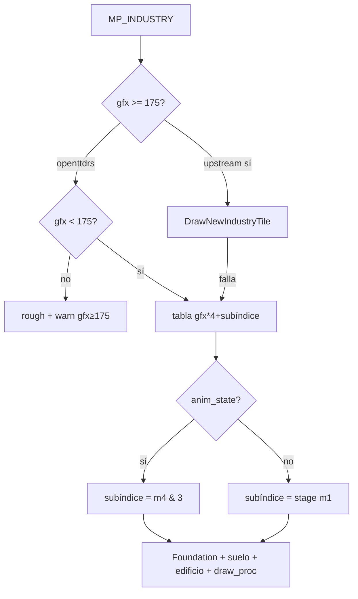

# Planificación y roadmaps

Fuente viva de roadmaps, gaps de producto, sprints, checklists y herramientas de sonda. Estado de madurez técnica road/rail y oráculos: [PARIDAD.md](PARIDAD.md).

## Índice

- [Vista corta de gaps](#vista-corta-de-gaps)
- [Paridad simulación P0–P3](#paridad-de-simulación-p0p3)
- [Paridad estructural](#paridad-estructural)
- [Paridad UI](#paridad-ui-global)
- [Sprints 0.1](#sprints-hito-01)
- [Importación](#importación-openttd)
- [Industrias](#industrias-paridad)
- [Junctionary](#junctionary-cruces-ferroviarios)
- [Export SAV](#export-sav)
- [Carreteras drag](#carreteras-drag-paused)
- [Siguientes pasos](#siguientes-pasos--hallazgos)
- [SP1](#checklist-sp1-ciclo-jugable)
- [Dev bot](#dev-bot-sonda-headless)

---

## Vista corta de gaps

Resumen ejecutivo. Detalle de comportamiento: [Paridad de simulación](#paridad-de-simulación-p0p3). Madurez road/rail: [PARIDAD.md](PARIDAD.md).

<!-- fuente: PARIDAD_OPENTTD.md -->

Resumen vivo de **openttdrs** vs OpenTTD. Detalle por dominio:

| Tema | Documento |
|------|-----------|
| **Paridad de comportamiento** (bucles, economía, ciudades, órdenes) | [ROADMAP_PARIDAD_SIMULACION.md](#paridad-de-simulación-p0p3) |
| UI / NewGRF cortes | [ROADMAP_PARIDAD_UI_GLOBAL.md](#paridad-ui-global) |
| Sim estructural (consist, PBS, economía, railtypes) | [ROADMAP_PARIDAD_ESTRUCTURAL.md](#paridad-estructural) |
| Madurez road / tick | [parity/status.md](PARIDAD.md#madurez-road--tick) |
| Madurez rail | [parity/rail_status.md](PARIDAD.md#madurez-rail) |
| Sprints 0.1 | [ROADMAP_SPRINTS.md](#sprints-hito-01) |

**Leyenda:** ✅ hecho · 🟡 parcial · ❌ no · 🔮 backlog lejano

---

### Resumen ejecutivo (jul 2026)

| Bloque | Estado |
|--------|--------|
| Carretera + ferrocarril (construcción, sim básica) | ✅ alto |
| Paridad visual OpenGFX vanilla | 🟡 ~85–90 % |
| Audio espacial + música OGG (subset) | 🟡 |
| Economía (préstamos, subsidios, averías, packets) | 🟡 |
| CargoDist MCF nivel 2 | 🟡 (MVP; jobs async OOS) |
| Ciudades (rating, crecimiento) | 🟡 |
| Órdenes y operación de flota | 🟡 |
| Aviones (FTA, compatibilidad, crash en pista corta, ruido) | 🟡 (#212 cerrado) |
| Barcos | 🔮 |
| NewGRF Action0–14 + Action2 runtime | 🟡 (parse + sprites in-world; paridad total OOS) |
| Multijugador I8 | 🟡 MVP ([#21](https://github.com/cavazquez/openttdrs/issues/21) ✅, host migration #171) |
| IA rivales (TransCargo) / GameScript-lite / editor | 🟡 (Squirrel OOS) |

---

### Gaps / mejoras por costo (orden barato → caro)

| # | Área | Feature | openttdrs | Costo | Notas |
|---|------|---------|-----------|-------|-------|
| 1 | Construcción | Convertir tipo de vía | ✅ | S–M | `RailConvert` → tipo seleccionado (#195) |
| 2 | Sim | Servicio en depósito | ❌ | M | |
| 3 | Import/export | `.sav` roundtrip oficial | 🟡 | M | Export propio parcial — [ROADMAP_SAV_EXPORT.md](#export-sav) |
| 4 | Ferrocarril | PBS golden vs OTTD | 🟡 | L | MVP interno; captura externa |
| 5 | UI | Paridad ventanas flota/estación | 🟡 | M | [ROADMAP_PARIDAD_UI_GLOBAL.md](#paridad-ui-global) |
| 6 | Mundo | Industrias por clima / gen | 🟡 | L | T1–T3 hechos; T4 parcial |
| 7 | Transporte | Barcos | 🔮 | L | Aviones cerrados (#212) |
| 8 | Modding | NewGRF paridad total | 🟡 | XXL | Fase 7 MVP en estructural |
| 9 | Red | Desync UI / lobby | 🟡 | XL | Core lockstep hecho |
| 10 | IA | Pathfind construcción / multi-rival | 🟡 | M–L | TransCargo = L Manhattan |

---

### Ya tenemos (alto nivel)

Mapa `.ottdmap`/TNBP · road+rail+señales/PBS MVP · consist · packets/rating · multi-compañía + feeder · IA TransCargo · NewGRF Action0–14 parse + Action2 sprites · I8 TCP + dedicated · save JSON + import/export `.sav` parcial · UI solitario (toolbar, listas, noticias).

---

**Nota de alcance:** esta vista mide **qué funciones existen**. Si el comportamiento coincide con el
original es otro eje, auditado en [ROADMAP_PARIDAD_SIMULACION.md](#paridad-de-simulación-p0p3)
(71 entradas, 2026-07-25): un bloque puede figurar aquí como ✅ y seguir teniendo divergencias de
simulación abiertas.

*Última actualización: 2026-07-25 — vista corta; no duplicar tablas largas aquí.*

## Paridad de simulación (P0–P3)

<!-- fuente: ROADMAP_PARIDAD_SIMULACION.md -->

Plan de cierre de divergencias **de comportamiento** entre `openttdrs-core` y OpenTTD.
Origen: auditoría de julio 2026 que leyó el C++ original y el port en paralelo, subsistema
por subsistema, en vez de fiarse de los documentos del repo.

**Referencia usada:** `reference/openttd-upstream` en **15.3** (`14ec60f`), contrastada con
`OpenTTD/` en master (`2effec96e8`). Todas las referencias `archivo:línea` de la columna
*Original* apuntan a `reference/openttd-upstream/src/`; las del *Port* a
`crates/openttdrs-core/src/`.

**Alcance:** bucles y reglas de simulación. Fuera: UI ([ROADMAP_PARIDAD_UI_GLOBAL.md](#paridad-ui-global)),
NewGRF más allá de los callbacks citados, red, scripts de IA/GS y formato de guardado salvo
donde afecta a la simulación ([ROADMAP_SAV_EXPORT.md](#export-sav)).

**Relacionado:** [PARIDAD_OPENTTD.md](#vista-corta-de-gaps) (vista corta) ·
[ROADMAP_PARIDAD_ESTRUCTURAL.md](#paridad-estructural) (fases 1–7 ya cerradas) ·
[parity/status.md](PARIDAD.md#madurez-road--tick) (niveles de madurez) ·
[ROADMAP_INDUSTRIAS_PARIDAD.md](#industrias-paridad) (render de industrias).

---

### 1. Diagnóstico de fondo

El port tiene buena paridad en **datos y fórmulas aisladas**, y poca en **los bucles que las
ejecutan**. El mismo patrón aparece en los seis subsistemas auditados: `DoUpdateSpeed`,
`GetCurveSpeedLimit`, el algoritmo `Randomizer`, las tarifas de carga templada o la codificación
de señales están portados con exactitud y con tests golden; pero el orden del tick, las
cadencias, el consumo de azar y las máquinas de estado que los invocan son reconstrucciones
propias. Por eso el juego se comporta *parecido* sin ser reproducible contra el original.

Consecuencia práctica: **ningún subsistema puede alcanzar el nivel 5 de
[parity/status.md](PARIDAD.md#madurez-road--tick)** (traza equivalente tick a tick) mientras no se cierren las
entradas de la prioridad **P2**.

---

### 2. Cómo leer este documento

| Prioridad | Criterio | Contenido |
|-----------|----------|-----------|
| **P0** | Corrección puntual, coste S, cambia comportamiento observable ya | Constantes y condiciones mal portadas |
| **P1** | Reglas que hacen que el juego *se sienta* OpenTTD | Rating, industrias, ciudades, dinero, averías |
| **P2** | Rediseño de bucle; habilita la reproducibilidad | Relojes, orden del tick, RNG, controladores, órdenes |
| **P3** | Mundo y contenido que hoy no existe | Generación procedural, inundación, casas, extras |

Formato de ficha en P0/P1:

- **Problema** — qué hace hoy el port y por qué importa.
- **Original** — la regla real, con `archivo:línea`.
- **Solución** — el cambio concreto propuesto.
- **Coste** — S horas · M días · L una semana o más · XL rediseño de subsistema.

En P2 y P3 el mismo contenido va en tabla por volumen. La auditoría catalogó 82 divergencias; aquí
aparecen como 71 entradas porque varias comparten solución y se agrupan (las tres fórmulas
financieras de P1.18, los flags de orden de P1.20, las dos generaciones procedurales de P3.1).
Las entradas marcadas **✔ verificado**
se comprobaron abriendo los dos ficheros durante la auditoría; el resto proviene de la
exploración automatizada con referencia de línea, así que conviene confirmar la línea exacta al
abrir el issue.

---

### 3. Camino recomendado

| # | Entrada | Prioridad | Coste | Estado | Por qué en ese orden |
|---|---------|-----------|-------|--------|----------------------|
| 1 | [P0.1](#p01--la-quiebra-ignora-el-préstamo---hecho) Quiebra con préstamo | P0 | S | hecho | Una línea; hoy una compañía sobreendeudada es inmortal |
| 2 | [P0.2](#p02--periodo-de-tránsito-de-la-carga---hecho) Periodo de tránsito 185 | P0 | S | hecho | Recalibra todos los ingresos, que hoy caen 2,5× más rápido |
| 3 | [P0.4](#p04--rating-inicial-de-autoridad-local---hecho) Rating de autoridad local | P0 | S | hecho | Cambia la curva de arranque y es requisito de P1.9 |
| 4 | [P1.1](#p11--updatestationrating-completo--hecho) `UpdateStationRating` + [P0.3](#p03--rating-inicial-de-estación--hecho-con-p11) | P1 | XL | hecho | Es lo que hace que servir bien una estación importe |
| 5 | [P1.2](#p12--reparto-de-carga-entre-estaciones-competidoras--hecho) Reparto entre estaciones | P1 | L | hecho | Cierra la mitad que le faltaba a P1.1: el rating ya reparte la producción |
| 6 | [P1.4](#p14--prod_level-y-cierre-de-industrias--hecho) Industrias dinámicas + [P1.3](#p13--producción-industrial-por-spec--hecho) rates | P1 | XL | hecho | Sin esto el mundo económico es estático y las rutas no caducan |
| 7 | [P3.1](#tabla-p3) `GenerateTowns` / `GenerateIndustries` | P3 | XL | hecho | Un mapa nuevo nace vacío: bloquea comparar una partida completa |
| 8 | [P2.1](#tabla-p2) Relojes calendario/economía | P2 | XL | hecho | Habilita los barridos escalonados de los que todo depende |
| 9 | Bloque 6: [P2.17](#tabla-p2)–[P2.22](#tabla-p2) órdenes/carga/linkgraph | P2 | XL | hecho | Órdenes implícitas, staging de carga y planificador linkgraph |

**P1 completo** (22/22). **P2 completo** (22/22). **P3 completo** (20/20): terreno,
población, inundación, desierto, pueblo vivo, carretera/crash/replace/andén/railtype,
carga (`travelled`/`Reroute`/`Split`), wallclock y consist fino. Sin entradas P3
pendientes. Los P0 puntuales también están cerrados (P0.7 reclasificado a P2).

---

### 4. P0 — Correcciones puntuales

Siete entradas. **Seis cerradas**: cinco como arreglos puntuales (P0.1, P0.2, P0.4, P0.5, P0.6) y
P0.3 más tarde, dentro de P1.1, porque exigía el modelo de rating entero. Queda P0.7, que choca
con la clasificación de segmentos de señal y está reclasificada a P2 (detalle en su ficha).

#### P0.1 — La quiebra ignora el préstamo ✔ · hecho

- **Problema** — `check_bankruptcy` compara solo la caja contra el techo de préstamo, así que
  una compañía endeudada nunca quiebra. Con 50.000 en caja, 400.000 de préstamo y techo de
  300.000, OpenTTD la liquida y openttdrs la mantiene viva indefinidamente.
- **Original** — sobrevive si `money - current_loan >= -GetMaxLoan()` (`economy.cpp:556`).
  El chequeo es mensual y la línea temporal de bancarrota es aviso al mes 4, venta al 7 y
  quiebra al 10 (`economy.cpp:566-631`).
- **Port** — `money < -max_loan` (`economy/payments.rs:157-158`); racha de 3 meses en
  `sim_step/economy.rs:99-116`.
- **Hecho** — `check_bankruptcy(money, loan, max_loan)` resta el préstamo; los tres puntos de
  llamada le pasan el saldo pendiente. Tests `bankruptcy_counts_outstanding_loan`.
- **Pendiente** — la línea temporal de OpenTTD (aviso al mes 4, venta al 7, quiebra al 10) sigue
  siendo una racha de 3 meses; va con [P1.9](#p19--autoridad-local-por-compañía) y P2.1.

#### P0.2 — Periodo de tránsito de la carga ✔ · hecho

- **Problema** — el port cuenta un periodo por día (74 ticks) cuando el original cuenta uno cada
  185. Para el mismo viaje acumula 2,5× más periodos, así que el factor de tiempo del pago cae
  mucho antes y todas las rutas largas rinden de menos.
- **Original** — `CARGO_AGING_TICKS = 185` (`timer/timer_game_tick.h:81`), unos 2,5 días; la API
  de scripts convierte con `days_in_transit * 2 / 5` (`script_cargo.cpp:78`).
- **Port** — `TICKS_PER_TRANSIT_DAY = 74` (`economy/time.rs:4`) usado para incrementar
  `periods_in_transit` (`cargo_packet/types.rs:197`, `313`).
- **Hecho** — la constante ambigua se partió en tres: `TICKS_PER_DAY = 74` (calendario),
  `CARGO_AGING_TICKS = 185` (envejecimiento a bordo) y `STATION_RATING_TICKS = 185` (barrido de
  rating de estación, que también corría por día). `ticks_to_transit_days` pasó a
  `ticks_to_transit_periods` y `age_one_day` a `age_one_period`, porque el nombre viejo era el
  origen de la confusión. Test `onboard_cargo_ages_every_185_ticks`.
- **Nota** — ningún test existente cubría la cadencia, así que la recalibración temida no ocurrió:
  la suite pasó sin tocar ningún valor esperado.

#### P0.3 — Rating inicial de estación · hecho con P1.1

- **Problema** — una estación recién construida rinde como perfecta desde el primer día porque el
  rating derivado arranca en 255.
- **Original** — `INITIAL_STATION_RATING = 175` (`station_base.h:23`) y, sin carga entregada, sube
  de uno en uno hasta ese techo (`station_cmd.cpp:3988`).
- **Port** — `recompute_station_rating` dejaba 255 mientras no hubiera carga esperando.
- **Por qué no era S** — en el original el 175 es el valor inicial de un rating **persistente por
  cargo** (`GoodsEntry::rating`), no una constante suelta: hacía falta el modelo entero.
- **Hecho** — dentro de [P1.1](#p11--updatestationrating-completo--hecho): `GoodsEntry::rating`
  nace en 175 y, mientras la estación nunca haya movido ese tipo de carga, sube de uno en uno sin
  pasar de ahí. Test `new_station_starts_at_initial_rating`.

#### P0.4 — Rating inicial de autoridad local ✔ · hecho

- **Problema** — los pueblos arrancan indiferentes (0) en vez de moderadamente favorables (500),
  lo que desplaza todos los umbrales de permisos.
- **Original** — `RATING_INITIAL = 500` (`town_type.h:45`), asignado por compañía en
  `town_cmd.cpp:2072`.
- **Port** — `local_authority_rating: 0` (`town.rs:85`, y en los constructores de
  `sav/entities.rs:293`, `sav/write/mod.rs:343`).
- **Hecho** — constante `TOWN_RATING_INITIAL = 500` usada por `Default for Town` y por el
  `serde(default)` del campo, así que también aplica a los pueblos importados de un `.sav` y a las
  partidas guardadas antes del cambio. Test `new_town_starts_at_initial_rating`.
- **Hecho (P1.9)** — el desglose por compañía está en `authority_ratings[]` con migración serde.

#### P0.5 — Todas las industrias producen en el mismo tick · hecho

- **Problema** — el port dispara la producción de todas las industrias en `tick % 256`, lo que
  crea picos sincronizados de carga en el mundo entero.
- **Original** — cada industria decrementa su propio `counter` y produce cuando
  `counter % INDUSTRY_PRODUCE_TICKS == 0`, con fase distinta por industria
  (`industry_cmd.cpp:1177-1191`).
- **Port** — `tick.is_multiple_of(256)` global (`industry.rs:297-298`).
- **Hecho** — `Industry::counter` (12 bits, como `GB(r, 4, 12)`) sembrado al fundar con el RNG
  determinista de teselas; `produces_on_tick` desplaza la fase en vez de mirar el tick global.
  Test `industries_produce_on_their_own_phase`.
- **Pendiente** — las industrias que vienen de un `.sav` importado nacen con fase 0, porque el
  chunk `INDY` todavía no decodifica `counter`. Va con [ROADMAP_SAV_EXPORT.md](#export-sav).

#### P0.6 — La hierba crece ocho veces más rápido · hecho

- **Problema** — el tile loop sube la densidad de hierba en cada visita, saltándose el contador
  intermedio del original.
- **Original** — `TileLoop_Clear` lleva un contador 0..7 y solo al octavo incremento sube la
  densidad 0→3 (`clear_cmd.cpp:271-284`).
- **Port** — sube densidad directamente cuando `cycle & 7 == 7` (`map/tree_tile_loop.rs:251-267`).
- **Hecho** — contador 0..7 en `m5` bits 5–7 (`clear_counter` / `with_clear_counter`), como
  `GetClearCounter`. Cada parcela madura en su propio momento en vez de cambiar toda la franja del
  tile loop a la vez. Tests `grass_density_needs_eight_visits_per_step` y
  `grass_tiles_with_different_counters_ripen_apart`.
- **Pendiente** — los campos (`CoalField`) siguen con el ciclo global: sus bits de `m5` están
  ocupados por la etapa de cultivo.

#### P0.7 — No existe el interruptor `reserve_paths` · reclasificada a P2

- **Problema** — el PBS está siempre activo, así que no se pueden reproducir partidas vanilla con
  el ajuste desactivado.
- **Original** — `_settings_game.pf.reserve_paths` ("always reserve paths regardless of signal
  type") **es `false` por defecto** (`table/settings/pathfinding_settings.ini:89`). Con el valor
  por defecto solo se reserva en segmentos que ya son PBS; el ajuste en `true` fuerza `SIGSEG_PBS`
  en todos (`train_cmd.cpp:2044`, `2324`, `2730`).
- **Port** — reserva incondicional (`sim_step/movement.rs:85-92`), es decir, el port se comporta
  como `reserve_paths = true`, que es el modo **no** vanilla.
- **Por qué no es S** — el interruptor por sí solo no sirve: para poder ponerlo en `false` hay que
  saber si el segmento del tren es PBS o de bloque, que es lo que resuelve `UpdateSignalsOnSegment`
  y el port no distingue. Añadir el flag con default `true` no cambiaría nada observable.
- **Solución** — junto al trabajo de segmentos de señal de P2: clasificar el segmento y reservar
  solo cuando sea PBS o el ajuste lo fuerce.
- **Coste** — M dentro de P2.

---

### 5. P1 — Reglas de comportamiento

Veintidós entradas, **todas cerradas** (P1.1 —con P0.3— a P1.22).
1
#### P1.1 — `UpdateStationRating` completo · hecho

- **Problema** — el rating era `255 − días de espera`. No influían la velocidad del vehículo, la
  edad del servicio ni el stock acumulado, y no había convergencia suave: la señal económica que
  debería premiar servir bien una estación no existía.
- **Original** — `station_cmd.cpp:3973-4126`, cada `STATION_RATING_TICKS = 185`
  (`timer_game_tick.h:78`, disparo en `station_cmd.cpp:4335-4339`). Términos: `last_speed - 85`
  desplazado 2; escalones de espera en 21/12/6/3 (+25/+25/+45/+35); base −90; umbrales de stock
  1500/1000/600/300/100; +26 por estatua; edad del vehículo <3/<2/<1 (+10/+10/+13); convergencia
  `clamp(objetivo - actual, -2, 2)`; truncado aleatorio si el rating queda bajo con mucho stock.
- **Hecho** — `station/goods_entry.rs` introduce `GoodsEntry` por carga (rating persistente,
  `has_rating`, `last_speed`, `last_age`, `max_waiting_cargo`) y `station/cargo_rating.rs` porta
  la función: objetivo con todos los términos, convergencia ±2 y los dos truncados aleatorios con
  el RNG de partida (`cargo_rng`), más el recorte progresivo por encima de 4096 unidades. La
  estación recuerda al último vehículo que cargó (`Vehicle::station_visit`, con las unidades de
  velocidad de cada tipo como en `economy.cpp:1745-1765`) y el tipo de vehículo, que es lo que
  hace que los barcos esperen cuatro veces más antes de penalizar. Save v22 con migración que
  reparte el rating agregado antiguo a las cargas que la estación estaba moviendo. Tests
  `new_station_starts_at_initial_rating`, `good_service_raises_rating_two_points_per_sweep`,
  `unserved_cargo_creeps_back_to_initial_rating`, `station_rating_decays_with_waiting_cargo` y
  `abandoned_station_loses_rating_over_time`.
- **Cambio de comportamiento** — el rating por compañía deja de existir como tal: en el original
  es de la estación e igual para todos, y la competencia se resuelve al repartir la producción
  ([P1.2](#p12--reparto-de-carga-entre-estaciones-competidoras--hecho)). `company_time_since_pickup` se
  conserva porque ese reparto lo va a necesitar.
- **Pendiente** — el +26 por estatua (no hay acciones de ayuntamiento todavía, va con
  [P1.10](#p110--efecto-real-de-la-publicidad), igual que `ModifyStationRatingAround`) y el número
  real de destinos: hoy `num_dests = 1`, que equivale al reparto manual del original.

#### P1.2 — Reparto de carga entre estaciones competidoras · hecho

- **Problema** — no había competencia: cada estación recogía lo suyo sin repartir con las demás que
  cubrían la misma industria, y la producción primaria ni siquiera pasaba por el andén.
- **Original** — `TransportIndustryGoods` saca el stock de la industria y `MoveGoodsToStation`
  pondera por `rating + 1` y reparte entre estaciones y compañías con
  `amount * company_best * station_rating / best_sum / company_sum`
  (`station_cmd.cpp:4599-4660`, disparo en `industry_cmd.cpp:541`). El rating también decide
  cuánto llega de verdad (`UpdateStationWaiting` hace `>> 8` sobre el escalado).
- **Hecho** — `station/move_goods.rs` porta `CanMoveGoodsToStation`, `UpdateStationWaiting`
  (con `amount_fract` en `GoodsEntry`) y `MoveGoodsToStation`. Tras cada ciclo de producción,
  `transport_industry_goods` mueve hasta 255 unidades del stock a las estaciones en cobertura.
  Los pueblos generan pax/correo por el mismo camino, así que el rating también recorta lo que
  llega al andén. Con `selectgoods`, una estación nunca visitada no recibe nada: el stock se
  queda en la industria (o no se genera en el pueblo) hasta que un vehículo intenta cargar
  (`note_station_load_attempt`, aunque el andén esté vacío). El camión en la tesela de la mina
  puede cargar del andén de la estación que la cubre. Tests
  `two_stations_compete_for_mine_output_by_rating`, `mine_production_splits_between_competing_stations`,
  `single_station_receives_rating_fraction`, `better_rated_station_gets_more_cargo`,
  `companies_compete_by_best_rating`, `unvisited_station_leaves_stock_on_industry`.
- **Pendiente** — el reparto entre paradas de bus que se pisan las mismas casas exige la
  producción por casa de [P1.7](#p17--producción-de-pasajeros-por-casa); hoy cada parada genera
  por su propio catchment. Tampoco está el consumidor exclusivo de industria
  (`exclusive_consumer`).

#### P1.3 — Producción industrial por spec · hecho

- **Problema** — toda industria sumaba 8 unidades por ciclo, sin relación con su tipo.
- **Original** — cada spec tiene su `production_rate`, escalado por `prod_level` con
  `CeilDiv(rate * prod_level, PRODLEVEL_DEFAULT)` (`industry_cmd.cpp:1160-1230`, `2592-2600`).
- **Hecho** — `IndustrySpec::production_rate` con los valores de `build_industry.h` (carbón 15,
  bosque 13, pozos 12, minas 10/7, etc.; procesadoras 0). `Industry::produce_amount` aplica
  `CeilDiv(rate * prod_level, 16)`. Las fábricas de goods siguen transformando insumos y
  escalan su salida de 8 con el mismo `prod_level`. Hecho junto a [P1.4](#p14--prod_level-y-cierre-de-industrias--hecho).
- **Pendiente** — segundo cargo de granja (livestock) y rates de NewGRF.

#### P1.4 — `prod_level` y cierre de industrias · hecho

- **Problema** — las industrias nunca cambiaban de producción ni cerraban, así que el mapa
  económico era estático y una ruta rentable lo era para siempre.
- **Original** — `prod_level` con `PRODLEVEL_DEFAULT = 0x10`, mínimo `0x04`, máximo `0x80` y
  cierre en `0x00` (`industry.h:35-38`); bucles diario y mensual con umbrales de transporte
  `PERCENT_TRANSPORTED_60 = 153` y `_80 = 204`, duplicando o partiendo el nivel y cerrando en el
  mínimo (`industry_cmd.cpp:2872-3148`). El bucle diario también crea industrias nuevas.
- **Hecho** — `Industry::prod_level` (default 0x10, serde para saves antiguos).
  `change_industry_production` porta el modo **original** (extractive/organic): cada día de
  calendario una industria al azar puede subir o bajar según el % transportado del mes pasado;
  al bajar desde el mínimo se marca cierre. El mes siguiente `remove_closed_industries` la
  borra del mapa y publica noticia (`NewsType::IndustryClose`). Sin historial mensual todavía
  no hay cambios (hace falta un mes cerrado). Pozos temperate solo bajan. Tests
  `coal_mine_produces_fifteen_at_default_level`, `doubling_prod_level_doubles_output`,
  `poor_service_closes_mine_from_minimum`, `closed_industries_are_removed_next_month`.
- **Pendiente** — economía smooth, creación diaria de industrias nuevas, abandono de
  procesadoras a los 5 años, noticias de subida/bajada de producción (hoy solo cierre).

#### P1.5 — Transformación de insumos · hecho

- **Problema** — solo las fábricas de `Goods` consumen algo; acería, refinería y el resto de
  cadenas no transforman.
- **Original** — al aceptar carga, `produced.waiting += accepted.waiting * input_cargo_multiplier / 256`
  con la matriz de multiplicadores del spec (`economy.cpp:1156-1165`).
- **Hecho** — `IndustrySpec::processing_inputs` con multiplicadores 256 para temperate:
  aserradero (madera→goods), refinería (petróleo→goods), acería (hierro+carbón→acero),
  fábrica (madera+carbón→goods). `produce_from_nearby_stations` consume desde estaciones en
  cobertura y aplica `out += in * multiplier / 256`. Corregido `output_cargo` de aserradero y
  refinería. Tests `sawmill_consumes_wood_for_goods`, `steel_mill_consumes_iron_and_coal_for_steel`,
  `oil_refinery_consumes_oil_for_goods` y fábrica actualizada.
- **Pendiente** — colas `accepted[]`/`produced[]` persistentes en la industria (hoy se consume
  del andén cada ciclo); specs de otros climas y segundo cargo de granja.

#### P1.6 — Pago diferido de transferencias · hecho

- **Problema** — cada descarga cobra el ingreso completo en el acto, también cuando es una
  transferencia intermedia. Eso hace rentables cadenas de feeder que en el original no lo son y
  rompe el sentido de `feeder_share`.
- **Original** — `PayTransfer` solo acumula el valor en `feeder_share` del paquete y el comentario
  es explícito en que no hay cobro; `PayFinalDelivery` paga `profit - GetFeederShare` al entregar
  (`economy.cpp:1217-1248`).
- **Port** — ingreso completo por descarga y 75 % a la primera estación
  (`sim_step/cargo_transfer.rs:76-128`).
- **Hecho** — `CargoUnloadAction::Transfer` solo acumula `feeder_share` (75 % del tramo) sin
  `credit_company`; `Deliver` liquida el acumulado al owner de `first_station` y paga al
  entregador `income - feeder_share`. Tests `feeder_share_paid_on_unload_preserves_packet_flags`
  (sin cobro en trasbordo) y `final_delivery_liquidates_accumulated_feeder_share`.
- **Pendiente** — el freight en hub sigue clasificándose siempre como `Transfer` hasta portar el
  staging de OpenTTD ([P2.19](#p219--clasificación-de-carga)); hoy no hay ingreso en andén
  intermedio, solo en entrega final de pax/mail.

#### P1.7 — Producción de pasajeros por casa · hecho

- **Problema** — el port genera 2 pasajeros y 1 correo por casa dentro de la cobertura de la
  parada. La producción no depende del tipo de casa ni existe fuera del alcance de una estación.
- **Original** — `TileLoop_Town` genera por casa con `hs->population` y `hs->mail_generation`,
  vía `TownGenerateCargoOriginal` o binomial con RNG (`town_cmd.cpp:602-667`, `751-778`).
- **Hecho** — `produce_town_cargo` recorre casas del mapa, usa `HOUSE_POPULATION` y
  `HOUSE_MAIL_GENERATION` (generado desde `town_land.h`), escala al ciclo de 256 ticks y reparte
  con `MoveGoodsToStation` entre paradas que comparten cobertura. Tests
  `produce_uses_house_spec_population`, `competing_bus_stops_split_house_passengers_by_rating` y
  `produce_adds_cargo_when_houses_in_coverage` actualizado.
- **Pendiente** — algoritmo original/binomial con RNG por tesela; `TileLoop_Town` completo con
  edad de casas ([P3.6](#p36--renovación-de-casas)).

#### P1.8 — Tasa de crecimiento urbano · hecho

- **Problema** — las ciudades suman 10 de población por pulso, sin depender de cuántas estaciones
  las sirven de verdad ni de su tamaño.
- **Original** — `GetNormalGrowthRate` indexa `_grow_count_values[2][6]` (normal
  `{320,420,300,220,160,100}`, financiado `{120,120,120,100,80,60}`) por `CountActiveStations`,
  ajusta por ciudad y divide por `num_houses/50+1` (`town_cmd.cpp:3819-3856`). Sin estaciones y
  sin financiación solo crece con `Chance16(1,12)` (`town_cmd.cpp:3876-3911`).
- **Port** — `grow_town_if_served` con paso fijo (`town.rs:222`, `293-331`).
- **Hecho** — `growth_rate` y `grow_counter` por pueblo; cadencia `TOWN_GROWTH_TICKS = 70`;
  `get_normal_growth_rate` desde estaciones activas y tablas `_grow_count_values`; expansión física
  sin step abstracto de población; `Chance16(1,12)` sin estaciones; metas invierno/desierto con
  altura (`DEF_SNOW_LINE_HEIGHT`) y desierto tropical. Tests `growth_rate_scales_with_active_stations`,
  `unserved_town_growth_requires_chance_without_funding`.
- **Coste** — L.

#### P1.9 — Autoridad local por compañía · hecho

- **Problema** — hay un único rating compartido, así que dos compañías en el mismo pueblo son
  indistinguibles para el ayuntamiento y no hay penalización ni recuperación con el tiempo.
- **Original** — `ratings[MAX_COMPANIES]` (`town_type.h`), evolución mensual con
  `RATING_GROWTH_UP_STEP = 5` hasta `RATING_GROWTH_MAXIMUM = 200` y ±12/−15 por estaciones bien o
  mal servidas (`town_cmd.cpp:3766-3794`); `CheckforTownRating` exige umbrales según
  `town_council_tolerance` para tocar carretera, túnel o puente municipal (`town_cmd.cpp:4077-4104`).
- **Port** — un `i16` y un umbral fijo de −200 solo para estaciones (`town.rs:43-45`, `355-363`).
- **Hecho** — `authority_ratings[]` por `CompanyId` (serde + save v23); `update_town_rating` mensual;
  estaciones y financiación usan `active_company`; `check_town_rating` con `TownCouncilTolerance` en
  demolición municipal (`OWNER_TOWN_M1`). Tests `authority_ratings_are_per_company`,
  `update_town_rating_recovers_and_penalizes_by_station_service`.
- **Coste** — M el modelo, L con los chequeos.

#### P1.10 — Efecto real de la publicidad · hecho

- **Problema** — la campaña sube el rating del ayuntamiento, cuando en el original no lo toca.
- **Original** — la publicidad llama a `ModifyStationRatingAround` con +0x40/+0x70/+0xA0 según el
  tamaño (`town_cmd.cpp:3412-3445`). Lo que sí afecta al ayuntamiento es financiar edificios
  (`fund_buildings_months = 3`), la estatua, el soborno y reconstruir carreteras.
- **Port** — `TOWN_ADVERTISE_RATING_BOOST` sobre el rating del pueblo (`command/town.rs:20-46`).
- **Hecho** — `station::modify_station_rating_around` (+0x70, radio 15, campaña mediana única) sobre
  cargas activas de estaciones del `active_company` en el radio; `town_advertise` ya no toca
  `local_authority_rating`. Test `town_advertise_boosts_nearby_station_rating_not_authority`.
- **Pendiente** — estatua (+26 rating estaciones y pending de P1.1), exclusividad 12 meses y
  soborno; tamaños small/large de publicidad si se exponen en UI.

#### P1.11 — Modelo de averías · hecho

- **Problema** — la avería era determinista (`tick * id % 256` bajo un umbral de fiabilidad) y duraba
  siempre 3 días. No había acumulación de riesgo ni relación con la velocidad.
- **Original** — `breakdown_chance` acumulativo (+1 por tick, +25 con probabilidad 1/25) contra la
  tabla `_breakdown_chance[rel >> 10]`, con `breakdown_ctr = GB(r,16,6)+0x3F` y
  `breakdown_delay = GB(r,24,7)+0x80` sacados de `Random()`, y solo con `cur_speed >= 5`
  (`vehicle.cpp:1276-1324`). `HandleBreakdown` tiene fases (`vehicle.cpp:1332-1392`).
- **Hecho** — `vehicle/reliability.rs` porta la tabla, el acumulador diario (`check_vehicle_breakdown`
  con `cargo_rng`), las fases `HandleBreakdown` (`breakdown_ctr` / `breakdown_delay`) en cada tick de
  movimiento, bonus de fiabilidad para barcos y umbral `cur_speed >= 5`. El evento `SimEvent::Breakdown`
  se emite al entrar en avería activa (fase 2→1). Tests en `reliability.rs` y
  `check_breakdown_triggers_when_unreliable`.
- **Pendiente** — ajuste `vehicle_breakdowns` reducido/nulo y RNG global de [P2.3](#tabla-p2) para
  reproducibilidad bit a bit.

#### P1.12 — Decaimiento de fiabilidad por motor · hecho

- **Problema** — todos los motores perdían 10 puntos cada 256 ticks; el catálogo no influaba.
- **Original** — `reliability -= reliability_spd_dec` propio del motor (`engine.cpp:785`,
  `vehicle.cpp:1294`), que además se duplica al pasar `max_age` (`vehicle.cpp:1410-1450`).
- **Hecho** — `EngineDef` incluye `reliability_spd_dec` y `lifelength_years` (valores del upstream en
  `catalog_data.rs`; barcos con `decay_speed` 5 → 20). Barrido diario con escala port 0..10 000,
  copia al vehículo al comprar, y `age_vehicle_calendar_day` duplica `reliability_spd_dec` en los
  años tras `max_age`. Tests `reliability_decays_by_engine_spd_dec` y
  `reliability_spd_dec_doubles_after_max_age_year_boundary`.
- **Hecho (P2.5)** — barrido diario de economía escalonado con `economy_timer.date_fract`.

#### P1.13 — Autorenew · hecho

- **Problema** — solo existen las reglas de reemplazo `from → to`. Un vehículo viejo sin regla
  configurada envejece para siempre.
- **Original** — `GetNewEngineType` devuelve el mismo `engine_type` cuando `NeedsAutorenewing`
  (`age - max_age >= engine_renew_months * 30`), aparte de las reglas de grupo
  (`autoreplace_cmd.cpp:281-309`, `vehicle.cpp:156-171`).
- **Hecho** — `autoreplace.rs` renueva al mismo motor si `engine_renew` y
  `needs_autorenewing(tick, engine_renew_months)` con `max_age_days` del motor; reserva
  `engine_renew_money` en reemplazo y en `pending_autoreplace_for_service`. Tests
  `autorenew_same_engine_when_old_enough` y `autorenew_respects_engine_renew_money`.
- **Coste** — L.

#### P1.14 — Servicio automático · hecho

- **Problema** — el intervalo solo se expresa en días y el vehículo no busca depósito por su
  cuenta.
- **Original** — `NeedsServicing` acepta intervalo en días **o** en porcentaje de fiabilidad,
  respeta `no_servicing_if_no_breakdowns` y puede mandar a depósito solo por un autoreplace
  pendiente si hay dinero para el doble del coste (`vehicle.cpp:201-276`);
  `CheckIfRoadVehNeedsService` inserta la orden vía pathfinder (`roadveh_cmd.cpp:1682-1718`).
- **Hecho** — `requires_service_for_company` / `requires_service_with` con intervalo en días o %,
  `no_servicing_if_no_breakdowns` + `vehicle_breakdowns`, y `check_road_vehicles_need_service`
  inserta `depot_pass_through` con pathfinder road. Tests `requires_service_by_percent_threshold`,
  `requires_service_by_day_interval` y `road_vehicle_inserts_depot_order_when_service_due`.
- **Coste** — L.

#### P1.15 — Inflación · hecho

- **Problema** — inflación lineal inventada (`1024 + años × 4`), que diverge del original desde el
  primer año y no tiene tope.
- **Original** — compuesta mensual: `inflation_prices += (inflation_prices * infl_amount * 54) >> 16`
  y lo mismo para pagos con `infl_amount_pr = max(0, initial_interest - 1)`, solo entre 1920 y
  2090, con base `1 << 16` (`economy.cpp:704-737`, `909-922`).
- **Hecho** — `GlobalEconomy` en `economy/global.rs` con acumuladores `inflation_prices` /
  `inflation_payment`, actualización mensual en `sim_step/economy.rs`, inflación previa al año de
  arranque en `startup`, y `max_loan` escalado vía `scaled_max_loan`. Pagos y costes de
  construcción leen los acumuladores (no la fórmula lineal). Tests `compound_inflation_matches_openttd_monthly_step`,
  `inflation_stops_outside_original_year_window`, `max_loan_scales_with_inflation_prices`,
  `startup_applies_pre_1950_inflation`.
- **Pendiente** — multiplicadores NewGRF por índice (`SetPriceBaseMultiplier`).

#### P1.16 — Sistema de precios base · hecho

- **Problema** — los costes eran constantes sueltas por acción, sin dificultad ni escala común.
- **Original** — tabla `PriceBase` escalada por dificultad (6/8/9) e inflación, consultada como
  `GetPrice(index, cost_factor, grf, shift)` (`economy.cpp:742-794`, `949-962`,
  `table/pricebase.h`).
- **Hecho** — `economy/pricebase.rs` con tabla `_price` de los índices principales,
  `get_price`/`base_price_at` escalando `GlobalEconomy.inflation_prices` y dificultad
  (`construction_cost`, `vehicle_costs`). Migrados a `GetPrice`: terraform, compra de terreno,
  objetos, vía, carretera, estación y waypoint (`economy/build_costs.rs` + comandos de
  construcción). Constantes en `game_state/mod.rs` alineadas a dificultad media sin inflación.
- **Pendiente** — depósitos, túneles/puentes, señales, clear-tile, compra de vehículos vía índice,
  infraestructura de mantenimiento y multiplicadores NewGRF.

#### P1.17 — Costes de funcionamiento · hecho

- **Problema** — coste fijo por tipo y solo en movimiento; un vehículo parado no costaba nada.
- **Original** — `GetRunningCost()` desde el spec del motor, prorrateado como
  `coste * running_ticks / (365 * DAY_TICKS)` (`train_cmd.cpp:4195-4287`).
- **Hecho** — `running_cost_year` del catálogo, prorrateo con acumulador fraccional
  (`running_cost_accum`) en `economy/vehicle_costs.rs`; cobro en `sim_step/economy.rs` aunque el
  vehículo esté parado si sigue en servicio (`running` / tren con `cur_speed > 0`). Suma del
  consist ferroviario. Tests `running_cost_prorates_yearly_catalog_cost`,
  `stopped_bus_with_running_flag_still_costs`.

#### P1.18 — Interés, valor de compañía e índice de rendimiento · hecho

- **Problema** — tres fórmulas financieras aproximadas que desalineaban las finanzas y el ranking.
- **Original** — interés: cuota anual prorrateada por mes, interés también sobre caja negativa y
  cargo fijo de `_price[PR_STATION_VALUE] >> 2` (`economy.cpp:800-827`). Valor:
  `instalaciones * PR_STATION_VALUE * 25 + Σ(v->value * 3/2) - préstamo + caja`
  (`economy.cpp:115-158`). Rendimiento: nueve componentes de `_score_part` con topes propios
  escalados a 1000 (`economy.cpp:91-102`, `202-314`).
- **Hecho** — `monthly_company_interest` + `monthly_station_maintenance_fee` en `economy/payments.rs`
  (mes 0..11 desde `calendar_month_index`); valor con `StationValue` vía `get_price` y
  `vehicle_asset_value` en `economy_quarterly.rs`; rating con componentes principales de
  `_score_part` (vehículos rentables, estaciones servidas, entregas, liquidez, préstamo).
  Tests `monthly_interest_on_100k_loan`, `monthly_interest_includes_negative_cash`,
  `company_value_uses_station_value_times_facilities`, `performance_rating_includes_profit_and_stations`.
- **Pendiente** — `v->value` con depreciación diaria; variedad real de cargas en `ScoreID::Cargo`;
  ingresos min/max desde 12 meses con desglose por tipo de cargo.

#### P1.19 — Subsidios · hecho

- **Problema** — generación determinista cada 8 meses, solo industria a estación, sin límite de
  distancia y con multiplicador fijo ×2.
- **Original** — mensual con `RandomRange(16)`: pasajeros 1/8, carga de pueblo 1/16, carga de
  industria 1/16; filtros de población y porcentaje transportado; `SUBSIDY_MAX_DISTANCE = 70`;
  duración `subsidy_duration * 12` meses; multiplicador configurable +50 %/×2/×3/×4
  (`subsidy.cpp:425-497`, `507-572`, `economy.cpp:1124-1131`).
- **Hecho** — `subsidy.rs` genera mensualmente (pax/town/industry), aplica `SUBSIDY_MAX_DISTANCE`,
  población mínima, duración `subsidy_duration * 12` y multiplicador por `subsidy_multiplier`.
  Rutas pueblo→pueblo y carga con destino town/industry. Tests `passenger_subsidy_respects_distance_and_population`,
  `subsidy_award_duration_uses_subsidy_duration_years` y `award_on_first_delivery_uses_difficulty_multiplier`.
- **Coste** — L.

#### P1.20 — Flags de orden que faltan · hecho

- **Problema** — la orden solo tenía `full_load` y `no_unload`, así que no existen transferencia
  forzada, no cargar, `FullLoadAny`, vías sin parar ni posición de parada. Es la carencia que más
  limita las rutas que el jugador puede montar.
- **Original** — `OrderLoadFlags` y `OrderUnloadFlags` en `order_type.h:67-82`;
  `OrderNonStopFlags` y `OrderStopLocation` en `order_type.h:87-123`; condicionales con ocho
  variables por ocho comparadores en `order_type.h:128-152`.
- **Hecho** — `VehicleOrder::Station` con `no_load`, `full_load_any`, `transfer`, `non_stop`
  (`OrderNonStop`); `station_flags_from_sav` / `station_flags_to_sav` sin colapsar flags;
  respeto en `cargo_transfer.rs` y `order_execution`/`movement.rs`. Tests
  `station_flags_preserve_transfer_no_load_and_timetable`, `full_load_any_flag_is_not_collapsed_to_full_load`,
  `no_load_order_skips_loading`.
- **Pendiente** — condicionales extendidas (ocho variables). `OrderStopLocation` cerrado en P3.14.

#### P1.21 — Horarios reales · hecho

- **Problema** — hay esperas por `wait_ticks` pero nadie mide el tiempo real de viaje, así que el
  retraso no es fiable y no se puede escalonar una línea.
- **Original** — `UpdateVehicleTimetable` resetea `current_order_time`, hace autofill con redondeo
  y ajusta `lateness_counter` (`timetable_cmd.cpp:469-575`); `timetable_start` y
  `CmdSetTimetableStart` reparten los vehículos de un grupo (`timetable_cmd.cpp:351-411`).
- **Hecho** — `current_order_time` + `update_vehicle_timetable` (lateness, autofill con redondeo
  a segundo); import ORDL conserva `wait_time`/`travel_time`; `timetable_start` y comando
  `SetVehicleTimetableStart`. Tests `timetable_clock_increments_current_order_time`,
  `autofill_sets_travel_ticks_on_arrival`, `lateness_increases_when_late`,
  `timetable_start_offsets_lateness_on_first_arrival`.
- **Pendiente** — reparto automático entre vehículos de órdenes compartidas (`timetable_all`);
  import de `timetable_start` desde chunk `VEHS`.

#### P1.22 — Rama asintótica del factor de tiempo y fluctuaciones · hecho

- **Problema** — dos reglas menores del pago y del clima económico.
- **Original** — para tránsitos muy largos el factor cae por
  `max(2 * MIN_TIME_FACTOR * 16 * 16 / (exceso + 32), 1)` con desplazamiento 25
  (`economy.cpp:1010-1015`); `HandleEconomyFluctuations` genera recesiones con noticias
  (`economy.cpp:844-863`).
- **Hecho** — `cargo_time_factor` devuelve la rama asintótica con `TIME_FACTOR_FRAC = 16` y
  desplazamiento 25 en `transported_goods_income`. `GlobalEconomy::fluct` con
  `handle_monthly_fluctuations` y noticias `NewsType::Economy`. Tests
  `asymptotic_time_factor_for_very_long_transit`, `recession_cycle_emits_fluctuation_events`.
- **Pendiente** — efectos de recesión en producción industrial / pueblos (hoy solo el contador y
  las noticias).

---

### 6. P2 — Bucles de simulación

Rediseños que habilitan la reproducibilidad. Mientras estén abiertos, cualquier golden tick a
tick contra OpenTTD seguirá divergiendo aunque las fórmulas individuales sean correctas.

<a id="tabla-p2"></a>

| ID | Tema | Problema (port) | Original | Solución | Coste |
|----|------|-----------------|----------|----------|-------|
| **P2.1** | Relojes separados | Un único `GameTick`; el calendario se deriva como `tick / 74` (`tick.rs:16-31`) | Tres relojes independientes —calendario, economía y tick— con `date_fract` 0..73 (`timer_game_economy.cpp:131`, `timer_game_calendar.cpp:117`) | Introducir los tres timers con su `date_fract`; es la base de todos los barridos escalonados | XL · **hecho** |
| **P2.2** | Orden del tick | · hecho | `AnimateAnimatedTiles` → timers → `RunTileLoop` → `CallVehicleTicks` (carga y luego movimiento) → `CallLandscapeTick` (`openttd.cpp:1257-1265`) | Secuencia OpenTTD; PBS grueso post-move (elección atómica en B4) | XL · **hecho** |
| **P2.3** | RNG global | · hecho | `_random` global consumido por toda la simulación y persistido en el save, con `_interactive_random` aparte (`random_func.cpp:36-48`, `misc_sl.cpp:96`) | `random` + `interactive_random` en `GameState`; alias serde `cargo_rng` → `random`; consumido en rating/subsidios/averías/desastres | XL |
| **P2.4** | `CallLandscapeTick` | · hecho | Orden town → trees → station → industry → companies → linkgraph (`landscape.cpp:1727-1740`) | `sim_step/landscape.rs::call_landscape_tick`; linkgraph stub hasta P2.21 | L · **hecho** |
| **P2.5** | Barridos diarios de vehículos | · hecho | `RunVehicleCalendarDayProc` y `RunEconomyVehicleDayProc` recorren 1/74 de la flota por día, con costes y averías cada 8 días (`vehicle.cpp:907-951`) | Barrido escalonado por `date_fract`; calendar day envejece, economy day averías; cada tick en `sim_step` | M · **hecho** |
| **P2.6** | `RunTileLoop` | · hecho | LFSR de Galois con feedback según tamaño de mapa y estado en `_cur_tileloop_tile` (`landscape.cpp:798-835`) | LFSR portado; una pasada por tick; tesela 0 especial cada 256 ticks; estado persistido | M |
| **P2.7** | `TrainController` | · hecho | `ChooseTrainTrack` decide el ramal con YAPF y reserva de forma atómica al entrar en la tesela; los vagones siguen `_connecting_track` (`train_cmd.cpp:3289-3487`, `2727-2888`) | `choose_train_track_on_enter` + YAPF en `advance_one_tile` | XL · **hecho** |
| **P2.8** | Liberación de reservas | · hecho | `FreeTrainTrackReservation` recorre la reserva tesela a tesela y pone en rojo las señales PBS al liberarlas (`train_cmd.cpp:2419-2477`) | `free_train_track_reservation` walk + PBS rojo en sync | L · **hecho** |
| **P2.9** | Costes de YAPF | · hecho | Segmentos con caché y penalizaciones calibradas: tesela 100, esquina 71, primera roja 1000, cruce de reserva 300, coste de estación y plataforma (`yapf_costrail.hpp:59-615`) | Escala OpenTTD + caché de paso por búsqueda | XL · **hecho** |
| **P2.10** | Reversa en señal | · hecho | `wait_oneway_signal`, `wait_twoway_signal` y `reverse_at_signals` actúan durante el movimiento (`train_cmd.cpp:3375-3422`) | `tick_signal_wait_and_maybe_reverse` en el bucle de movimiento | L · **hecho** |
| **P2.11** | Geometría del consist | · hecho | Cada unidad avanza en su propio paso con `CalcNextVehicleOffset` dentro de `TrainController` (`train_cmd.cpp:1903-1966`) | Poses unidad a unidad con offset centro-a-centro | XL · **hecho** |
| **P2.12** | PBS en cruces | · hecho | Con `Split` o `MultiEnter` la señal va a rojo aunque no haya tren (`signal.cpp:410-458`) | Flags en `explore_sig_segment` → PBS rojo sin reserva | M · **hecho** |
| **P2.13** | Buffer de señales | · hecho | `_globset` guarda pares (tesela, `DiagDirection`) y fuerza actualización a las 64 entradas (`signal.cpp:589-610`) | `SignalGlobEntry` + flush a 64 | M · **hecho** |
| **P2.14** | Controlador de carretera | · hecho | `IndividualRoadVehicleController` avanza frame a frame con `_road_drive_data` y los estados `RVSB_*` (`roadveh_cmd.cpp:1201-1576`, `roadveh.h:38-57`) | FSM en `road_movement/controller.rs` + tablas `drive_data` | XL · **hecho** |
| **P2.15** | Tráfico en carretera | · hecho | `RoadVehFindCloseTo` sincroniza velocidad con el de delante y `blocked_ctr > 1480` permite atravesarlo (`roadveh_cmd.cpp:627-694`) | `road_movement/traffic.rs` | XL · **hecho** |
| **P2.16** | Pasos por tick | · hecho | Bucle `while (j >= adv_spd)` que consume varios sub-pasos en el mismo tick (`roadveh_cmd.cpp:1610-1645`) | `road_vehicle_tick` con remanente en `progress` | L · **hecho** |
| **P2.17** | Órdenes implícitas | · hecho | `OT_IMPLICIT` con `cur_implicit_order_index` y `cur_real_order_index`, insertadas al visitar estaciones (`base_consist.h:47-48`, `vehicle.cpp:2152-2275`) | Índices en `Vehicle`; inserción en llegada; SAV conserva implícito | XL · **hecho** |
| **P2.18** | `ProcessOrders` | · hecho | Máquina que interrumpe por depósito, resuelve vías, avanza índices y busca depósito más cercano (`order_cmd.cpp:1949-2159`) | `process_orders` / `update_order_dest` en `order_execution.rs` | XL · **hecho** |
| **P2.19** | Clasificación de carga | · hecho | `PrepareUnload` llama a `Stage`, que clasifica cada paquete en `TRANSFER`, `DELIVER`, `KEEP` o `LOAD` usando los flujos (`cargopacket.cpp:406-526`) | `prepare_unload` / `Stage` cableado en `cargo_transfer.rs` | XL · **hecho** |
| **P2.20** | Cola de estación | · hecho | `StationCargoList` es un `MultiMap` indexado por `next_hop`, con cantidad reservada (`cargopacket.h:513-608`) | `by_next_hop` + `reserved` en `cargo_packet/types.rs` | L · **hecho** |
| **P2.21** | Planificador del linkgraph | · hecho | `OnTick_LinkGraph` lanza y recoge jobs asíncronos sobre una copia del grafo de estaciones cuando `date_fract == 21`, con `recalc_interval` (`linkgraphschedule.cpp:202-216`) | Jobs síncronos MCF en `landscape.rs` (`date_fract == 21`) | XL · **hecho** |
| **P2.22** | Siguiente parada del flujo | · hecho | `GetNextStoppingStation` recorre la lista de forma recursiva con vías y condicionales (`order_cmd.cpp:363-409`) | `get_next_stopping_station` recursivo; `next_station_hop` delega | M · **hecho** |

**P2.1 · hecho** — `timer/mod.rs`: `CalendarTimer` y `EconomyTimer` con `date_fract` 0..73,
`elapsed_tick()` → `TimerTriggers` (día/mes/año), persistidos en `GameState` con migración serde
desde `tick`. `sim_step` avanza ambos relojes tras `tick.advance()`; economía mensual e intereses
usan `economy_timer`, noticias y edad de vehículo usan `calendar`. Por defecto alineados (sin
wallclock).

**P2.5 · hecho** — `process_vehicle_calendar_day` / `process_vehicle_economy_day` recorren
`index % DAY_TICKS == date_fract` cada tick (`vehicle/reliability.rs`); cadencia OpenTTD 1/74.

**P2.2 · hecho** — `sim_step`: animación → tile loop → paths (sin PBS) → load/unload → move →
PBS post-move → landscape. El routing PBS completo ya no precede a la carga.

**P2.4 · hecho** — `call_landscape_tick`: town → trees → station → industry → companies →
linkgraph (P2.21 cablea el planificador).

**P2.7 · hecho** — `choose_train_track_on_enter` elige ramal con `next_rail_trackdir_yapf`
en cruces y anota reserva atómica al entrar; `advance_one_tile` lo invoca antes de consumir
el `path`.

**P2.8 · hecho** — `free_train_track_reservation` recorre `reserved_steps`, pone PBS a rojo y
limpia `m2_hi`; `sync_reservations_to_map` también enrojece PBS al liberar teselas.

**P2.9 · hecho** — Escala YAPF OpenTTD: tesela 100, esquina 71, primera roja 1000, cruce de
reserva 300, PBS-behind 1500; heurística Manhattan×100; caché de coste de paso por búsqueda.

**P2.10 · hecho** — `wait_oneway_signal` / `wait_twoway_signal` (defaults 15/41 días ×2) y
`reverse_at_signals` en el bucle de movimiento vía `tick_signal_wait_and_maybe_reverse`.

**P2.11 · hecho** — `consist_unit_poses` coloca cada vagón con `CalcNextVehicleOffset` respecto
a la unidad precedente sobre el historial de la cabeza; el controlador propaga esas poses.

**P2.12 · hecho** — `SigSegmentProbe::{split,multi_enter}` en `explore_sig_segment`; PBS sin
reserva permanece roja con Split/MultiEnter.

**P2.13 · hecho** — `_globset` como `SignalGlobEntry { tile, enter_dir }` con
`SIG_GLOB_UPDATE = 64` y flush inmediato al encolar en movimiento.

**P2.14–P2.16 · hecho** — controlador road con `road_state`/`frame`, tablas drive, bucle
`while j >= adv_spd` y `RoadVehFindCloseTo` (`blocked_ctr`).

**P2.17–P2.22 · hecho (Bloque 6)** — `cur_real`/`cur_implicit` + `OT_IMPLICIT` al visitar;
`ProcessOrders`/`UpdateOrderDest`; `GetNextStoppingStation` recursivo; `StationCargoList`
por `next_hop`+`reserved`; `PrepareUnload`/`Stage`; `OnTick_LinkGraph` en `date_fract==21`.

**P3.3 · hecho** — `world_gen/tgp.rs`: Perlin TGP con `terrain_type`, `quantity_sea_lakes`,
`tgen_smoothness`/`variety`, costas por `island`, y coberturas nieve/desierto vía
`CalculateCoverageLine`; heightmap externo intacto.

**P3.1 · hecho** — `world_gen/population`: tablas `{5,11,23,46}` / `{0,0,10,25,55,80}` +
`ScaleBySize` (`CeilDiv`); `generate_towns` / `generate_industries` /
`apply_population_gen` sobre `GameState`; cliente thin wrapper; enganche post-terreno y
en `RegenerateLandscape`. MVP de colocación (calle+casas / specs por clima); falta
paridad fina de layouts, land-proportion y probs land/water.

**P3.9 · hecho** — `TileLoopClearDesert` en `map/tree_tile_loop.rs`: densidad 1/3 según
vecinos diagonales y zona `desert_patch`; hierba↔desierto en el tile loop subtropical
antes del crecimiento de hierba (nieve ártico intacta).

**P3.2 · hecho** — `map/water_flood.rs`: `TileLoop_Water` / `DoFloodTile` / `FloodVehicles`
sobre visitas LFSR; mar a z=0 inunda tierra clara diagonal; ahoga tren/carretera;
ríos/canales no propagan. Enganche en `sim_step/landscape`.

**P3.10–P3.15 · hecho** — Adelantamiento carretera, crash en cruces, `ReplaceChain`,
pendiente road, `GetTrainStopLocation`/`OrderStopLocation`, `cached_max_track_speed`.

**P3.16–P3.20 · hecho** — `travelled`/`source_xy` y pago por tramos; truncado aleatorio
+ `Split` con prorrateo feeder; `Reroute` tras rebuild de flows; wallclock (meses 30
días); powered wagons / min speed / `compatible_railtypes` en `consist_changed`.

---

### 7. P3 — Mundo y contenido

<a id="tabla-p3"></a>

| ID | Tema | Problema (port) | Original | Solución | Coste |
|----|------|-----------------|----------|----------|-------|
| **P3.1** | Generación de pueblos e industrias · hecho | Ausente en la generación de mundo; solo fundación manual (`command/town.rs:49-121`) | `GenerateTowns` coloca `{5,11,23,46}` pueblos escalados por tamaño con layout y proporción de ciudades (`town_cmd.cpp:2432-2485`); `GenerateIndustries` reparte por probabilidad, clima y proporción tierra/agua (`industry_cmd.cpp:2488-2540`) | Portar ambas al `world_gen`; sin esto no hay escenario para comparar una partida completa | XL · **hecho** |
| **P3.2** | Inundación · hecho | El agua nunca inunda | `TileLoop_Water` propaga en diagonal, arrasa la tesela y ahoga vehículos (`water_cmd.cpp:1074-1301`) | Portar `DoFloodTile` y `FloodVehicles` | XL · **hecho** |
| **P3.3** | Generación de terreno · hecho | Ruido por capas propio (`world_gen/mod.rs`) | TGP con Perlin y ajustes por `terrain_type`, `quantity_sea_lakes` y coberturas de nieve y desierto (`tgp.cpp`, `landscape.cpp:1606-1706`) | Portar TGP con sus parámetros de configuración | XL · **hecho** |
| **P3.4** | Expansión física del pueblo · hecho | Radio 12, tres intentos y solo hierba plana (`town_expand.rs:9-43`) | `GrowTownAtRoad` recorre el grafo de carreteras con iteraciones según `TownLayout` y respeta rejillas y puentes (`town_cmd.cpp:1793-1950`) | Portar el recorrido y los layouts | XL · **hecho** |
| **P3.5** | Elección de casa · hecho | Identificador por `seed % 110` (`town_expand.rs:228-235`) | `TryBuildTownHouse` filtra por `HouseZone`, años de validez y probabilidad ponderada, con edificios únicos (`town_cmd.cpp:2814-2935`) | Portar `_house_specs` completa al runtime | L · **hecho** |
| **P3.6** | Renovación de casas · hecho | Las casas no envejecen | Pasado `minimum_life` se demuelen y se reconstruyen con probabilidad 20/256 (`town_cmd.cpp:671-705`) | Portar la edad de casa dentro de `TileLoop_Town` (P1.7) | L · **hecho** |
| **P3.7** | Aceptación de carga urbana · hecho | Ausente | `AddAcceptedCargo_Town` acepta bienes, comida o agua según el spec (`town_cmd.cpp:805-851`) | Portar la aceptación por casa | L · **hecho** |
| **P3.8** | Radio de zonas del pueblo · hecho | Población abstracta, sin zonas | `UpdateTownRadius` con `_town_squared_town_zone_radius_data` según número de casas (`town_cmd.cpp:1956-1997`) | Portar la tabla de radios; requisito de P3.5 | M · **hecho** |
| **P3.9** | Propagación del desierto · hecho | Solo se pinta en la generación inicial | `TileLoopClearDesert` ajusta densidad según vecinos y convierte hierba en desierto (`clear_cmd.cpp:234-253`) | Portar la transición en el tile loop | M · **hecho** |
| **P3.10** | Adelantamiento en carretera · hecho | Ausente | `RoadVehCheckOvertake` con carril opuesto, aceleración 512 y `RV_OVERTAKE_TIMEOUT = 35` (`roadveh_cmd.cpp:806-857`) | Portar tras P2.14 y P2.15 | L · **hecho** |
| **P3.11** | Choques en tierra · hecho | Solo está implementado el choque de aviones (`aircraft_crash.rs`) | `Vehicle::Crash` con `crashed_ctr` hasta 2220 ticks y `RoadVehCheckTrainCrash` en pasos a nivel (`roadveh_cmd.cpp:524-553`, `vehicle.cpp:291-317`) | Portar el estado `Crashed` y el chequeo en cruces | L · **hecho** |
| **P3.12** | Reemplazo de cadena · hecho | Cambia `engine_id` sobre el mismo vehículo (`autoreplace.rs:61-77`) | `ReplaceChain` reconstruye el consist con articulados, dual-head y wagon removal (`autoreplace_cmd.cpp:739-816`) | Portar la reconstrucción; depende de P1.13 | XL · **hecho** |
| **P3.13** | Pendiente en carretera · hecho | El efecto solo existe en trenes | `RoadZPosAffectSpeed` aplica 232/256 al subir y +2 al bajar (`roadveh_cmd.cpp:859-868`) | Portar la corrección por altura | M · **hecho** |
| **P3.14** | Punto de parada en andén · hecho | Siempre en el centro del andén (`station/geometry.rs:142-197`) | `GetTrainStopLocation` coloca al principio, en medio o al final según orden y longitud (`train_cmd.cpp:263-299`) | Portar junto con `OrderStopLocation` (P1.20) | M · **hecho** |
| **P3.15** | Límite del tipo de vía · hecho | No se aplica durante el movimiento | `cached_max_track_speed` limita según el railtype de la tesela (`train_cmd.cpp:382-426`) | Consultar el railtype al avanzar | M · **hecho** |
| **P3.16** | Distancia de pago · hecho | Manhattan entre origen y estación de entrega (`sim_step/cargo_transfer.rs:81-82`) | El paquete acumula distancia recorrida y `GetDistance` la usa por tramos (`cargopacket.h:220-252`) | Añadir `travelled` y `source_xy` al paquete | M · **hecho** |
| **P3.17** | Truncado y división de paquetes · hecho | Truncado por tipo, sin prorrateo del feeder (`cargo_packet/types.rs:136-204`) | Truncado aleatorio por destino; `Split` reparte `feeder_share` proporcionalmente (`cargopacket.cpp:94-102`, `763-806`) | Portar ambas operaciones | M · **hecho** |
| **P3.18** | Reroute de carga · hecho | Ausente | `Reroute` reasigna `next_hop` cuando cambian los flujos (`cargopacket.cpp:663-667`) | Portar tras P2.21 | M · **hecho** |
| **P3.19** | Modo wallclock · hecho | Ausente | `TimerGameEconomy::UsingWallclockUnits` con meses de 30 días desacoplados del calendario (`timer_game_economy.cpp:98-103`) | Añadir el modo tras P2.1 | L · **hecho** |
| **P3.20** | Consist: vagones y railtypes · hecho | Sin powered wagons, límites de velocidad por vagón ni `compatible_railtypes` por unidad (`train_consist/topology.rs:68-150`) | `ConsistChanged` los calcula por unidad con callbacks GRF (`train_cmd.cpp:107-250`) | Extender el cacheo del consist | M · **hecho** |

---

### 8. Qué ya está en paridad

No reabrir sin evidencia nueva; varios puntos tienen tests golden.

| Área | Piezas verificadas |
|------|--------------------|
| **Tiempo y azar** | `DAY_TICKS = 74` y 27 ms/tick (`timer_game_tick.h:75` ↔ `economy/time.rs:4`) · algoritmo `Randomizer` con `0x1234567F` y test de secuencia (`random_func.cpp:47` ↔ `cargodist/parity/rng.rs:34`) · frecuencia 256 del tile loop y ciclo `11x + 9y + (tick >> 8)` (`tree_cmd.cpp:848` ↔ `map/tree_tile_loop.rs:38`) · `TREE_UPDATE_FREQUENCY = 16` |
| **Física de vehículos** | `DoUpdateSpeed` con `subspeed` y `tempmax` (`ground_vehicle.hpp:365` ↔ `engine/physics.rs:71`) · `GetAdvanceSpeed` y distancias 192/256 (`vehicle_base.h:412` ↔ `physics.rs:45`) · aceleración original de tren (×2, freno ×4) y carretera (256) · −25 % al girar · `GetCurveSpeedLimit` con golden 61/88/231 y tilt |
| **Ferrocarril** | Codificación de señales (tipos, colocación, variantes, ciclo de UI) · presignals entry/exit/combo en las topologías con test, incluido wormhole · modelo de reserva PBS por track bit con límite de 64 pasos · `CheckTrainStayInDepot` con espera de 37 ticks y rollback · `CalcNextVehicleOffset` y tablas de subcoordenadas |
| **Economía y carga** | Tarifas de los 11 cargos templados y núcleo del ingreso (`>> 21`, factores 31 y 255) · feeder share 75 % (`economy.cpp:1245` ↔ `company.rs:171`) · `INDUSTRY_PRODUCE_TICKS = 256` · truncado a 255 periodos · préstamo en tramos de 10.000 con techo 300.000 · pipeline MCF y cálculo de demanda con los tres modos de distribución |
| **Aviación y paisaje** | FTA de aeropuertos, `AirportFtaFlags` y crash de jet en pista corta (3276 sobre 2²²) · densidad de nieve `k = z − snowline + 1` (`clear_cmd.cpp:190` ↔ `map/tree_tile_loop.rs:426`) · radio de autoridad 20 y clamp de rating ±1000 · tabla de población de las 110 casas originales · generadores de nombres de pueblo |

---

### 9. Método y limitaciones

Seis exploraciones paralelas del C++ y del port, con la consigna de extraer primero la regla del
original y solo después buscar su equivalente en Rust. Las entradas marcadas **✔ verificado**
([P0.1](#p01--la-quiebra-ignora-el-préstamo---hecho) a [P0.4](#p04--rating-inicial-de-autoridad-local---hecho))
se comprobaron abriendo ambos ficheros. El resto conserva la referencia de línea que devolvió la
exploración: **confirmar la línea antes de abrir el issue**, porque el upstream se mueve.

El inventario corto [PARIDAD_OPENTTD.md](#vista-corta-de-gaps) mide qué funciones existen; este
documento mide si el comportamiento coincide. Son ejes distintos y conviene no mezclarlos: al
cerrar la FTA de aeropuertos el primero pasó a ✅ mientras el segundo seguía teniendo divergencias
abiertas en el mismo subsistema.

---

*Auditoría: 2026-07-25 · referencia OpenTTD 15.3 (`14ec60f`) · 71 entradas (P0 7 · P1 22 · P2 22 · P3 20).*

## Paridad estructural

<!-- fuente: ROADMAP_PARIDAD_ESTRUCTURAL.md -->

Plan vivo para cerrar las divergencias estructurales. Fases **1–6** MVP
implementadas jul 2026. Fase 7 = hito 0.6 (MVP parcial + runtime completo pendiente).

### Fase 1 — Consist / vagones ✅

- Modelo `next_unit` / `prev_unit`, `cached_total_length`, potencia/peso agregados.
- Catálogo: `ENGINE_WAGON_*` (150–153).
- Comandos: `AttachWagonToConsist`, `DetachConsistUnit`, `MoveRailVehicle`, venta de cadena.
- Save JSON v12 + migración; import `.sav` conserva vagones.
- UI: compra auto-engancha; depósito muestra `[Nu]`; render de trailers.

### Fase 2 — Cargo packets + rating + carga gradual ✅

- `cargo_packet.rs`: `CargoPacket`, colas estación/vehículo, `load_unload_speed`.
- Carga/descarga gradual por tick; pago por packet (`periods_in_transit`).
- Rating combina `time_since_pickup` + edad del packet más viejo.
- Save JSON v13 + migración desde balances; UI estación/vehículo muestra rating/packets.
- Decay fuerte: `time_since_pickup == 255` → `truncate_cargo` (estilo `TruncateCargo` /
  `selectgoods`); nueva carga reinicia antigüedad. Gate `OrderSettings.selectgoods`
  (default true) en `GameState.order`.
- Tabla temperate completa: **11 cargos** (`TEMPERATE_CARGO_TYPES`) + industrias
  IronOre / Grain / SteelMill / Bank.

### Fase 3 — YAPF incremental + PBS paridad ✅ (MVP)

- YAPF: `next_rail_trackdir_yapf` / `extend_rail_path_yapf`; búsqueda trackdir.
- PBS: huella multi-tesela del consist (`rail_tile_history` + `consist_occupied_tiles`).
- Reserva de plataforma en orden Station; TryReserve con wormholes JGR.
- `FollowTrainReservation` simplificado + traza PBS (`reserved_len` / `blocked_by_reservation`) + golden interno `train_pbs` (#54) ✅.
- Golden estático de rutas YAPF (`yapf_routes_golden.json`, #53 slice) ✅.
- Pendiente: golden tick-a-tick vs OpenTTD (captura externa YAPF/PBS).

### Fase 4 — Economía multi-compañía + Cargo Dist + IA ✅ (MVP)

- Pool `companies` + `CompanyId`; `owner` en vehículo/estación; save **v14**.
- Feeder share **75 %** (`feeder_payment_share`) vía `first_station` + campo
  `CargoPacket.feeder_share`:
  `feeder_paid` al liquidar; `first_station` al cargar desde cola de estación;
  reinserción freight preserva flags del packet.
- IA rival «TransCargo» (`ai/rule_based.rs`); escenario `ai_rival_line`.
- Quiebra rival + `BuyCompany` ✅ (`bankruptcy_months`, UI Finanzas).
- Link graph observacional ✅. CargoDist (#49) MVP ✅; **nivel 2 MCF** ✅:
  pipeline OpenTTD (`Demand` + MCF1/2 Dijkstra + `FlowMapper`) en `linkgraph_parity/`;
  `GetVia` con `RandomRange` + RNG alineado; Symmetric = Demand Symmetric (no espejo);
  stub `CapacityScaled` legado solo para tests. LGRP + overlay ✅ (#102); OOS: jobs async `LGRJ`/`LGRS`.

### Fase 5 — Railtypes / electrificación / RailConvert ✅ (MVP)

- `rail_type.rs`: `Rail` / `Electric` en `m8` bits 0–5; `current_rail_type`.
- `Command::ConvertRail`; eléctricos (110–113) exigen vía electrificada adyacente.
- Toolbar «Convertir vía»; save **v15**.
- Catenaria Action5 (`ogfxe_extra`): wires + postes PPP + entradas túnel;
  PCP/PPP por vecinos; vanos de puente; estaciones con flags m3
  `CanStationTileHavePylons/Wires`.
- TO_CATENARY persistente desde Ajustes (visible/transparente/oculta), con
  `OPENTTDRS_HIDE_CATENARY` / `OPENTTDRS_TRANSPARENT_CATENARY` como overrides.

### Fase 6 — Monorail / maglev ✅ (MVP)

- `RailType::{Monorail, Maglev}` (2/3); redes aisladas (solo Rail↔Electric compatibles).
- Motores X2001 (154) / Lev1 (184); compra exige vía adyacente del tipo.
- YAPF filtra por `required_rail_type_for_engine`; ConvertRail cicla 4 tipos.
- Save **v16** (migración no-op desde v15).
- Sprites OpenGFX planos mono/maglev (+82/+164); pendientes/nieve siguen con tinte fallback.
- Tranvía = `RoadType` en OpenTTD → fuera de este corte.

### Fase 7 — NewGRF runtime ✅ (MVP config) / completo pendiente

**MVP (v17):**
- `newgrf_config.rs`: `NewGrfEntry`, stack por defecto OpenGFX, `scan_grf_*` (contenedor v1/v2 + Action 8).
- `GameState.newgrf_stack`; save **v17** + migración desde v16.
- UI Ajustes → «NewGRF…» (lista de solo lectura).

**Pendiente (runtime completo):** Action0–14, callbacks, gfx ≥175, edición/reorden del stack, chunk `NGRF` en `.sav`.

### UI continua

La prioridad global de toolbar, menús, directorios, ventanas y subventanas vive
en [`ROADMAP_PARIDAD_UI_GLOBAL.md`](#paridad-ui-global). El detalle
histórico de flota continúa en
[`parity/ui_windows_parity.md`](PARIDAD.md#paridad-ventanas-ui).

Orden UI recomendado:

1. infraestructura dropdown/lista y rutas tipadas;
2. directorios de flota, pueblos, industrias y estaciones;
3. StationView y subventanas de vehículo;
4. economía/gráficos/opciones;
5. construcción clásica restante;
6. modos avanzados después de la paridad single-player.

## Paridad UI global

<!-- fuente: ROADMAP_PARIDAD_UI_GLOBAL.md -->

Fecha: **2026-07-17**  
Estado: **fuente viva de “siguiente corte” UI** (inventario detallado archivado)

Objetivo: misma **capacidad funcional, descubribilidad y profundidad de navegación**
que OpenTTD; el layout puede diferir si no elimina rutas ni acciones.

### Documentos relacionados

| Documento | Rol |
|-----------|-----|
| [archive/ROADMAP_PARIDAD_UI_GLOBAL_DETAIL.md](archive/ROADMAP_PARIDAD_UI_GLOBAL_DETAIL.md) | Inventario UI-0…UI-8, checklists y baseline histórico |
| [parity/ui_windows_parity.md](PARIDAD.md#paridad-ventanas-ui) | Comparación depósito / vehículo / órdenes / horario |
| [ROADMAP_PARIDAD_ESTRUCTURAL.md](#paridad-estructural) | Dependencias de simulación |
| [PARIDAD_OPENTTD.md](#vista-corta-de-gaps) | Vista corta de gaps |
| [archive/ROADMAP_MENUS_UI.md](archive/ROADMAP_MENUS_UI.md) | Histórico flota |

---

### Definición de paridad (resumen)

Una feature UI alcanza paridad cuando es **descubrible**, **operable** vía
`Command`/`apply_command`, **conserva contexto**, tiene **lifecycle** completo
(setup → Esc / salida InGame) y **pruebas** de apertura/flujo. No basta con un
enum, un dato en el HUD o una hotkey oculta.

---

### Inventario hecho (UI-0…UI-8)

| Fase | Estado | Notas |
|------|--------|-------|
| UI-0 | ✅ | ListWindow, harness, directorios migrados |
| UI-1 | ✅ | MenuSpec, dropdowns, navegación toolbar |
| UI-2 | ✅ | Town / Industry / Station / VehicleList |
| UI-3 | ✅ | Mundo, StationView, subsidios; historial estación opcional |
| UI-4 | ✅ | Flota, refit, shared orders, autoreplace; polish: drag órdenes |
| UI-5 | ✅ | Economía, gráficos, Display Options, mapas |
| UI-6 | ✅ | Construcción jugable (señales, trees, tram, JoinStation MVP, …) |
| UI-7 | ✅ | Settings / NewGRF config-only / ayuda / presets |
| UI-8 | ✅ | Tools-dev, highscore, multi-compañía mínima, Rival IA |

Detalle de criterios y checklists: [archive/…_DETAIL.md](archive/ROADMAP_PARIDAD_UI_GLOBAL_DETAIL.md).

---

### Backlog activo (siguiente corte)

Prioridad tras cierre UI-0…UI-8 (no reabrir fases cerradas salvo regresión):

#### P0 — Pulido y huecos jugables

1. ~~Drag nativo de órdenes (pendiente UI-4 polish).~~ ✅ [#194](https://github.com/cavazquez/openttdrs/issues/194)
2. ~~Pulido UI `RailConvert` / ciclo tipo de vía (core existe).~~ ✅ [#195](https://github.com/cavazquez/openttdrs/issues/195)
3. Paridad ventanas flota/estación restante — ver [ui_windows_parity.md](PARIDAD.md#paridad-ventanas-ui).

#### P1 — Sim / red / modding (fuera de UI pura)

1. Desync UI / lobby multijugador ([#21](https://github.com/cavazquez/openttdrs/issues/21) MVP hecho; host migration #171).
2. NewGRF parámetros editables + paridad Action0–14 total → OOS / estructural.
3. LGRJ CargoDist async → OOS.

#### P2 — Modos avanzados (no bloquean P0)

1. Editor / GS / IA Squirrel — épicas cerradas en lite; profundidad OOS.
2. Segunda humana local — wontfix (#41); MP humanas → #21.

---

### Arquitectura UI (recordatorio)

- Toolbar → `MenuSpec` / popover → `FloatingWindowId` / `ListWindow`.
- Mutaciones de simulación solo por comandos.
- Single-instance por `FloatingWindowId` (MVP documentado en detalle archivado).

No inventar controles que aparenten funcionar sin backend.

---

### Pruebas mínimas por ventana nueva

- `setup_*`, apertura desde ruta real, `sync_*` vacío/poblado, handlers, cierre/Esc,
  salida/reentrada `InGame`. Preferir `scripts/check.sh`.

---

*Detalle histórico y métricas de cobertura: archive. Actualizar este archivo al
cerrar un corte P0/P1; no volver a inflar con checklists largos.*

## Sprints hito 0.1

<!-- fuente: ROADMAP_SPRINTS.md -->

Plan operativo en **6 sprints** (~2 semanas c/u). Solo ítems de costo **S–M** (días a ~2 semanas).
Objetivo histórico: cerrar el **vertical slice en solitario**.

**Estado (jul 2026):** I0–I7 ✅ · I8 red MVP + host migration ✅ · NewGRF Action0–14/Action2 parcial ✅ · CargoDist MCF nivel 2 ✅ · IA TransCargo ✅. Este documento sigue siendo la checklist de sprints S1–S6; gaps vivos en [PARIDAD_OPENTTD.md](#vista-corta-de-gaps).

**Relacionado:** [PARIDAD_OPENTTD.md](#vista-corta-de-gaps),
[SIGUIENTES_PASOS.md](#siguientes-pasos--hallazgos),
[DISENO_INCREMENTAL.md](ARCHITECTURE.md#diseño-incremental-i0i8) (spec I0–I8).

---

### Visión por sprint

| Sprint | Foco | Resultado jugable |
|--------|------|-------------------|
| **S1** | SP4 + deuda técnica | Saves migrables; tests de regresión mapa |
| **S2** | Toolbar ferroviario | Quitar vía, waypoint, depósito carretera OK |
| **S3** | Visual ferrocarril | ✅ Pendientes/junctions slope; culling; industrias 0–174 |
| **S4** | SP1 ciclo jugable | Sesión 15–30 min sin pasos raros |
| **S5** | Señales v1 + audio | Trenes con bloques simples; SFX básicos |
| **S6** | Import `.sav` + órdenes | Partidas OTTD más jugables; full load básico |

---

### Sprint 1 — SP4: pulido y confianza ✅ (cerrado 2026-06-22)

**Objetivo:** guardar/cargar y CI dan seguridad para iterar rápido.

| Tarea | Costo | Entregable |
|-------|-------|------------|
| Migración save real al cambiar esquema (bump v4 + test roundtrip) | S | `save.rs` + test v3→v4 ✅ |
| Test `effective_road_bits` en fixture `.ottdmap` | S | Regresión carreteras importadas ✅ |
| Cerrar checklist SP2 manual pendiente (1 pasada) | S | `archive/SP2_CHECKLIST.md` § S1 refresh ✅ |
| Documentar flujo `check.sh ci` en README si falta | S | README ✅ |

**Done:** `bash scripts/check.sh` verde; migración probada; golden `parse_sav` OK.

---

### Sprint 2 — Toolbar ferroviario completo

**Objetivo:** los botones stub del toolbar rail hacen algo útil.

| Tarea | Costo | Entregable |
|-------|-------|------------|
| `RailRemove`: borrar solo vía + `refresh_rail_neighbors` | S | ✅ `Command::RemoveRail` + preview |
| `RailWaypoint`: tesela waypoint + orden “pasar por” | S–M | ✅ `PlaceRailWaypoint` + render ogfx2 |
| Depósito carretera: calibración RemapCoords | S | ✅ Hecho — `gen_road_depot_gfx_data.py`, `road_depot_build_sprite_center` |
| `RailConvert`: al tipo seleccionado, área + ghost (`Command::ConvertRail`) | S | ✅ [#195](https://github.com/cavazquez/openttdrs/issues/195) |

**Done:** construir T, quitar tramo, waypoint visitable por tren; depósito carretera alineado; `RailConvert` al tipo seleccionado.

---

### Sprint 3 — Visual ferrocarril y mapas grandes ✅ (cerrado 2026-07)

**Objetivo:** mapa legible en pendientes; FPS estable en mapas grandes.

| Tarea | Costo | Entregable |
|-------|-------|------------|
| Junctions de vía en pendiente (overlays slope) | M | ✅ `sp3_visual_checklist_sloped_junction_sprite_ids` |
| Culling de teselas fuera de viewport (no solo agua) | M | ✅ `MapTileSpawnViewport` + `resync_town_labels` |
| Industrias gfx 120–174 (tabla vanilla) | M | ✅ `INDUSTRY_GFX_TABLE_LEN=175` + checklist y=10 |
| Captura regresión cruce X\|Y + slope | S | Driver `OPENTTDRS_MAP_SHOT_*` (CI opcional) |

**Done:** curva/cruce en colina correctos; mapa 256×256 con culling; industrias vanilla 0–174.

---

### Sprint 4 — SP1: ciclo jugable cerrado

**Objetivo:** partida de **15–30 minutos** sin trucos manuales.

| Tarea | Costo | Entregable |
|-------|-------|------------|
| Checklist SP1: industria → estación → vehículo → carga → pago | M | Test integración + doc |
| HUD: “sin ruta”, “sin carga”, estación incompatible | S | `hud/display/` |
| Coherencia `state.stations` ↔ tiles `MP_STATION` | M | Tests `state/stations.rs` |
| SFX: construcción, error, ingreso cargo (3–5 samples) | S | Bevy audio |

**Guion manual (15 min):**
1. Mina + fábrica (o mapa demo).
2. Estación camión + ruta con 2 paradas.
3. Estación tren 3×2 + tren + 2 órdenes.
4. Ver carga y dinero en HUD.
5. F5 guardar → reiniciar → F9 cargar.

---

### Sprint 5 — Señales v1 (bloque simple) + audio

**Objetivo:** primer paso hacia ferrocarril “serio” sin PBS completo.

| Tarea | Costo | Entregable |
|-------|-------|------------|
| `Command::PlaceRailSignal` (bloque eléctrica) | M | Bits en tile |
| Sim: un tren por bloque (reserva hasta salir) | M | `sim_step` |
| Toolbar señales conectado al comando | S | Ya hay icono |
| Preview fantasma señal | S | Como autorail |
| Música ambiente (1 track, opcional) | S | Toggle en menú |

**Fuera de alcance S5:** presignals, path signals, PBS, YAPF.

Referencia detallada (tipos oficiales, codificación `m2`/`m3`, fases A–E):
[SENALES_FERROVIARIAS.md](MAPA_Y_FERROCARRIL.md#señales-ferroviarias).

---

### Sprint 6 — Import `.sav` jugable + órdenes básicas

**Objetivo:** abrir save OpenTTD y jugar algo reconocible.

| Tarea | Costo | Entregable |
|-------|-------|------------|
| Import: dinero, tick, órdenes VEHS básicas | M | `sav/entities` → `Vehicle.orders` |
| Orden Full load / no unload (2 flags) | M | Extender `VehicleOrder` |
| Panel órdenes: tipo de parada | S | `order_panel` |
| Test: fixture save + sim 100 ticks | M | `tests/sav_load.rs` |
| Doc limitaciones import en `TILES_Y_SAVEGAMES_OPENTTD.md` | S | § limitaciones |

---

### Después de S6 — paridad estructural (hitos 0.2–0.6)

Detalle vivo: [ROADMAP_PARIDAD_ESTRUCTURAL.md](#paridad-estructural).

| Hito | Fase | Cuándo |
|------|------|--------|
| 0.2 | **Fase 1 Consist** ✅ + **Fase 2** cargo packets / rating ✅ | post-0.1 inmediato |
| 0.3 | **Fase 3** YAPF incremental + PBS multi-tesela ✅ (MVP) | tras consist estable |
| 0.4 | **Fase 4** economía multi-compañía + feeder + IA ✅ (MVP) | tras packets |
| 0.5 | **Fase 5–6** railtypes + mono/maglev ✅ (MVP) | tras PBS básico |
| 0.6 | **Fase 7** NewGRF config ✅ (MVP) → runtime Action0–14 | meta larga |

| Item | Cuándo |
|------|--------|
| PBS / path signals | Hito 0.3 (Fase 3) |
| Barcos / aviones | paralelo / hito transporte |
| Terraform (elevar / bajar / nivelar) | [archive/ROADMAP_TERRAFORM.md](archive/ROADMAP_TERRAFORM.md) T1–T3; paralelo a S4 |
| Barra de estado + noticias | [archive/ROADMAP_NEWS_STATUSBAR.md](archive/ROADMAP_NEWS_STATUSBAR.md) N1–N3; mejora SP1 |
| Generación de mundo + 4 climas | Hito 0.2+ |
| Cargo Dist / link graph | Hito 0.4 (Fase 4) |
| Multijugador I8 | Explícitamente post-paridad de sim |
| NewGRF runtime | Hito 0.6 (Fase 7) |
| Flota F0–F8 (timetable, autoreemplazo, pool) | [archive/ROADMAP_MENUS_UI.md](archive/ROADMAP_MENUS_UI.md) §13 · [ROADMAP_PARIDAD_UI_GLOBAL.md](#paridad-ui-global) |
| **Paridad UI global** (toolbar, menús, directorios, ventanas) | [ROADMAP_PARIDAD_UI_GLOBAL.md](#paridad-ui-global) UI-0–UI-8 |
| **Junctionary completo** (cruces comunidad OTTD) | [ROADMAP_JUNCTIONARY.md](#junctionary-cruces-ferroviarios) J0–J5 |

---

### Dependencias

```
S1 (SP4) ──┬──► S2 (toolbar rail) ──► S5 (señales)
           ├──► S3 (visual) ──► S4 (SP1 ciclo)
           └──► S4 ──► S6 (import sav)
```

S2 y S3 pueden ir en paralelo.

---

### Criterios de cierre hito 0.1

- [ ] Sesión solitario 15–30 min sin bugs bloqueantes
- [ ] Guardar/cargar JSON con migraciones
- [ ] Construcción road + rail completa (menos convert)
- [ ] Estación tren multi-tesela + ventana selección
- [ ] Señales bloque básicas
- [ ] Import `.sav` con vehículos que se mueven
- [ ] `check.sh` + CI verdes
- [ ] Paridad visual SP3 ≥ 90 % (`archive/ROADMAP_PARIDAD_VISUAL.md`)

---

*Última actualización: 2026-06-22*

## Importación OpenTTD

<!-- fuente: ROADMAP_IMPORTACION_OPENTTD.md -->

**Fecha:** 2026-07-05  
**Alcance:** animaciones, sonido, música y dinámicas de juego importables del original (`OpenTTD/src/`) al port Rust/Bevy (`openttdrs/crates/`).

**Relacionado:** [PARIDAD_OPENTTD.md](#vista-corta-de-gaps), [ROADMAP_SPRINTS.md](#sprints-hito-01), [parity/rail_status.md](PARIDAD.md#madurez-rail), [SPRITES_OPENGFX.md](GRAFICOS.md#sprites-opengfx).

---

### Resumen: qué ya tenemos vs. qué falta

El port tiene un **core jugable** (transporte carretera/rail, industrias, economía básica, señales v1, IA rival #86) y un **cliente Bevy con animaciones visuales fieles** (agua, humo, paletas). Los grandes huecos son **música**, **sonido completo**, **CargoDist** y **NewGRF runtime**.

| Área | Nivel actual | Gap principal |
|------|--------------|---------------|
| Animaciones visuales | Avanzado + humo trenes/FX | NewGRF tile callbacks completos |
| Sonido | Catálogo 73 SFX + mixer 8 ch + motores | Ambiente / NewGRF Action11 |
| Música | MusicPlugin + script OGG | Playlist completa OpenMSX |
| Dinámicas de juego | Préstamos, ciudades, averías, subsidios, desastres, IA rival (#86), CargoDist MCF nivel 2 + LGRP | NewGRF runtime |

---

### 1. Animaciones y efectos visuales

Sorprendentemente, esta es el área **más avanzada** del port. Ya está portado: ciclo de paleta del agua, fuego de refinería, burbujas de fábrica, humo de central eléctrica y mina de cobre, animación de edificios de industria, remapeo de color por compañía.

#### 1.1 Lo que se puede importar del original

| Efecto | Sistema en C++ | Complejidad | Estado port |
|--------|----------------|-------------|-------------|
| **Humo de locomotoras** (vapor/diésel/chispas eléctricas) | `effectvehicle.cpp` | Media | **Hecho** — sprites `3073–3089` (`gen_effect_vehicle_sprites.py`, `render/train_smoke.rs`) |
| **Explosiones / humo de avería** | `effectvehicle.cpp:152-253` | Media | **Hecho** — sprites `3709–3724` / `3737–3740` (`render/effect_fx.rs`) |
| **Bulldozer en obras** | `effectvehicle.cpp:255-325` | Baja | **Hecho** (road works FX) |
| **Animación de estaciones/aeropuertos** | `newgrf_station.cpp` | Media | **OK radar** (`airport_radar_anim.rs` + `step_airport_tiles` m7) |
| **Ascensor de edificios de ciudad** | `town_cmd.cpp:346-368` | Baja | **MVP** (`HouseLiftAnimPlugin`, s2 1442/4569) |
| **Cursores animados** | `table/animcursors.h` | Baja | **MVP demolish** (4 frames + `anim_cursor_frame`) |
| **Árboles creciendo / cultivos** | `tree_cmd.cpp:679` | Baja–Media | **Hecho** (sim + render) |
| **Scroll suave del viewport** | `viewport.cpp:1947` | Media | **Hecho** (lerp 300 ms) |

#### 1.2 Ya implementado en el cliente

| Efecto | Módulo Rust | Archivo |
|--------|-------------|---------|
| Ciclo de paleta del agua | `WaterAnimationPlugin` | `render/water.rs` |
| Llama de refinería | `RefineryFireAnimPlugin` | `render/refinery_fire.rs` |
| Burbujas fábrica de bebidas | `FizzyDrinkAnimPlugin` | `render/fizzy_drink.rs` |
| Faro / luces de estadio | `LighthouseAnimPlugin` | `render/lighthouse_anim.rs` |
| Humo chimenea / mina cobre | `IndustrySmokePlugin` | `render/smoke.rs` |
| Animación edificios industria | `IndustryBuildingAnimPlugin` | `render/industry_anim.rs` |
| Radar aeropuerto (m7) | `AirportRadarAnimPlugin` | `render/airport_radar_anim.rs` |
| Overlays draw_proc (chispas, burbujas) | `IndustryDrawProcPlugin` | `render/industry_draw_proc.rs` |
| Tween sprites fantasma construcción | ghost lerp | `ui/toolbar/preview/ghost_lerp.rs` |
| Popups de ingreso animados | income popup | `ui/hud/income_popup.rs` |
| Paleta por compañía | recolor | `sprites/company_palette.rs`, `render/company_recolor.rs` |
| Tile loop industrial (sim) | anim frames | `map/industry_tile_anim.rs` |

#### 1.3 Notas del original (no son “faltantes”)

| Fenómeno | Comportamiento OpenTTD |
|----------|------------------------|
| Lluvia / copos de nieve | **No existen** como partículas; el clima es estado de tesela + línea de nieve |
| Fades de ventana UI | **No existen**; redraw inmediato con borde blanco al activar |
| Balanceo de vehículos | **No hay** sway/roll; solo ajuste Z en pendiente |

#### 1.4 Framework de animación de teselas (referencia)

| Subsistema | Clase C++ | Archivo original |
|------------|-----------|------------------|
| Lista global de teselas animadas | `_animated_tiles` | `animated_tile.cpp` |
| Industrias | `IndustryAnimationBase` | `industry_cmd.cpp:693` |
| Estaciones / roadstops | `StationAnimationBase` | `newgrf_station.cpp` |
| Aeropuertos | `AirportTileAnimationBase` | `newgrf_airporttiles.cpp` |
| Casas | `HouseAnimationBase` | `newgrf_house.cpp` |
| Objetos (faros, antenas) | `ObjectAnimationBase` | `newgrf_object.cpp` |

**Complejidad global del framework NewGRF:** Alta (callbacks, triggers, `m7` frame counter).

---

### 2. Sonido

Estado actual: **73 SFX** vía `SoundId` + mixer de 8 canales (`audio/world_sfx.rs`); motores por `motion_counter` / `VehicleRunning`; 6 WAV HUD heredados; script `preparar_sonidos_opensfx.sh` genera `snd_00`…`snd_72`.

#### 2.1 Arquitectura del original

| Componente | Archivo OpenTTD | Descripción |
|------------|-----------------|-------------|
| Mixer (8 canales) | `mixer.cpp:43` | Resampling, volumen estéreo, mezcla con música |
| Reproducción SFX | `sound.cpp` | `StartSound`, `SndPlayFx/TileFx/VehicleFx` |
| Paneo por viewport | `sound.cpp:203` | `SndPlayScreenCoordFx` |
| Catálogo (73 sonidos) | `sound_type.h:46-122` | Enum `SoundFx` / `SoundID` |
| Carga baseset | `sound.cpp:27` | `.obs` → `samples.cat` (OpenSFX) |
| Pool NewGRF | `newgrf_sound.cpp` | Sonidos custom en `.grf` |

#### 2.2 Catálogo SFX por categoría (importables)

| Categoría | Sonidos ejemplo | Disparo en original |
|-----------|-----------------|---------------------|
| Construcción | `SND_20_CONSTRUCTION_RAIL`, `SND_1F_CONSTRUCTION_OTHER` | `rail_gui.cpp`, `road_gui.cpp` |
| Demolición | `SND_12_EXPLOSION` | `main_gui.cpp`, `terraform_gui.cpp` |
| GUI | `SND_15_BEEP` (click/confirm) | `sound.cpp:254` |
| Economía | `SND_14_CASHTILL` (ingreso carga) | `economy.cpp:1193` |
| Noticias | `SND_16_NEWS_TICKER`, `SND_1D_APPLAUSE`, `SND_1E_NEW_ENGINE` | `news_gui.cpp` |
| Año bueno/malo | `SND_00_GOOD_YEAR`, `SND_01_BAD_YEAR` | `company_cmd.cpp:826` |
| Desastres | `SND_12_EXPLOSION`, `SND_13_TRAIN_COLLISION` | `disaster_vehicle.cpp`, `train_cmd.cpp` |
| Ambiente | `SND_0E_LEVEL_CROSSING`, `SND_21_ROAD_WORKS`, pájaros/selva | `train_cmd.cpp`, `tree_cmd.cpp` |
| Industrias | sonidos mina, central, aserradero (aleatorio) | `industry_cmd.cpp:1167` |

#### 2.3 Sonidos de vehículos

| Tipo | Evento | Archivo original |
|------|--------|------------------|
| Tren — salida estación | Vapor / diésel / monorail / maglev | `train_cmd.cpp:2273` |
| Tren — túnel | `SND_05_TRAIN_THROUGH_TUNNEL` | `tunnelbridge_cmd.cpp:1979` |
| Carretera — motor | `RoadVehInfo->sfx` | `roadveh_cmd.cpp:610` |
| Avión — despegue/aterrizaje | por tipo de motor | `aircraft_cmd.cpp:585` |
| Claxon | reutiliza salida de estación (`force=true`) | `vehicle_gui.cpp:3379` |
| Motor en marcha | `VSE_RUNNING` cada tick | `vehicle.cpp:1037` |
| Avería | fallback por landscape/tipo | `vehicle.cpp:1398` |

#### 2.4 Estado en el port

| Aspecto | Estado | Ubicación |
|---------|--------|-----------|
| Dependencia audio | `bevy` + `bevy_audio` + `wav` | `openttdrs-client/Cargo.toml` |
| SFX HUD (5 tipos) | Implementado | `ui/hud/sound_ping.rs` |
| SFX mundo (73 `SoundId`) | Implementado | `sound_id.rs`, `audio/sim_events.rs` |
| Audio espacial (paneo por cámara) | Implementado | `audio/world_sfx.rs` |
| Volumen SFX / música | `sfx_volume`, `music_volume` | `settings.rs`, ventana **Audio...** |
| Flags granulares | `sound_vehicle/ambient/disaster/confirm/click_beep` | `settings.rs`, `audio_settings_window.rs` |
| OpenSFX metadatos | En repo | `assets/opensfx/opensfx-1.0.3/` |
| WAV runtime | Scripts HUD + OpenSFX (73) | `preparar_sonidos_hud.sh`, `preparar_sonidos_opensfx.sh` |
| Eventos cruce / salida tren | `LevelCrossing`, `VehicleDepart` | `sim_step.rs`, `map/level_crossing.rs` |
| Mixer 8 canales estilo original | Implementado (MVP Bevy) | `audio/world_sfx.rs` `SfxMixer` |
| Catálogo 73 SFX completo | Implementado | `sound_id.rs` + script |
| Motores en marcha por tick | Implementado (MVP) | `motion_counter` + `SimEvent::VehicleRunning` |

#### 2.5 Mapeo HUD actual → OpenTTD

| `HudSfxKind` (port) | Analogía OpenTTD |
|---------------------|------------------|
| `ClickBeep` | `SND_15_BEEP` / `sound.click_beep` |
| `Error` | — (no directo; beep extra del port) |
| `NewsTicker` | `SND_16_NEWS_TICKER` |
| `NewsApplause` | `SND_1D_APPLAUSE` |
| `NewsChime` | `SND_1E_NEW_ENGINE` |

Ingreso de carga (`SND_14_CASHTILL`) y construcción en mapa van por `SimEvent` → `PlayWorldSfx`, no por HUD.

**Complejidad de portado:** Media. **Assets:** OpenSFX (GPL, libre) — ya parcialmente en `assets/opensfx/`.

---

### 3. Música

**Estado:** `MusicPlugin` reproduce OGG pre-decodificado (OpenMSX vía `descargar_musica.sh` + `fluidsynth`/`ffmpeg`). Volumen `music_volume` separado de SFX; sin UI play/pause/skip ni playlists completas.

#### 3.1 Sistema del original

| Componente | Archivo OpenTTD | Descripción |
|------------|-----------------|-------------|
| Baseset OpenMSX | `music.cpp:71` | 31 slots: `theme`, `old_0..9`, `new_0..9`, `ezy_0..9` |
| Manifiesto | `.obm` | Metadatos, `[catindex]`, `[timingtrim]` |
| Formatos | `base_media_music.h` | MIDI estándar o MPS/CAT (DOS) |
| Playlists | `music_gui.cpp:40` | All / Old / New / Ezy / Custom1/2 / Theme |
| Drivers | `music/fluidsynth.cpp`, `extmidi.cpp`, etc. | Síntesis o proceso externo |
| Mezcla con SFX | `mixer.cpp:236` | Música en mismo buffer que efectos |

#### 3.2 Playlists

| Playlist | Contenido |
|----------|-----------|
| `PLCH_ALLMUSIC` | theme + 30 pistas |
| `PLCH_OLDSTYLE` | `old_0`…`old_9` |
| `PLCH_NEWSTYLE` | `new_0`…`new_9` |
| `PLCH_EZYSTREET` | `ezy_0`…`ezy_9` |
| `PLCH_CUSTOM1/2` | hasta 32 pistas cada una |
| `PLCH_THEMEONLY` | menú principal, loop |

#### 3.3 Estado en el port

| Aspecto | Estado |
|---------|--------|
| Reproducción OGG en juego | **Hecho** (`audio/music.rs`) |
| Playlists / shuffle OpenMSX | **Falta** |
| Volumen música separado de SFX | **Hecho** (`music_volume` + ventana Audio; sync en caliente en `music.rs`) |
| Script descarga OpenMSX | Existe | `scripts/descargar_musica.sh` |
| Assets OpenMSX en repo | Gitignored; generar con script |
| Controles play/pause/skip en UI | **Falta** |

#### 3.4 Atajo pragmático para Bevy

| Enfoque | Complejidad | Nota |
|---------|-------------|------|
| Pre-decodificar MIDIs OpenMSX → OGG/WAV | Media | Evita FluidSynth embebido; script one-shot |
| Crate MIDI + SoundFont en runtime | Alta | Paridad fiel, dependencia SoundFont (licencia propia) |
| Solo theme en menú | Baja | Primer hito jugable |

**Complejidad global:** Alta. **Assets:** OpenMSX (GPL, libre).

---

### 4. Dinámicas de juego

Inventario de mecánicas del original cruzado con `openttdrs-core`. Estados: **EXISTE**, **PARCIAL**, **FALTA**.

#### 4.1 Tabla principal

| Dinámica | Referencia OpenTTD | Estado port | Prioridad sugerida |
|----------|-------------------|-------------|-------------------|
| **Crecimiento de ciudades + autoridad local** | `town_cmd.cpp:890-4190` | Parcial (rating, publicidad, fondos UI) | ⭐ Alta |
| **Préstamos, intereses, quiebra** | `economy.cpp:799`, `misc_cmd.cpp:41` | Parcial→casi completo (préstamos + compra rival en quiebra) | ⭐ Alta |
| **Averías + fiabilidad + servicio** | `vehicle.cpp:1303-1492` | Parcial (averías sim + servicio depósito) | ⭐ Alta |
| **Subsidios** | `subsidy.cpp` | Parcial→casi (noticias/SFX + compañía adjudicada) | Media |
| **Decaimiento carga en estación + ratings** | `station_cmd.cpp:3959` | Parcial→casi (rating por compañía + gate urbana) | Media |
| **Desastres** (UFO, accidentes, submarinos) | `disaster_vehicle.cpp` | Parcial→casi (noticias + toggle nueva partida) | Media |
| **Árboles** (crecer / talar / plantar) | `tree_cmd.cpp` | Parcial (`tree_tile_loop.rs`) | Baja–Media |
| **IA de compañías rivales** | `ai/` (Squirrel) | TransCargo Rust ✅ (`archive/epics/ai_rivals.md`) | Baja (Squirrel OOS) |
| **Barcos y aviones** | `ship_cmd.cpp`, `aircraft_cmd.cpp` | Parcial (movimiento básico) | Media |
| **NewGRF (mods)** | `newgrf.cpp` + ecosistema | Falta | Fuera de alcance actual |

#### 4.2 Detalle por bloque

##### Economía avanzada

| Mecánica | Original | Port |
|----------|----------|------|
| Pago por distancia/tránsito | `economy.cpp:952` | **EXISTE** (`economy.rs`) |
| Inflación ingresos/precios | `economy.cpp:695` | **PARCIAL** |
| Costes operativos | `economy.cpp:644` | **EXISTE** (`sim_step.rs`) |
| Préstamos pedir/devolver | `misc_cmd.cpp:41` | **PARCIAL** (`command/economy.rs`, `finances_window.rs`) |
| Intereses mensuales | `economy.cpp:799` | **PARCIAL** (`sim_step.rs`) |
| Quiebra / compra rivales | `company_cmd.cpp:546` | **EXISTE** (`BuyCompany` + `bankruptcy_months` / streak) |
| Subsidios en pagos | `subsidy.cpp` | **EXISTE** (`subsidy.rs`; ×2 solo compañía adjudicada) |
| Valoración trimestral compañía | `economy.cpp:637` | **EXISTE** (`economy_quarterly.rs`) |

##### Desastres y averías

| Mecánica | Original | Port |
|----------|----------|------|
| Desastres ambientales (UFO, zeppelin, etc.) | `disaster_vehicle.cpp:939` | **PARCIAL** (`disaster.rs` + noticias; sin vehículo animado) |
| Breakdowns vehículos | `vehicle.cpp:1303` | **PARCIAL** (`vehicle.rs`, `sim_step.rs`) |
| Choques de trenes | `train_cmd.cpp:3205` | **EXISTE** (`train_collision.rs`; `force_proceed` puede forzar) |
| Servicio en depósito vs fiabilidad | `vehicle.cpp:187` | **PARCIAL** (`service_at_depot`) |

##### Ciudades

| Mecánica | Original | Port |
|----------|----------|------|
| Demanda pasajeros/correo | `town_cmd.cpp:522` | **PARCIAL** (`town.rs`) |
| Expansión física (casas, calles) | `town_cmd.cpp:1184` | **OK MVP** (`town_expand.rs` + `grow_town_if_served`) |
| Rating autoridad local | `town_cmd.cpp:3257` | **PARCIAL** (`town.rs`, estaciones) |
| Acciones de ciudad (publicidad, fondos, vías) | `town_cmd.cpp:3421` | **PARCIAL** (publicidad/fondos UI) |
| Metas de carga para crecer | `town_cmd.cpp:3916` | **EXISTE** (`town.rs` goals/received/is_growing) |

##### Vehículos (envejecimiento)

| Mecánica | Original | Port |
|----------|----------|------|
| Autoreemplazo en depósito | `vehicle.cpp:695` | **PARCIAL** (`autoreplace.rs`) |
| Edad calendario | `vehicle.cpp:1440` | **PARCIAL** (`vehicle_age_years`) |
| Fiabilidad dinámica | `vehicle.cpp:1318` | **PARCIAL** (`check_breakdown`) |
| Órdenes de servicio / revisión | `vehicle.cpp:210` | **EXISTE** (`requires_service` + skip depósito) |

##### Clima

| Mecánica | Original | Port |
|----------|----------|------|
| 4 climas (LandscapeType) | `landscape.h` | **PARCIAL** (`world_gen.rs` `Climate`) |
| Nieve por altura / tile-loop | `clear_cmd.cpp` `TileLoopClearAlps` | **EXISTE** (#196: franja + `DEF_SNOW_LINE_HEIGHT`; NewGRF snow table OOS) |
| Zonas desierto/selva tropical | `landscape.cpp:984` | **PARCIAL** |
| Industrias por clima | `industry_cmd.cpp` | **EXISTE** (`industry.rs`) |

##### Cargo

| Mecánica | Original | Port |
|----------|----------|------|
| 6 tipos básicos | `cargotype.h` | **EXISTE** (`cargo.rs`) |
| Cadena fábrica (madera+carbón→goods) | `industry_cmd.cpp` | **PARCIAL** |
| Envejecimiento en vehículo | `cargopacket.cpp` | **EXISTE** (`cargo_transit_ticks`) |
| Decaimiento en estación | `station_cmd.cpp:3959` | **EXISTE** (edad + truncate; rating por compañía + gate pax) |
| Link graph / flow stats | `linkgraph/` | **EXISTE** (`linkgraph_parity/` + `sav/linkgraph` LGRP + overlay; LGRJ async OOS) |

##### Puentes y túneles

| Mecánica | Original | Port |
|----------|----------|------|
| 13 tipos puente (specs) | `bridge_land.h` | **EXISTE** (`bridge_spec.rs`) |
| Construcción rail/road | `tunnelbridge_cmd.cpp` | **PARCIAL** (`bridge.rs`) |
| Límite velocidad en puente | specs → movimiento | **HECHO** (`bridge_max_speed_for_tile` + `step_with_map`) |
| Ocultamiento tren en túnel | `_tunnel_visibility_frame` | **EXISTE** (`vehicle_hidden_in_tunnel` + render) |

---

### 5. Estado actual del port (inventario)

#### 5.1 Core (`openttdrs-core`)

| Sistema | Nivel | Módulo |
|---------|-------|--------|
| Simulación por tick | ✅ | `sim_step.rs` |
| Economía básica (pago, inflación, costes) | ✅ Parcial | `economy.rs` |
| Industrias + producción | ✅ | `industry.rs` |
| Vehículos + órdenes + horarios | ✅ Parcial | `vehicle.rs`, `timetable.rs` |
| Pathfinding road/rail | ✅ | `pathfinder.rs` |
| Señales ferroviarias v1 | ✅ | `rail_signals.rs` |
| Autoreemplazo depósito | ✅ Parcial | `autoreplace.rs` |
| Noticias | ✅ | `news.rs` |
| Save JSON + import `.sav` | ✅ | `save.rs`, `sav/` |
| Paridad headless (trazas) | ✅ | `parity/` |
| Ciudades (crecimiento, rating, acciones) | ✅ Parcial | `town.rs`, `command/town.rs` |
| Subsidios | ✅ Parcial | `subsidy.rs` |
| Desastres | ✅ Parcial | `disaster.rs` |
| Préstamos activos | ✅ Parcial | `economy.rs`, `command/economy.rs` |
| IA rivales | ✅ (#86) | `docs/archive/epics/ai_rivals.md` |
| Barcos / aviones | ✅ Parcial | FTA + oráculo Helidepot (#198 cerrado); catchment por `AirportSpec` (#212 corte 1) |

#### 5.2 Cliente (`openttdrs-client`)

| Sistema | Nivel | Módulo |
|---------|-------|--------|
| Render isométrico + atlas | ✅ | `render/`, `sprites/` |
| Animaciones agua/industria/humo | ✅ | `render/water.rs`, `smoke.rs`, etc. |
| SFX HUD + mundo (~20) | ✅ Parcial | `ui/hud/sound_ping.rs`, `audio/` |
| Música OGG | ✅ Parcial | `audio/music.rs` |
| Ventana audio (volúmenes/flags) | ✅ | `ui/audio_settings_window.rs` |
| Finanzas + préstamo UI | ✅ Parcial | `ui/finances_window.rs` |
| Pueblo (publicidad/fondos) | ✅ Parcial | `ui/town_window.rs` |
| Vehículos sub-tesela + extrapolación | ✅ | `render/vehicles.rs` |
| UI toolbar / ventanas flota | ✅ Parcial | `ui/toolbar/`, `vehicle_window.rs` |

#### 5.3 Dependencias principales

| Crate | Versión | Uso |
|-------|---------|-----|
| `bevy` | 0.19 | Motor (2d, UI, state, **audio**, wav, png) |
| `openttdrs-core` | path | Simulación sin gráficos |
| `serde` / `serde_json` | 1.0 | Saves |
| `flate2` / `lzma-rs` | — | Descompresión `.sav` |

**Sin:** `kira`, `rodio`, crates MIDI, sistema de partículas Bevy dedicado.

#### 5.4 Assets

| Carpeta | En repo | Tras scripts |
|---------|---------|--------------|
| `assets/opengfx/` | Metadatos `.obg` | Miles de PNG + atlas |
| `assets/opensfx/` | Metadatos `.obs` | `samples.cat` → WAV |
| `assets/sounds/` | Vacía (gitignored) | 6 WAV HUD |
| `assets/openmsx/` | No presente | vía `descargar_musica.sh` |
| `reference/openttd-upstream/` | Gitignored | Clone C++ referencia |

---

### 6. Complejidad de portado (resumen)

| Categoría | Complejidad | Bloqueadores principales |
|-----------|-------------|--------------------------|
| Animaciones vehículo (humo/chispas) | Media | Reusa `IndustrySmokePlugin`; 12 tipos `EffectVehicle` |
| Framework tile animation NewGRF | Alta | Callbacks, `m7`, triggers por dominio |
| Mixer + paneo SFX | Media | Bevy no expone paneo nativo; cámara isométrica |
| Catálogo 73 SFX + triggers | Media–Alta | ~73 samples, decenas de call sites |
| Sonidos vehículos | Alta | `motion_counter`, callbacks NewGRF |
| Música MIDI + playlists | Alta | SoundFont o pre-decode a OGG |
| Base sets `.obs`/`.obm` | Media | Parser + MD5; assets GPL |
| Dinámicas economía/ciudades | Media–Alta | Muchos comandos y UI |
| Desastres | Media | Flavor; no bloquea gameplay core |
| IA rivales | Muy alta | Motor script o IA propia |
| NewGRF runtime | Muy alta | Fuera de alcance |

---

### 7. Dependencias de assets y copyright

| Asset | Licencia | Uso recomendado en port |
|-------|----------|-------------------------|
| **OpenSFX** (`samples.cat`, `.obs`) | GPL v2, contenido libre | ✅ Recomendado |
| **OpenMSX** (`.obm`, MIDIs) | GPL v2, música libre | ✅ Recomendado para música |
| **OpenGFX** (sprites) | GPL v2 | ✅ Ya en uso |
| **TTD original** (`sample.cat`, `gm.cat`) | Propietario | Solo si el usuario posee TTD; no redistribuir |
| **SoundFonts** (FluidSynth) | Licencia propia (FluidR3, etc.) | Necesario solo para síntesis MIDI in-process |
| **NewGRF custom** | Depende de cada GRF | Mismo modelo que OpenTTD |

---

### 8. Orden sugerido de implementación

Combinando impacto en el “feel” del juego y esfuerzo de desarrollo:

| Fase | Ítem | Tipo | Esfuerzo | Impacto |
|------|------|------|----------|---------|
| **A1** | Humo de locomotoras (`EffectVehicle`) | Visual | S | Alto — vida visible a trenes |
| **A2** | SFX espaciales (construcción, cajero, cruce) | Audio | S–M | Alto — feedback inmediato |
| **A3** | Volumen dual música/efectos + flags settings | Audio | S | Medio — base para expansión |
| **B1** | Préstamos + intereses + quiebra | Dinámica | M | Alto — ciclo económico |
| **B2** | Crecimiento ciudades + autoridad local | Dinámica | M–L | Muy alto — mundo vivo |
| **B3** | Averías / fiabilidad / servicio | Dinámica | M | Alto — loop flota |
| **C1** | Música (OGG pre-decodificado OpenMSX) | Audio | M | Medio — ambiente |
| **C2** | Subsidios | Dinámica | M | Medio — objetivos |
| **C3** | Decaimiento carga + ratings estación | Dinámica | M | Medio — logística |
| **C4** | Desastres | Dinámica + FX | M | Medio — flavor |
| **C5** | Árboles + campos | Visual + sim | M | Bajo–Medio |
| **D1** | Barcos / aviones | Vehículo nuevo | L | Medio |
| **D2** | IA rivales | Dinámica | XL | ✅ Cerrado (#86, jul 2026) |
| **—** | NewGRF runtime | Mods | XL | Fuera de alcance actual |

#### 8.1 Próximo paso concreto (recomendado)

Feel de partida + IA rivales (#86) ✅. CargoDist MVP (#49) ✅ + paridad MCF nivel 2 ✅. Pendiente de impacto jugable: NewGRF runtime. «Segunda humana» local (#41) descartada (las varias humanas son modelo MP, #21). Paridad rail fina: ver `docs/PARIDAD.md`.

---

### 9. Referencias OpenTTD (archivos clave)

| Área | Rutas en `OpenTTD/src/` |
|------|---------------------------|
| Animación teselas | `animated_tile.cpp`, `newgrf_animation_base.h` |
| Effect vehicles | `effectvehicle.cpp`, `effectvehicle_func.h` |
| Paleta animada | `palette.cpp`, `table/palettes.h` |
| Sonido | `sound.cpp`, `mixer.cpp`, `sound_type.h` |
| Música | `music.cpp`, `music_gui.cpp`, `music/` |
| Base sets | `base_media_sounds.h`, `base_media_music.h` |
| Economía | `economy.cpp`, `subsidy.cpp`, `misc_cmd.cpp` |
| Ciudades | `town_cmd.cpp` |
| Desastres | `disaster_vehicle.cpp` |
| Vehículos | `vehicle.cpp`, `train_cmd.cpp`, `roadveh_cmd.cpp` |
| Árboles / campos | `tree_cmd.cpp`, `clear_cmd.cpp` |
| NewGRF | `newgrf.cpp` + `newgrf_*.cpp` |

| Área | Rutas en `openttdrs/` |
|------|----------------------|
| Sim | `crates/openttdrs-core/src/sim_step.rs` |
| Economía | `crates/openttdrs-core/src/economy.rs` |
| Audio HUD | `crates/openttdrs-client/src/ui/hud/sound_ping.rs` |
| Animaciones | `crates/openttdrs-client/src/render/*.rs` |
| Assets scripts | `scripts/descargar_assets.sh`, `preparar_sonidos_hud.sh`, `preparar_sonidos_opensfx.sh`, `preparar_musica_ogg.sh`, `descargar_musica.sh` |
| Paridad rail | `docs/PARIDAD.md` |

---

### 10. Historial

| Fecha | Cambio |
|-------|--------|
| 2026-07-05 | Documento inicial: inventario post-auditoría animaciones, audio, música y dinámicas |

## Industrias (paridad)

<!-- fuente: ROADMAP_INDUSTRIAS_PARIDAD.md -->

Documento de **seguimiento** para cerrar la brecha entre el renderer de industrias de
OpenTTD upstream y el cliente Rust. Resume el análisis de `DrawTile_Industry`,
`industry_map.h` e `industry_land.h` frente a `spawn_industry_tile` y `INDUSTRY_GFX_DATA`.

**Estado (2026-07):** nivel **A–C** cerrados para vanilla. Nivel **D** MVP (#71):
Action0 IndustryTiles + Action1/3 → catálogo gfx≥175 + draw in-world (fallback `subst_id`).
OOS: callbacks TileLayout / foundations CB / feature Industries.

**Relacionado:**

- [archive/PLAN_SP3_CASAS_INDUSTRIAS.md](archive/PLAN_SP3_CASAS_INDUSTRIAS.md) — P1–P6 históricos (tabla 0–119 → extendida a 0–174).
- [archive/INDUSTRIAS_OPENGFX.md](archive/INDUSTRIAS_OPENGFX.md) — rangos gfx (histórico); preferir código.
- [TILES_Y_SAVEGAMES_OPENTTD.md](MAPA_Y_FERROCARRIL.md#tiles-y-savegames-openttd) §8 — bytes `m1`–`m6`.
- [archive/ROADMAP_PARIDAD_VISUAL.md](archive/ROADMAP_PARIDAD_VISUAL.md) — contexto SP3 visual general.
- Upstream: `src/industry_cmd.cpp`, `src/industry_map.h`, `src/table/industry_land.h`
  (copia parcial en `third_party/openttd/industry_land.h`).

---

### 1. Objetivo de paridad

| Nivel | Alcance | Criterio de “hecho” |
|-------|---------|---------------------|
| **A — Vanilla estático** | `gfx 0..174`, tesela terminada, plano, sin `draw_proc` animado | Misma elección de fila + suelo + edificio que OpenTTD en screenshot |
| **B — Vanilla dinámico** | A + `anim_state`, `draw_proc`, fundaciones, agua, paleta | Torres/pozos/chispas/burbujas visibles; pendiente con fundación |
| **C — Datos de mapa** | B + semántica `m2`/`m1`/`m4` alineada con upstream | Agrupación industria y HUD coherentes en saves reales |
| **D — NewGRF** | `gfx ≥ 175`, `DrawNewIndustryTile`, callbacks | Partidas con GRF de industria custom |

Hoy openttdrs: **nivel A ✅**; **B ✅** (P2–P4); **C ✅** (P5–P7); **D MVP ✅** (#71 draw NewGRF; callbacks/TileLayout OOS).

---

### 2. Qué ya coincide

| Pieza | OpenTTD | openttdrs |
|-------|---------|-----------|
| **gfx de tesela (9 bits)** | `GetCleanIndustryGfx`: `m5 \| ((m6>>2)&1)<<8` | Igual en `spawn_industry_tile` / HUD |
| **Etapa de obra** | `m1` bit 7 = terminada; bits 0–1 = stage 0–2 | `industry_construction_stage_from_tile(m1)` |
| **Índice de tabla** | `gfx * 4 + subíndice` | `industry_gfx_draw_index(gfx, stage)` |
| **Capas estáticas** | suelo `s1` + edificio `s2` | `ground_sprite_id` + `sprite_id` |
| **Offsets** | macro `M(dx,dy,sx,sy,...)` | `gen_industry_gfx_data.py` → NFO + PNG |
| **Terminadas gfx 0–174** | fila stage 3 | **175** tipos en tabla (`INDUSTRY_GFX_DATA` 700 filas) |
| **Sin arte** | omitir capa con `sprite == 0` | omitir capa; rough bajo `MP_INDUSTRY` |
| **Avisos** | (implícito: sin sprite) | `log_industry_gfx_once`, HUD `⚠gfx≥175` / `⚠sin sprite` |
| **anim_state + m4** | frame animación | `industry_gfx_table_subindex` |
| **draw_proc 1–5** | overlays animados | `IndustryDrawProcPlugin` |

**Nota sobre WARN gfx 14/15:** upstream también usa `s2 = 0` en etapas 0–2 del aserradero
(`industry_land.h`). En obra vacía es **paridad correcta**.

---

### 3. Pipeline upstream vs cliente

```text
OpenTTD (DrawTile_Industry)
──────────────────────────
  gfx = GetIndustryGfx(tile)          ← traducción NewGRF / subst_id
  if gfx >= 175 → DrawNewIndustryTile (o subst_id → tabla vanilla)
  subíndice = anim_state ? (m4 & 3) : GetIndustryConstructionStage(m1)
  fila = _industry_draw_tile_data[gfx*4 + subíndice]
  DrawFoundation si tileh != FLAT
  suelo (+ agua si SPR_FLAT_WATER + IsTileOnWater)
  suelo/edificio con PaletteTransform + random_colour industria
  if draw_proc 1..5 → overlay animado extra (5 procedimientos)

openttdrs (spawn_industry_tile)
───────────────────────────────
  gfx = GetCleanIndustryGfx (sin traducción NewGRF)
  if gfx >= 175 → rough + warn (OutOfRange)
  subíndice = anim_state ? (m4 & 3) : stage(m1)
  rough + PNG estáticos / draw_proc / fundación según fila
```



---

### 4. Constantes de referencia (upstream)

| Constante | Valor | Significado |
|-----------|-------|-------------|
| `NEW_INDUSTRYTILEOFFSET` | **175** | Primera tesela definida por NewGRF; tabla vanilla = gfx **0..174** |
| `INDUSTRY_COMPLETED` | **3** | Subíndice de fila cuando la obra terminó |
| Filas en `industry_land.h` | **700** | `175 × 4` macros `M()` |
| `INDUSTRY_GFX_TABLE_LEN` (Rust) | **175** | Tabla completa vanilla |

El checklist SP3 incluye gfx **120** (en tabla) y **256** (NewGRF / OutOfRange) a propósito.

---

### 5. Campos de mapa — semántica upstream vs openttdrs

Fuente canónica: [OpenTTD `industry_map.h`](https://github.com/OpenTTD/OpenTTD/blob/master/src/industry_map.h).

| Campo | OpenTTD (MP_INDUSTRY) | openttdrs hoy | Gap |
|-------|----------------------|---------------|-----|
| **`m5` + `m6` bit 2** | `GetCleanIndustryGfx` (9 bits) | OK en render | — |
| **`m2`** | **`IndustryID`** (índice de instancia) | `Industry.instance_id` + flood/`industry_link` por `m2` | **P5 ✅** |
| **`m1` bit 7** | obra terminada | OK | — |
| **`m1` bits 0–1** | etapa 0–2 | OK | — |
| **`m1` bits 2–3** | contador construcción (`MakeIndustryTileBigger`) | `industry_construction.rs` en tile loop | **P6 ✅** |
| **`m3`** | random bits (callbacks GRF) | `industry_random.rs` + seed en `PlaceIndustry` | **P7 ✅** |
| **`m4` / `m3hi`** | frame animación (`GetAnimationFrame`) | Usado si `anim_state` | — |
| **`m6` bits 3–5** | triggers random | tile loop / IndustryTick / CargoReceived | **P7 ✅** |

---

### 6. Roadmap por prioridad

#### P1 — Tabla vanilla completa `gfx 0..174` — **hecho**

`scripts/gen_industry_gfx_data.py` con `GFX_COUNT = 175`; `INDUSTRY_GFX_DATA` 700 entradas;
tests `gfx_120_through_130_in_table`, `sp3_visual_checklist_industry_gfx_in_table`.
HUD: `⚠gfx≥175` solo fuera de tabla.

#### P2 — Subíndice `anim_state` + frame `m4` — **hecho**

#### P3 — Procedimientos `draw_proc` (1–5) — **hecho**

#### P4 — Fundación / agua / paleta — **hecho**

Fundación en pendiente; agua si oil-rig / `IsTileOnWater` (`WaterClass`) / hierba+costa;
paleta company en gfx 18–22 (Oil Refinery) y 29–174 (excl. pozos/torres animados);
`random_colour` desde chunk `INDY` al cargar `.sav`; lookup por `instance_id`/`m2`.

#### P5 — `m2` IndustryID — **hecho**

#### P6 — Obra simulada — **hecho**

`MakeIndustryTileBigger` en tile loop (`m1` bits 2–3 → stage → completed).

#### P7 — Tile loop / random — **hecho** (capa mapa)

`industry_random.rs`: `m3` + triggers `m6` bits 3–5; seed en colocación; tile loop /
IndustryTick / CargoReceived. Sin sprite groups NewGRF reseedea `m3` al completo
(MVP); `ResolveRerandomisation` por grupos → P8.

#### P8 — NewGRF ≥175 — **MVP hecho** (#71)

Catálogo `IndustryTileSpecDef`, overrides, `collect_industry_tile_sprite_graphics`,
draw in-world con fallback `subst_id`. Callbacks / TileLayout completo → OOS.

#### P9 — Logs obra vacía — **opcional**

---

### 7. Matriz de estado

| ID | Tema | Estado | Bloquea |
|----|------|--------|---------|
| P1 | Tabla 0..174 | **hecho** | — |
| P2 | anim_state + m4 | **hecho** | — |
| P3 | draw_proc 1–5 | **hecho** | — |
| P4 | Fundación/agua/paleta | **hecho** | — |
| P5 | m2 IndustryID | **hecho** | — |
| P6 | Obra simulada | **hecho** | — |
| P7 | Tile loop / random bits | **hecho** | ResolveRerandomisation GRF → P8 |
| P8 | NewGRF ≥175 | **MVP #71** | callbacks / TileLayout |
| P9 | Logs obra vacía | opcional | Ruido debug |

---

### 8. Comandos útiles

```bash
## Regenerar tabla (tras cambiar GFX_COUNT)
python3 scripts/gen_industry_gfx_data.py

## Auditoría PNG industria
python3 scripts/audit_sp3_assets.py

## Checklist visual (incluye gfx 120, 256 en y=10)
OTTDMAP_FILE=crates/openttdrs-core/tests/fixtures/sp3_visual_checklist.ottdmap \
  cargo run -p openttdrs-client

## Tests industria en cliente
cargo test -p openttdrs-client industry_gfx
cargo test -p openttdrs-client sp3_visual_checklist_industry_gfx_in_table
```

---

### 9. Próximo PR sugerido

Fuera del cierre SP3 visual: **P5 (`m2` IndustryID)** o polish **waypoints**
([HANDOFF_WAYPOINTS_RAIL.md](MAPA_Y_FERROCARRIL.md#waypoints-rail-handoff)). NewGRF industrias = P8 backlog.

## Junctionary (cruces ferroviarios)

<!-- fuente: ROADMAP_JUNCTIONARY.md -->

Inventario de **cruces ferroviarios** de la comunidad OpenTTD para implementarlos en openttdrs como escenarios jugables, fixtures de pathfinding/señales y regresión visual.

**Fuente:** [OpenTTD Junctionary](https://wiki.openttd.org/en/Community/Junctionary/) (Community wiki).

**Relacionado:** [SENALES_FERROVIARIAS.md](MAPA_Y_FERROCARRIL.md#señales-ferroviarias), [VIAS_FERROVIARIAS_COLOCACION.md](MAPA_Y_FERROCARRIL.md#colocación-de-vías), [parity/scenario.rs](../crates/openttdrs-core/src/parity/scenario.rs), [ROADMAP_SPRINTS.md](#sprints-hito-01) § backlog post-0.1.

---

### Criterio de “implementado” por ítem

Para marcar `[x]` en este roadmap, cada junction debe cumplir **como mínimo**:

| # | Entregable | Dónde |
|---|------------|--------|
| 1 | Mapa reproducible (builder en `parity/scenario.rs` o fixture `.sav` / JSON) | `build_junction_*()` |
| 2 | Tren(es) con órdenes que **atraviesan** todas las ramas usadas en el diseño | `dev_bot` o test de sim |
| 3 | `find_path` / YAPF encuentra ruta entre entradas y salidas del junction | test en `openttdrs-core` |
| 4 | Sin atascos permanentes con señales del tipo que el diseño requiere (bloque, PBS, presignal…) | test ≥ N ticks |
| 5 | (Opcional) Captura `MAP_SHOT` o golden de sprites en pendiente/cruce | cliente |

Los **track layouts** (sin merge/split) son solo geometría + test de colocación de vía.

---

### Fases sugeridas

| Fase | Alcance | Prioridad |
|------|---------|-----------|
| **J0** | Infra: plantilla `build_junction_scenario`, convención nombres, export JSON | Prerrequisito |
| **J1** | 3-way y 4-way básicos + merges + depots/túneles | Alta — enseñan pathfinding |
| **J2** | Cloverleaf, spaghetti, star, roundabout (sin flyover) | Media |
| **J3** | Pre-signaled / RoW / priority merge + layouts | Media — enlaza S5 señales |
| **J4** | Enormous + fly-over/under + dual/quad | Baja — mapas grandes |
| **J5** | “Unuseful” + casos límite (crossover, 3/4) | Baja — regresión |

---

### 3-Way junctions

| Estado | Junction | Fase | Notas |
|--------|----------|------|-------|
| [ ] | Basic 3-Way | J1 | |
| [ ] | Line Merge | J1 | |
| [ ] | Half Cloverleaf | J2 | |
| [ ] | Half Spaghetti | J2 | |
| [ ] | Compact 3-Way | J1 | |
| [ ] | Compact 3-Way B-M Junction | J2 | Branch-Merge |
| [ ] | Ultimate 3-way | J2 | |
| [ ] | Half Transmogrified | J3 | |
| [ ] | Braided Junction | J3 | |

---

### 4-Way junctions

| Estado | Junction | Fase | Notas |
|--------|----------|------|-------|
| [ ] | Basic 4-Way | J1 | |
| [ ] | Roundabout | J2 | |
| [ ] | Cloverleaf | J2 | |
| [ ] | Spaghetti | J2 | |
| [ ] | Star | J2 | |
| [ ] | Complex Star | J3 | |
| [ ] | Branch-Merge | J2 | |
| [ ] | Tetrathorp | J3 | |
| [ ] | High Speed 4-Way Fly-over/under | J4 | Puentes/túneles |
| [ ] | Pre-Signaled Roundabout | J3 | Requiere presignals/PBS |
| [ ] | Advanced Roundabout | J3 | |
| [ ] | Right-of-way Roundabout | J3 | |
| [ ] | Improved Roundabout | J3 | |
| [ ] | Transmogrified | J3 | |
| [ ] | Tightlong | J3 | |
| [ ] | Deepblue2k8 4-way Junction | J4 | |

---

### Enormous junctions

| Estado | Junction | Fase | Notas |
|--------|----------|------|-------|
| [ ] | Multi-way/multi-track cloverleaves | J4 | |
| [ ] | Dual Tetrathorp | J4 | |
| [ ] | Dual Transmogrified | J4 | |
| [ ] | Dual Branch-Merge | J4 | |
| [ ] | Quad Branch-Merge | J4 | |
| [ ] | Quad Tetrathorp | J4 | |
| [ ] | 6-tuple Branch-Merge | J4 | |
| [ ] | 8-Way Star | J4 | |
| [ ] | High Speed 4-way | J4 | |

---

### Other junctions

| Estado | Junction | Fase | Notas |
|--------|----------|------|-------|
| [ ] | Building depots | J1 | Boca depósito + órdenes |
| [ ] | Dual tunnels | J1 | JGR / wormholes si aplica |
| [ ] | Sideline U Turn | J2 | |
| [ ] | Right-of-way Lane Change | J3 | |
| [ ] | Priority Merge | J3 | |

---

### Track layouts

Sin fusiones ni bifurcaciones — solo disposición de vías (paridad de construcción y sprites).

| Estado | Layout | Fase | Notas |
|--------|--------|------|-------|
| [ ] | 4-Way Triple Axial | J3 | |
| [ ] | 4-Way Triple Axial 2 | J3 | |
| [ ] | Triple Via Mini | J3 | |
| [ ] | High Hill | J3 | Pendiente + junctions slope (S3) |

---

### Unuseful junctions

Útiles como **tests de regresión** (pathfinding no debe colgar; señales no deben deadlock eterno).

| Estado | Junction | Fase | Notas |
|--------|----------|------|-------|
| [ ] | Crossover | J5 | |
| [ ] | 3/4ths junction | J5 | |
| [ ] | Ultimate 3-way junction for 4 tracks | J5 | |

---

### Reglas de diseño (wiki → criterios de aceptación)

Extraídas de [Junctionary — Tips](https://wiki.openttd.org/en/Community/Junctionary/) para validar escenarios:

- Curvas de 90° deben tener **≥ 1 tesela recta** entre giros de 45° (velocidad del tren).
- Evitar rampas en el tramo crítico del cruce (o documentar penalización esperada).
- Puentes cortos (&lt; 4 teselas): documentar límite de velocidad si aplica.
- **Merge antes de exit** en el diseño → test debe demostrar que no hay gridlock con ≥ 2 trenes.
- Ramas de salida **más largas que el tren** si hay merge con espera.

---

### Ya en el repo (parcial)

| Escenario | Junction / uso | Gap respecto al Junctionary |
|-----------|----------------|----------------------------|
| `rail_signals_mixed` | Throat presignal + plataformas + línea principal | No es un tipo nombrado del wiki; sirve de J0 demo |
| `train_supply` / `train_supply_dual` | Línea simple / dual carril | Line Merge simplificado |
| `train_supply_signal` | Bloque + señal | Other — señalización básica |

---

### Backlog técnico transversal

- [x] Comando o macro `export_junction_json(name)` para cada escenario
- [x] Catálogo en cliente: `scenario list` / `scenario export` en DevConsole
- [x] Tabla golden `junctionary_golden.json` con hashes de tiles/señales por diseño
- [x] Documentar en `DEV_BOT.md` flags `--junction <name>` por escenario

---

### Referencias externas

- [Junctionary (wiki)](https://wiki.openttd.org/en/Community/Junctionary/)
- [Owen's — Rail Junctions](https://wiki.openttd.org/) (enlazado desde la wiki)
- [#openttdcoop Junctionary](https://wiki.openttd.org/) (variantes coop)

## Export SAV

<!-- fuente: ROADMAP_SAV_EXPORT.md -->

Documento de reproducción: cómo guardar y cargar el mismo formato `.sav` en
openttdrs, qué está implementado, qué falta, y cómo extenderlo sin romper el
import existente.

**Estado (2026-07-15):** export operativo (mapa + `STNN` + `CITY` + `INDY` + `ORDL` + `VEHS` + `LGRP`/`LGRJ`/`LGRS` + `DATE` + `PLYR`).
`LGRP` persiste capacity/usage/travel_time del link graph observado (#102); jobs vacíos.
El JSON propio sigue siendo el formato más completo (horarios, grupos, shared orders, etc.).

---

### 1. Objetivo

| Acción | Formato | API |
|--------|--------|-----|
| Cargar | `.sav` OpenTTD **o** `.json` propio | `sav::load` / `save::load_from_str` |
| Guardar (UI, por defecto) | `.sav` (OTTZ) | `sav::save` |
| Guardar (sim extendida) | `.json` (sufijo explícito) | `save::save` |

La UI de partidas (`ui/save_window/`):

- Nombre sin extensión → escribe `{nombre}.sav`.
- Sufijo `.sav` → export OpenTTD (mapa + entidades mínimas).
- Sufijo `.json` → save nativo (horarios, grupos, shared orders, etc.).

---

### 2. Cómo reproducir / verificar

Desde la raíz del repo `openttdrs/`:

```bash
## Tests del writer + roundtrip + chunks obligatorios (#66)
cargo test -p openttdrs-core sav::write::

## Validación estructural de chunks (fixture / export)
python3 scripts/validate_sav_export.py
python3 scripts/validate_sav_export.py --export ruta/export.sav

## Smoke opcional con OpenTTD oficial (SKIP si no hay binario)
bash scripts/validate_sav_openttd.sh [ruta.sav]

## Suite habitual (incluye validate_sav_export.py)
bash scripts/check.sh

## Smoke manual (cliente)
## 1. Nueva partida / cargar mapa
## 2. F5 → nombre "prueba" → Guardar → debe crear save/prueba.sav
## 3. F9 → elegir prueba.sav → Cargar
## 4. Para JSON completo: guardar como "prueba.json"
```

Roundtrip programático:

```rust
use openttdrs_core::{sav, GameState};

let state = GameState::new(64, 64);
let bytes = sav::save_to_bytes(&state)?;           // OTTZ
let bytes = sav::save_to_bytes_with(&state, sav::SavContainer::Ottn)?; // tests
let loaded = GameState::from_sav_game(sav::load(&bytes)?);
```

Referencia sintética de chunks (solo lectura / fixtures):

```bash
python3 scripts/gen_demo_sav.py crates/openttdrs-core/tests/fixtures/demo_openttd.sav
```

---

### 3. Archivos clave

| Ruta | Rol |
|------|-----|
| `crates/openttdrs-core/src/sav/write.rs` | **Writer**: planos + STNN/CITY/INDY/ORDL/VEHS + LGRP + DATE + PLYR |
| `crates/openttdrs-core/src/sav/linkgraph.rs` | Decode/encode `LGRP` → `LinkGraphStats` (#102) |
| `crates/openttdrs-core/src/sav/mod.rs` | `load`, `SavError`, reexport `save` / `SavContainer` |
| `crates/openttdrs-core/src/sav/container.rs` | OTTN / OTTZ / OTTX decompress |
| `crates/openttdrs-core/src/sav/chunks.rs` | Parse RIFF / TABLE |
| `crates/openttdrs-core/src/sav/build.rs` | Chunks → `.ottdmap` en memoria |
| `crates/openttdrs-core/src/sav/date.rs` | Lectura `DATE` |
| `crates/openttdrs-core/src/sav/entities.rs` | Lectura `PLYR` / STNN / CITY / INDY / VEHS |
| `crates/openttdrs-core/src/sav/orders.rs` | Lectura ORDL / ORDR |
| `crates/openttdrs-core/src/save.rs` | Persistencia **JSON** (no confundir) |
| `crates/openttdrs-client/src/ui/save_window/systems.rs` | `confirm_save` / `confirm_load` |
| `scripts/gen_demo_sav.py` | Generador OTTN de referencia |
| `scripts/validate_sav_export.py` | Validación estructural de chunks (#66) |
| `scripts/validate_sav_openttd.sh` | Smoke carga con OpenTTD oficial (opcional) |
| `docs/MAPA_Y_FERROCARRIL.md` §16–17 | Formato chunks / import |

Versión de export: `EXPORT_SAVE_VERSION = 350` (≥ 348 HouseID en MAP8; ≥ 300 tick u64).

---

### 4. Formato escrito hoy

#### Contenedor

```
OTTZ | OTTN
u16 BE version (= 350)
u16 BE unused (= 0)
payload (zlib si OTTZ; raw si OTTN)
```

#### Stream de chunks (orden)

1. `MAPS` — `CH_TABLE` `dim_x` / `dim_y` (SLE_FILE_U32 BE; SLV ≥ 294) — MVP #226  
2. Planos `CH_RIFF` densos (W×H bytes, salvo MAP2/MAP8 = 2×):
   - `MAPT`, `MAPH`, `MAPO` (m1), `MAP2` (u16 BE: hi=`m2_hi`, lo=`m2`),
   - `M3LO`, `M3HI` (= m4 OpenTTD), `MAP5`, `MAPE` (m6), `MAP7`, `MAP8` (u16 BE desde `Tile.m8` LE)
3. `STNN` — `CH_TABLE` moderno (SAVEBYTE + structs; #226) desde `GameState.stations`
4. `CITY` — `CH_TABLE` `xy` / `name` / `cache.population` / townname* desde `GameState.towns`
5. `INDY` — `CH_TABLE` `location.tile` / `w` / `h` / `type` desde `GameState.industries`
6. `ORDL` — `CH_TABLE` con struct `orders` (goto estación/waypoint); una lista por vehículo con órdenes
7. `VEHS` — `CH_SPARSE_TABLE` cabezas tren/bus/camión + ref a ORDL
8. `DATE` — `CH_TABLE` `date` (i32) + `tick_counter` (u64)
9. `PLYR` — `CH_TABLE` `money` (i64) + `colour` (u8)
10. Terminador `00 00 00 00`

#### Mapeo `Tile` → planos

- Si `tile.mapt != 0` → se escribe tal cual.
- Si `mapt == 0` → se deriva del `TileKind` (`0x10` rail, `0x20` road, `0x50` station, `0x90` tunnel/bridge, …). Ver `tile_mapt()` en `write.rs`.

Endianness crítica (debe coincidir con `build.rs` al importar):

- `MAP2` save = BE → en memoria `m2_hi` / `m2`
- `MAP8` save = BE → en memoria `m8` LE

---

### 5. Limitaciones (no romper expectativas)

| Chunk / dato | Estado |
|--------------|--------|
| Planos + DATE + PLYR | ✅ |
| `STNN` | ✅ nombres + facilities |
| `CITY` | ✅ nombre + pos; población se recalcula al load |
| `INDY` | ✅ tile/w/h/type (mapeo `IndustrySpec` → tipo OTTD best-effort) |
| `VEHS` / `ORDL` | ✅ tren/bus/camión + goto estación/waypoint/depósito/condicional + full_load |
| Barcos / aviones | ❌ omitidos |
| Horarios / grupos / shared orders / autoreplace | ❌ solo en `.json` |
| `OBJS`, `NEWS`, settings, NewGRF | ❌ |

Por eso:

- Para **horarios, grupos, shared orders** → seguir usando `.json`.
- Para **mapa + estaciones + ciudades + flota básica** → `.sav` ya roundtrippea con `sav::load`.
- Abrir el `.sav` en OpenTTD oficial puede fallar (faltan settings/NewGRF/chunks de juego completo). Objetivo: **roundtrip con nuestro loader**.

Fecha de calendario en `DATE`: aproximación `year * 365 + (doy - 1)`; el tick monotónico se preserva exactamente.

---

### 6. Extender el export (guía para la siguiente IA)

Orden sugerido:

1. ~~**`STNN`**~~ ✅  
2. ~~**`CITY`**~~ ✅  
3. ~~**`INDY`**~~ ✅  
4. ~~**`ORDL` + `VEHS`**~~ ✅ (goto estación/waypoint/depósito/condicional + full_load)  
5. ~~Órdenes depósito / condicionales / flags full_load más fieles~~ ✅  
6. ~~Validar export (#66)~~ ✅ estructural (`REQUIRED_EXPORT_CHUNKS` + `validate_sav_export.py`); smoke OpenTTD opcional (`validate_sav_openttd.sh`). Pendiente: GSET/NewGRF para carga completa en oficial.

Reglas:

- No cambiar el layout de planos que `build::export_ottdmap` ya asume.
- Preferir `CH_TABLE` SLV ≥ 295 (como el demo).
- Mantener `EXPORT_SAVE_VERSION` alineada con lo que el loader ya soporta.
- Tras cada chunk nuevo: `cargo test -p openttdrs-core sav::` y `bash scripts/check.sh`.
- Actualizar esta tabla y `TILES_Y_SAVEGAMES_OPENTTD.md` §17.

---

### 7. Errores frecuentes

| Síntoma | Causa probable |
|---------|----------------|
| `MAP2`/`m2_hi` invertidos tras roundtrip | Escribir MAP2 en LE en vez de BE |
| `m8` HouseID basura | MAP8 no en BE, o versión &lt; 348 |
| Dinero `None` al cargar | Falta chunk `PLYR` o tipo SLE distinto de 7 |
| UI guarda JSON sin querer | Nombre con `.json`; por defecto ya es `.sav` |
| Órdenes depósito/condicionales perdidas | ✅ `OT_GOTO_DEPOT` / `OT_CONDITIONAL` en export/import |
| Vehículos sin lista | Órdenes vacías → `orders` ref = 0 (válido) |

---

### 8. Relación con otros docs

- Import detallado: [TILES_Y_SAVEGAMES_OPENTTD.md](MAPA_Y_FERROCARRIL.md#tiles-y-savegames-openttd) §16–17  
- Paridad producto: [PARIDAD_OPENTTD.md](#vista-corta-de-gaps) (fila Save)  
- Menú / cargar: [archive/ROADMAP_MAIN_MENU.md](archive/ROADMAP_MAIN_MENU.md)  
- Fixture demo: `scripts/gen_demo_sav.py`

---

*Última actualización: 2026-07-13 — #66 validación estructural + smoke OpenTTD opcional.*

## Carreteras drag (paused)

<!-- fuente: ROADMAP_CARRETERAS_DRAG.md -->

**Estado (2026-06-22):** parcialmente mejorado; el usuario reporta que **sigue sin sentirse
correcto** en juego. Se deja así a petición suya. Este documento es para que otra sesión de
IA (o un humano) retome el trabajo sin re-descubrir el contexto.

**Relacionado:** [TILES_Y_SAVEGAMES_OPENTTD.md](MAPA_Y_FERROCARRIL.md#tiles-y-savegames-openttd) § road bits,
[SPRITES_OPENGFX.md](GRAFICOS.md#sprites-opengfx) § orientación isométrica, [archive/ROADMAP_TERRAFORM.md](archive/ROADMAP_TERRAFORM.md)
T3 autoslope, [archive/SP2_CHECKLIST.md](archive/SP2_CHECKLIST.md) § drag carretera.

---

### 1. Síntoma reportado por el usuario

Capturas y GIF (sesión 2026-06-22):

1. Al **arrastrar** o **clic** para extender una carretera existente (eje NE–SW en pantalla,
   `0x0A` en mapa), aparecen teselas **perpendiculares** (NW–SE, `0x05`), **desconectadas**
   o en “escalera” (misma fila de teselas pero sprite girado 90°).
2. El **fantasma** a veces coincidía con lo colocado, pero el usuario quiere una **línea
   continua** alineada con la red, no una tesela aislada mal orientada.
3. Tras varios fixes dijo «sigue igual» y luego «empeoró» (inferencia de eje anulaba la
   herramienta `RoadX`). Último mensaje: **dejarlo así** y documentar.

---

### 2. Modelo OpenTTD (referencia obligatoria)

#### Road bits (`m5` nibble bajo, tesela `MP_ROAD` normal)

| Valor | Nombre upstream | Eje en grilla | Apariencia isométrica típica |
|-------|-----------------|---------------|------------------------------|
| `0x0A` | `ROAD_X` (SW\|NE) | Misma **Y**, varía **X** | Diagonal **NE–SW** |
| `0x05` | `ROAD_Y` (NW\|SE) | Misma **X**, varía **Y** | Diagonal **NW–SE** |
| `0x0F` | Cruce | Ambos ejes | Cruz |

Constantes en cliente: `BuildMenuAction::RoadX` → `0x0A`, `RoadY` → `0x05`, `Road` → genérica.

#### Herramientas en toolbar (`layout/sections.rs`)

| Botón UI | Acción | Icono PNG |
|----------|--------|-----------|
| Carretera NW–SE | `RoadY` | `road_flat_00.png` |
| Carretera NE–SW | `RoadX` | `road_flat_01.png` |
| Cruce de carretera | `Road` | `road_flat_02.png` |

**Confusión habitual:** en isométrico, el usuario elige el botón que “se ve” como la carretera
en pantalla; si la red existente es `RoadX` y tiene activo `RoadY`, coloca perpendicular.

OpenTTD **no** reorienta automáticamente `RoadY` hacia `RoadX` al arrastrar paralelo (la tool
bloquea eje). La mejora deseada en openttdrs sería UX extra, no paridad estricta.

#### Render en pendiente

`GetRoadSpriteOffset` en OpenTTD (`road_cmd.cpp`): en `SLOPE_NE/SE/SW/NW` **ignora** `road_bits`
y usa sprites 11–14. Mismo comportamiento en `road_flat_sprite_index` (cliente). En colina,
una recta plana puede **verse** “girada” aunque `m5` sea correcto → hace falta **autoslope**
([archive/ROADMAP_TERRAFORM.md](archive/ROADMAP_TERRAFORM.md) T3) o cimientos.

---

### 3. Flujo actual en openttdrs

```
Toolbar → click.rs (drag arm / release)
       → drag_line_tiles(map, action, from, to)   // teselas de la línea
       → apply_drag_action → Command::PlaceRoadBits(c, axis | ROAD_PLACE_FORCE_AXIS)
       → transport::place_road_bits → merge_road_bits_with_neighbors → m5
       → render: road_bits_for_render + road_flat_sprite_index(tileh, bits)
```

Preview: `preview/mod.rs` → `road_preview_at` (sprite según `tileh` + bits inferidos).

#### Flag `ROAD_PLACE_FORCE_AXIS` (`0x10`)

Bit alto en el parámetro `bits` de `PlaceRoadBits` (no se guarda en `m5`). Indica arrastre en
línea: `merge` debe usar `connect | requested` y **no** girar 90° por un vecino cardinal suelto.

---

### 4. Cambios aplicados (sin commit pedido; junio 2026)

Archivos principales:

| Archivo | Qué se tocó |
|---------|-------------|
| `crates/openttdrs-core/src/command/transport.rs` | `merge_road_bits_with_neighbors`, `propagate_road_bits_to_neighbors`, `ROAD_PLACE_FORCE_AXIS`, `road_bits_for_autoroute`, `preview_road_bits_at`, `infer_road_drag_axis`, `road_locked_tool_axis`, `road_drag_line_tiles`, `finalize_road_drag_line`, `road_axis_from_colinear_neighbor` |
| `crates/openttdrs-client/.../build_input/drag.rs` | Arrastre con eje; `road_drag_axis()`; línea solo con inferencia para `Road` genérica |
| `crates/openttdrs-client/.../build_input/commands.rs` | Clic suelto `Road` usa `road_bits_for_autoroute` (no `0x0F` aislado) |
| `crates/openttdrs-client/.../preview/mod.rs` | Fantasma con PNG según pendiente + bits efectivos |

Tests añadidos/actualizados: `command/tests.rs`, `drag.rs` (cliente), `ui_command_integration.rs`.

CI: `bash scripts/check.sh ci` pasaba tras el último cambio.

---

### 5. Comportamiento **actual** (post-fixes)

| Herramienta | Línea de arrastre | Eje de bits |
|-------------|------------------|-------------|
| **RoadX** | Siempre fila constante **Y** (como OpenTTD) | `road_locked_tool_axis` → casi siempre `0x0A`; rama si arrancas **sobre** tesela recta y arrastras perpendicular |
| **RoadY** | Siempre columna constante **X** | Igual con `0x05` |
| **Road** (genérica) | `road_drag_line_tiles` + `infer_road_drag_axis` (vecinos, colinear ±1 tesela, ratón) | Inferido |

**Clic suelto** (sin arrastre): una tesela vía `apply_drag_action` con `pending_tiles.len()==1`.

**Merge sin arrastre** (`PlaceRoadBits` sin `FORCE`): vecino cardinal E/O fuerza horizontal;
vecino N/S fuerza vertical (test `place_road_bits_extends_horizontal_when_neighbor_west`).

---

### 6. Problemas **no resueltos** / hipótesis para la próxima IA

#### P1 — UX tool vs geometría isométrica (muy probable)

El usuario construye una línea NE–SW (`RoadX`) pero tiene seleccionado el **primer** botón
(`RoadY`) o arrastra con ratón en dirección que no coincide con el eje bloqueado de la tool.

**Prueba manual:** con **segundo** botón (NE–SW) activo, arrastrar **desde** el extremo de la
carretera en la misma fila Y.

**Posible mejora:** resaltar en UI qué eje está activo; al acercar el cursor a una red
existente, **sugerir** tool (`RoadX`/`RoadY`) en el fantasma o con mutación temporal de eje
solo para tool genérica.

#### P2 — Inferencia demasiado agresiva (regresión «empeoró»)

Versión intermedia aplicaba `infer_road_drag_axis` también a `RoadX`/`RoadY`, cambiando eje
y sprites a 90°. **Revertido:** tools bloqueadas usan `road_locked_tool_axis`.

No reintroducir colinear/cardinal override en tools bloqueadas sin tests de regresión.

#### P3 — Pendientes sin autoslope

Colocar en tesela inclinada: `m5` puede ser correcto pero sprite 11–14 no coincide con
recta plana vecina. Requiere T3 terraform o `CheckRoadSlope` + foundation como OpenTTD.

#### P4 — Fantasma sin textura en algunos casos

Informe usuario: a veces solo cuadrado verde (`tile_select` fallback no — carretera usa
`road_flat_XX`). Verificar que `road_preview_at` devuelve `Some` para todas las tools road y
que el asset existe.

#### P5 — Arrastre que no coloca (micro-movimiento)

Si entre press/release el ratón mueve 2 teselas, `just_released` con `len>1` **no** coloca
hasta un segundo click (`click.rs`). Puede parecer “clic no hace nada” o línea inesperada.

#### P6 — Huecos en la línea

Si una tesela del arrastre falla (`CannotPlaceRoadOnWater`, industria, etc.), se omiten
teselas intermedias → segmentos desconectados con orientación correcta pero gap.

#### P7 — Paridad OpenTTD `CmdBuildRoad` drag

Revisar `OpenTTD/src/road_cmd.cpp` + GUI autoroute para: snap a red, coste por pieza,
`CheckRoadSlope`, actualización de vecinos tras línea completa. openttdrs coloca tesela a
tesela sin pasada global de normalización (salvo `finalize_road_drag_line`).

---

### 7. Funciones clave (punto de entrada)

```text
Core
  place_road_bits(state, c, bits)           — bits & 0x10 → force axis
  merge_road_bits_with_neighbors(...)       — lógica de eje + cruces
  propagate_road_bits_to_neighbors(...)     — enlace recíproco vecinos
  infer_road_drag_axis(map, start, end, tool_axis)  — SOLO tool genérica
  road_locked_tool_axis(map, start, end, tool_axis) — RoadX / RoadY
  road_drag_line_tiles(map, from, to, tool_axis)    — SOLO invocada para Road genérica
  road_bits_for_autoroute(map, c)           — clic suelto genérico
  preview_road_bits_at(map, c, requested, force_axis)

Cliente
  drag_line_tiles(map, action, from, to)     — RoadX/Y: eje fijo; Road: inferida
  apply_drag_action(...)                    — bucle PlaceRoadBits + finalize_road_drag_line
  road_preview_at(...)                      — ghost PNG
  command_for_action(..., map)              — Road → autoroute
```

Constantes: `ROAD_PLACE_FORCE_AXIS = 0x10` exportada en `openttdrs_core`.

Tabla sprites planos: `ROAD_FLAT_OFFSET_TBL` en `sprites/road.rs` (golden tests bits 1–15).

---

### 8. Tests útiles para no romper

```bash
## Core
cargo test -p openttdrs-core place_road_bits
cargo test -p openttdrs-core infer_road_drag_axis
cargo test -p openttdrs-core road_locked

## Cliente drag
cargo test -p openttdrs-client drag_road
cargo test -p openttdrs-client road_x_drag_keeps
cargo test -p openttdrs-client generic_road_drag

## CI completo
bash scripts/check.sh ci
```

Casos que **deben** seguir pasando:

- `drag_road_merge_bits_at_perpendicular_intersection` — cruce X luego Y → `0x0F`.
- `road_x_drag_keeps_horizontal_axis_near_vertical_road` — RoadX no gira por vía vertical cercana.
- `place_road_bits_links_perpendicular_neighbor` — T correcto en vecino horizontal.

---

### 9. Enfoques recomendados (orden sugerido)

1. **Reproducir con save concreto** del usuario (`save/partida_2026-06-22_0942.json` citado en
   capturas): log `m5` tras colocar vs tool activa y teselas de `pending_tiles`.
2. **Decidir política de producto:** ¿paridad estricta OpenTTD (tool bloquea eje) o autoroute
   amigable (tercer botón / snap)?
3. **Tool genérica como default** al abrir panel carretera (hoy atajos pueden dejar `RoadY`).
4. **Autoslope T3** si el bug es solo visual en pendiente.
5. **Pasada post-drag** estilo `normalize_rail_trackbits_from_neighbors` pero para carreteras
   en la polilínea colocada (re-merge todos los tiles de la línea + vecinos).
6. **Comparar** con `OpenTTD/src/road_cmd.cpp` `CmdBuildRoad` y drag en `road_gui.cpp`.

---

### 10. Commits

El usuario **no pidió commit** de estos cambios. Verificar `git status` antes de asumir qué
está en el árbol de trabajo.

---

### 11. Historial breve de la conversación

| Intento | Idea | Resultado |
|---------|------|-----------|
| 1 | `PlaceRoadBits` en drag OR `propagate_road_bits_to_neighbors` | Mejor en cruces; usuario: «sigue igual» |
| 2 | `merge_road_bits_with_neighbors` alinea eje cardinal | Mejor al continuar desde vecino |
| 3 | `ROAD_PLACE_FORCE_AXIS` + primera tesela arrastre | Mejor en línea aislada |
| 4 | `road_bits_for_autoroute` (no cruce 0x0F en hierba) | Clic genérico más sensato |
| 5 | Fantasma con `road_flat_sprite_index(tileh, bits)` | Preview alineado con render |
| 6 | `infer_road_drag_axis` en **todas** las tools | **Empeoró** — sprites 90° con RoadX |
| 7 | Split: `road_locked_tool_axis` (X/Y) vs `infer_*` (solo Road) + merge force antes de vecino | Estado actual; usuario: dejarlo |

---

*Fin del handoff.*

## Siguientes pasos / hallazgos

<!-- fuente: SIGUIENTES_PASOS.md -->

Documento vivo con **hallazgos técnicos** y **comandos**. El plan de trabajo está en
[ROADMAP_SPRINTS.md](#sprints-hito-01); el inventario completo de paridad en
[PARIDAD_OPENTTD.md](#vista-corta-de-gaps). Índice general: [README.md](README.md).

**Auditoría #121 (cerrada):** [archive/ROADMAP_AUDITORIA_2026.md](archive/ROADMAP_AUDITORIA_2026.md)
— camino crítico `#108 → #115 → #114 → #21` ✅; host migration `#171` ✅ (ADR 0004).

**Hito actual:** 0.1 solitario · **I0–I7** hechos · **I8 (red)** MVP + host migration listen-server.
Pulido jul 2026: `--client` sin bootstrap local; dedicated isla 64² con pueblos/industrias (`--seed`); tiles `water_lock_*` vía `scripts/gen_water_lock_tiles.py`.
**Siguiente foco:** SP1 ciclo jugable ([SP1_CHECKLIST.md](#checklist-sp1-ciclo-jugable)).

---

### Prioridad inmediata (Sprint 1) — cerrado 2026-06-22

- [x] Migración save v3→v4 con test
- [x] Test `effective_road_bits` en fixture `.ottdmap`
- [x] Pasada SP2: CI + tests `command` / `preview` (ver § S1 refresh en [archive/SP2_CHECKLIST.md](archive/SP2_CHECKLIST.md))
- [x] `check.sh ci` documentado en [README.md](../README.md)

**Siguiente foco recomendado:** [SP1_CHECKLIST.md](#checklist-sp1-ciclo-jugable) (sesión manual) y [ROADMAP_SPRINTS.md](#sprints-hito-01) § Sprint 3 (visual).

---

### Estado de fases SP

| Fase | Estado | Referencia |
|------|--------|------------|
| **SP2** Construcción | ✅ Cerrado 2026-05-22 | [archive/SP2_CHECKLIST.md](archive/SP2_CHECKLIST.md) |
| **SP3** Visual | ✅ Cerrado en código (jul 2026) | [archive/ROADMAP_PARIDAD_VISUAL.md](archive/ROADMAP_PARIDAD_VISUAL.md), [archive/SP3_AUDIT_SUMMARY.md](archive/SP3_AUDIT_SUMMARY.md) |
| **SP4** Pulido | ✅ Cerrado 2026-06-22 | ROADMAP_SPRINTS S1 |
| **SP1** Ciclo jugable | 🟡 En curso | [SP1_CHECKLIST.md](#checklist-sp1-ciclo-jugable), ROADMAP S4 |

**SP3 visual vanilla:** cerrado en código (junctions slope, culling teselas+labels, industrias gfx 0–174). QA manual opcional del checklist y=3/5/7. Waypoints: posicionamiento corregido jul 2026 ([HANDOFF_WAYPOINTS_RAIL.md](MAPA_Y_FERROCARRIL.md#waypoints-rail-handoff)). Preview estación multi-tesela: sprites reales (jul 2026). Fuera de SP3: NewGRF gfx≥175.

**Terraform (paisaje):** T1–T3 implementados; gen procedural T4 MVP en `world_gen.rs` — [archive/ROADMAP_TERRAFORM.md](archive/ROADMAP_TERRAFORM.md).

**Noticias / barra inferior:** N1–N5 implementados — [archive/ROADMAP_NEWS_STATUSBAR.md](archive/ROADMAP_NEWS_STATUSBAR.md).

**Carreteras — drag / orientación (handoff IA):** fixes parciales junio 2026; usuario pidió
dejarlo — ver [ROADMAP_CARRETERAS_DRAG.md](#carreteras-drag-paused).

**Export `.sav` (handoff IA):** mapa+STNN+CITY+INDY+ORDL+VEHS+DATE+PLYR; horarios/grupos solo en JSON —
ver [ROADMAP_SAV_EXPORT.md](#export-sav).

**Señales — pick en diagonal:** ✅ fix jul 2026 (tap ancla press + seed preferido) —
[SENALES_FERROVIARIAS.md §11](MAPA_Y_FERROCARRIL.md#señales-ferroviarias).

**Menú de inicio:** pantallas raíz/nueva partida, cargar desde menú, población procedural y lagos — ver
[archive/ROADMAP_MAIN_MENU.md](archive/ROADMAP_MAIN_MENU.md) (fase 2 cerrada; pendiente preferencias resolución/idioma).

**Refactor módulos (jun 2026):** `ui/main_menu/`, `bootstrap/procedural_population/`, `command/transport/`, `command/tests/` — sin cambio de API pública; CI usa perfil nextest `ci` en `.config/nextest.toml`.

**Toolbar rail:** `RailConvert` convierte al tipo seleccionado (área + ghost). `RailRemove`, waypoint y señales ya cableados.

**Perf mapas grandes:** [`PERF_LARGE_MAP.md`](RENDIMIENTO.md#rendimiento-mapas-grandes) — nieve tile-loop ✅ [#196](https://github.com/cavazquez/openttdrs/issues/196); pendiente remap viewport [#197](https://github.com/cavazquez/openttdrs/issues/197).

---

### Hallazgos fijos (no olvidar)

1. **Cruces a nivel** — no usar bits 0–3 de `m5` como road bits; eje en bit 0. Ver [TILES_Y_SAVEGAMES_OPENTTD.md](MAPA_Y_FERROCARRIL.md#tiles-y-savegames-openttd).
2. **MAPT + `m5`** — byte MAPT crudo necesario para túneles/puentes vs `MP_ROAD`.
3. **`road_tx` ↔ `road_ty`** — intercambio respecto a `RoadDir` para isometría del cliente (validado visualmente).
4. **Sprite coal mine** — ID correcto 2013; verificación en [SPRITES_OPENGFX.md](GRAFICOS.md#sprites-opengfx).
5. **Fuente UI** — `static/fonts/DejaVuSansMono.ttf` (no en `assets/` ignorado).
6. **Estación tren** — multi-tesela `PlaceRailStationArea`, ventana selección, cruce X\|Y en intersecciones (save v3).
7. **Vía Horz/Vert/X/Y** — `PlaceRailBits` solo en tesela del cursor (fantasma = colocación); uniones automáticas solo con autoraíl. Ver [VIAS_FERROVIARIAS_COLOCACION.md](MAPA_Y_FERROCARRIL.md#colocación-de-vías).
8. **Señales** — pick en vecindario + offset sub-tesela; se conservan al cruzar diagonales. Pick diagonal tap/seed ✅ jul 2026 — [SENALES §11](MAPA_Y_FERROCARRIL.md#señales-ferroviarias).

---

### Comandos útiles

```bash
## Mapa desde save OpenTTD
python3 scripts/parse_sav.py partida.sav assets/maps/mapa.ottdmap
OTTDMAP_FILE=assets/maps/mapa.ottdmap cargo run -p openttdrs-client

## Demo procedural
cargo run -p openttdrs-client

## CI local
bash scripts/check.sh ci

## Checklist visual SP3
OTTDMAP_FILE=crates/openttdrs-core/tests/fixtures/sp3_visual_checklist.ottdmap cargo run -p openttdrs-client

## Captura automatizada (ghost / herramientas)
OPENTTDRS_MAP_SHOT=/tmp/shot.png OPENTTDRS_MAP_SHOT_TOOL=rail_station cargo run -p openttdrs-client

## DevBot — ¿cargó, descargó, cuánto ganó? (headless, sin UI)
cargo run -p openttdrs-core --bin dev_bot -- \
  --scenario train_line --vehicle 1 --ticks 12000 --require-delivery
cargo test -p openttdrs-core dev_metrics
## Referencia completa: docs/PLANIFICACION.md
```

---

### Si algo se pierde

1. [docs/README.md](README.md) — índice completo
2. Comentarios y submódulos en `crates/openttdrs-core/src/command/` (`transport/`, `tests/`) y `crates/openttdrs-client/src/ui/` (`main_menu/`, `toolbar/`)
3. Upstream (pin #109): `bash scripts/fetch-openttd-reference.sh` → `reference/openttd-upstream/` @ [`parity/openttd-reference.json`](parity/openttd-reference.json)

---

*Última actualización: jul 2026 (DevBot / `dev_metrics`; refactor módulos, menú fase 2)*

## Checklist SP1 (ciclo jugable)

<!-- fuente: SP1_CHECKLIST.md -->

Objetivo: partida de **15–30 minutos** en solitario sin trucos manuales.

**Automático:** `cargo test -p openttdrs-core --test sp1_playable_cycle`  
**Demo procedural:** el mapa de arranque incluye mina, paradas y camión con órdenes (`demo_layout.rs`).

---

### Automático (CI)

```bash
bash scripts/check.sh ci
cargo test -p openttdrs-core --test sp1_playable_cycle
cargo test -p openttdrs-core station::coherence_tests
cargo test -p openttdrs-client vehicle_hud_alert_line
```

- [x] Test integración: mina → paradas → camión → carga → entrega → ingresos
- [x] Coherencia `state.stations` ↔ tiles `MP_STATION` (`station_map_coherence`)
- [x] HUD: sin ruta, sin órdenes, parada incompatible, sin carga disponible
- [x] SFX cableados: error (`hud_soft.wav`), construcción OK (`build_ok.wav`), ingreso (`income.wav`)

---

### Guion manual (~15 min)

```bash
cargo run -p openttdrs-client
```

1. [ ] Observar camión demo: carga en mina, entrega en parada lejana, dinero sube en HUD
2. [ ] Colocar carretera + depósito + comprar bus; parada bus con boca correcta (RMB orienta)
3. [ ] Órdenes circulares bus; ver alerta «sin ruta» si falta red
4. [ ] Estación tren 3×2 junto a vía demo; tren con 2 órdenes
5. [ ] **F5** guardar → reiniciar cliente → **F9** cargar; herramientas y órdenes operativas

---

### Criterio de cierre SP1

- Sesión manual sin bugs bloqueantes en los pasos anteriores
- Economía visible (dinero, entregas, texto `+$N` y sonido de ingreso)
- Alertas HUD accionables antes de abrir panel de vehículo

*Última actualización: 2026-06-22*

## Dev bot (sonda headless)

<!-- fuente: DEV_BOT.md -->

**Fecha:** jul 2026  
**Estado:** implementado (módulo opcional). Rival CPU **TransCargo** en core (`ai/`); escenario `ai_rival_line`.  
**Relacionado:** [archive/epics/ai_rivals.md](archive/epics/ai_rivals.md) (épica cerrada), [parity/status.md](PARIDAD.md#madurez-road--tick), [ROADMAP_JUNCTIONARY.md](#junctionary-cruces-ferroviarios)

Herramienta de desarrollo y QA que corre la simulación **sin cliente Bevy** y responde:
¿el vehículo **cargó**, **descargó** y **cuánto ganó**?

---

### Flags

| Flag | Descripción |
|------|-------------|
| `--scenario <nombre>` | Escenario de paridad (`parity::build_scenario`) |
| `--junction <nombre>` | **Alias** de `--scenario` (Junctionary J0) |
| `--vehicle ID` | Id de vehículo a sondear (default 1) |
| `--ticks N` | Ticks máximos (default 12000) |
| `--export-json path` | Guarda la partida en tick 0 (`parity::export_junction_json`) |
| `--out report.json` | Informe JSON de la sonda |
| `--require-delivery` | Exit ≠ 0 si no hubo entrega |
| `--require-signal-wait` | Solo `train_supply`: espera en señal roja |

#### Escenarios disponibles

`truck_bay`, `train_line`, `train_supply`, `train_supply_dual`, `train_supply_signal`, `train_signal`, `train_pbs`, `ai_rival_line`, `rail_signals_mixed`, `loan_interest`, `town_growth`, `breakdown`.

Lista runtime: `cargo run -p openttdrs-core --bin dev_bot -- --help`.

#### Junctionary (J0)

Hasta existir builders `junction_*` del wiki, `--junction` y `export_junction_json` usan los escenarios de paridad anteriores.

```bash
cargo run -p openttdrs-core --bin dev_bot -- \
  --junction rail_signals_mixed --export-json save/scenarios/rail_signals_mixed.json

OTTDJSON_LOAD=save/scenarios/rail_signals_mixed.json cargo run -p openttdrs-client
```

En el cliente (DevConsole F3): `scenario list` y `scenario export <nombre> [ruta]`.

---

### Comandos rápidos (copiar/pegar)

Desde la raíz del repo:

```bash
cd openttdrs
```

#### Prueba básica — tren `train_line` (recomendada primero)

```bash
cargo run -p openttdrs-core --bin dev_bot -- \
  --scenario train_line --vehicle 1 --ticks 12000 --require-delivery
```

Éxito: exit code `0`, JSON con `"loaded": true`, `"delivered": true`, `"delivery_income" > 0`.

#### Cadena productor → consumidor — tren `train_supply`

Mina de carbón → estación A → señal en (7,6) → estación B junto a fábrica:

```bash
cargo run -p openttdrs-core --bin dev_bot -- \
  --scenario train_supply --vehicle 1 --ticks 12000 --require-delivery
```

Éxito: `"cargo_type": "Coal"`, `loaded` y `delivered` en `true`.

#### Doble vía — 1 tren, ida y vuelta (`train_supply_dual`)

| Vía | Hilera | Sentido | Rol |
|-----|--------|---------|-----|
| Ida | y=6 | A → B (este) | Carga carbón en A, descarga en B |
| Vuelta | y=4 | B → A (oeste) | Mismo tren vacío de vuelta |

**Dos rieles físicos separados** (no un solo carril bidireccional). Señales **unidireccionales** por vía: orientación `0` = →este (+x) en y=6, orientación `2` = ←oeste (-x) en y=4. Conectores en x=3 y x=10 para cambiar de vía en los extremos. Solo **2 estaciones** (A ~(1,6), B ~(13,6)).

```bash
## Ciclo completo A → B → A
cargo run -p openttdrs-core --bin dev_bot -- \
  --scenario train_supply_dual --vehicle 1 --ticks 12000 --require-delivery

## Ver en cliente (arranque directo al escenario, sin menú)
cargo run -p openttdrs-core --bin dev_bot -- \
  --scenario train_supply_dual --export-json save/scenarios/train_supply_dual.json

OTTDJSON_LOAD=save/scenarios/train_supply_dual.json cargo run -p openttdrs-client
```

En el mapa: vía de arriba (y=6) solo hacia la derecha; vía de abajo (y=4) solo hacia la izquierda. El pathfinder **YAPF** (`pathfinder/yapf.rs`) elige la vuelta por y=4 sin waypoints artificiales: las señales unidireccionales en contra son callejón sin salida al planificar.

#### Probar que las señales funcionan (espera en rojo)

`train_supply` incluye **4 señales** en la L: (5,6), (7,6), (10,6) y (12,8).

Headless — el bot inyecta un tren bloqueador cuando el líder llega a la señal (7,6):

```bash
cargo run -p openttdrs-core --bin dev_bot -- \
  --scenario train_supply --require-signal-wait --ticks 12000
```

Éxito en stderr: `bloqueador inyectado: true`, `esperó: true`, `reanudó: true`.

#### Ver el escenario en el cliente Bevy

El bot corre **headless** (sin ventana). Usa el **mismo motor** (`GameState`, `sim_step`) que el juego, pero no se integra solo al abrir el cliente.

Exportá la partida al tick 0 y cargala en la ventana:

```bash
mkdir -p save/scenarios
cargo run -p openttdrs-core --bin dev_bot -- \
  --scenario train_supply --export-json save/scenarios/train_supply.json

OTTDJSON_LOAD=save/scenarios/train_supply.json cargo run -p openttdrs-client
```

Con `OTTDJSON_LOAD` el cliente **salta el menú** y entra directo al escenario. (`OPENTTDRS_JSON_SAVE` solo define la ruta por defecto de F5/F9, no carga sola.)

En el cliente: acercá la cámara a la L ferroviaria (estación A ~(1,6), señales en (5,6)/(7,6)/(10,6)/(12,8), estación B ~(12,10)), poné **velocidad** y observá al tren cargar carbón en A y llevarlo a B.

**Instantánea con tren detenido en señal** (bloqueador ya colocado):

```bash
cargo run -p openttdrs-core --bin dev_bot -- \
  --scenario train_supply_signal --export-json save/scenarios/train_supply_signal.json

OTTDJSON_LOAD=save/scenarios/train_supply_signal.json cargo run -p openttdrs-client
```

Al quitar el bloqueador (o avanzar la simulación) el tren en (7,6) debería continuar hacia B.

#### Guardar informe JSON

```bash
cargo run -p openttdrs-core --bin dev_bot -- \
  --scenario train_line --vehicle 1 --ticks 12000 \
  --out /tmp/train_cargo.json --require-delivery
```

#### Camión — escenario `truck_bay`

```bash
cargo run -p openttdrs-core --bin dev_bot -- \
  --scenario truck_bay --vehicle 1 --ticks 5000 --require-delivery
```

#### Tests automáticos del módulo

```bash
cargo test -p openttdrs-core dev_metrics
```

#### Check completo del proyecto

```bash
./scripts/check.sh
```

#### Ayuda del binario

```bash
cargo run -p openttdrs-core --bin dev_bot -- --help
```

---

### Opciones de `dev_bot`

| Flag | Default | Descripción |
|------|---------|-------------|
| `--scenario <nombre>` | `train_line` | Escenario de `parity::build_scenario` |
| `--vehicle <id>` | `1` | Id del vehículo a observar |
| `--ticks <N>` | `12000` | Máximo de ticks de simulación |
| `--out <archivo.json>` | (stdout) | Guardar informe en disco |
| `--export-json <partida.json>` | off | Exportar `GameState` al tick 0 (cargar con `OTTDJSON_LOAD=…`) |
| `--require-delivery` | off | Exit code `1` si no hubo descarga |
| `--require-signal-wait` | off | Exit code `1` si no hubo espera/reanudación en señal (`train_supply`) |

#### Escenarios disponibles

```
truck_bay, train_line, train_supply, train_supply_dual, train_supply_signal, train_signal, loan_interest, town_growth, breakdown
```

Listar en runtime:

```bash
cargo run -p openttdrs-core --bin dev_bot -- --help
```

---

### Campos del informe (`VehicleCargoReport`)

| Campo | Tipo | Significado |
|-------|------|-------------|
| `vehicle_id` | u32 | Vehículo observado |
| `ticks_run` | u64 | Ticks simulados hasta descarga o límite |
| `loaded` | bool | Pasó de `cargo == 0` a `cargo > 0` |
| `delivered` | bool | Tras cargar, descargó (`cargo` → 0 y `cargo_deliveries++`) |
| `cargo_type` | string | Tipo de carga (ej. `"Goods"`) |
| `units_loaded_peak` | u32 | Máximo a bordo tras cargar |
| `units_delivered` | u32 | Unidades entregadas en la primera descarga |
| `delivery_income` | u64 | Ingreso por transporte (`stats.cargo_income_earned` en la ventana) |
| `money_net` | i64 | Δ `economy.money` (incluye costes de explotación) |
| `tick_loaded` | u64? | Tick en que cargó |
| `tick_delivered` | u64? | Tick en que descargó |

#### Interpretar `delivery_income` vs `money_net`

- **`delivery_income`**: solo el pago por entregar carga (paridad con OpenTTD).
- **`money_net`**: balance real de la compañía en ese intervalo (puede ser **negativo** si los costes de explotación del tren superan el ingreso del viaje).

Ejemplo real en `train_line` (~146 ticks):

```json
{
  "delivery_income": 14,
  "money_net": -1114,
  "units_loaded_peak": 19,
  "units_delivered": 19
}
```

---

### Uso desde Rust (tests / herramientas)

```rust
use openttdrs_core::{
    dev_metrics::{CargoProbeOptions, probe_vehicle_cargo_cycle},
    parity,
};

let mut state = parity::build_scenario("train_line").unwrap();
let report = probe_vehicle_cargo_cycle(
    &mut state,
    &CargoProbeOptions {
        vehicle_id: 1,
        max_ticks: 12_000,
    },
);
assert!(report.delivered);
assert!(report.delivery_income > 0);
```

API pública en `openttdrs_core::dev_metrics` y reexportada en la raíz del crate.

---

### Arquitectura (módulos)

| Ruta | Rol |
|------|-----|
| `crates/openttdrs-core/src/dev_metrics/` | Lógica de medición (opcional) |
| `crates/openttdrs-core/src/dev_metrics/cargo_probe.rs` | `probe_vehicle_cargo_cycle` |
| `crates/openttdrs-core/src/bin/dev_bot.rs` | CLI |
| `crates/openttdrs-core/src/ai/mod.rs` | Trait `CompanyAi` (vacío, rival futuro) |
| `crates/openttdrs-core/src/parity/scenario.rs` | Escenarios determinísticos |

---

### Cómo eliminar el módulo (si no interesa)

1. Borrar `crates/openttdrs-core/src/dev_metrics/`
2. Borrar `crates/openttdrs-core/src/bin/dev_bot.rs`
3. Borrar `crates/openttdrs-core/src/ai/` (si no hay rival aún)
4. Quitar en `lib.rs`: `pub mod dev_metrics`, `pub mod ai`, y el `pub use dev_metrics::…`
5. Borrar esta doc y la sección en `archive/epics/ai_rivals.md`

No afecta al cliente Bevy ni a partidas guardadas.

---

### Primera tarea recomendada

1. Ejecutar la **prueba básica `train_line`** (comando arriba).
2. Confirmar exit code `0` y `delivered: true`.
3. Si falla → revisar simulación (`sim_step.rs`, escenario en `parity/scenario.rs`).

---

### Siguientes pasos (roadmap)

| # | Tarea | Comando / criterio |
|---|--------|-------------------|
| 1 | ✅ Sonda carga/descarga/ingreso | `dev_bot --scenario train_line --require-delivery` |
| 2 | ✅ Escenario mina→fábrica con señal | `dev_bot --scenario train_supply --require-delivery` |
| 3 | ✅ Exportar partida para el cliente | `dev_bot --export-json save/scenarios/train_supply.json` |
| 4 | Escenario `ai_smoke`: bot construye vía + estación + tren | Nuevo en `parity/scenario.rs` |
| 5 | Política `CompanyAi` mínima (reglas, no ML) | `ai/rule_based.rs` |
| 6 | CI: `dev_bot --require-delivery` tras `check.sh` | `.github/workflows/ci.yml` |
| 7 | Rival jugable multi-compañía | Ver [archive/epics/ai_rivals.md](archive/epics/ai_rivals.md) (cerrada) |

---

### Comparar con `parity_runner`

| Herramienta | Para qué |
|-------------|----------|
| **`dev_bot`** | ¿Cargó? ¿Descargó? ¿Cuánto ganó? (métricas de negocio) |
| **`parity_runner`** | Traza JSONL tick a tick (paridad posición lógica) |

```bash
## Paridad posicional (traza detallada)
cargo run -p openttdrs-core --bin parity_runner -- \
  --scenario train_line --ticks 500 --out /tmp/train_line.jsonl
```

---

### Troubleshooting

| Síntoma | Qué revisar |
|---------|-------------|
| `loaded: false` | Stock en estación/industria; órdenes del vehículo; pathfinder |
| `delivered: false` | Estación destino acepta el cargo; `max_ticks` bajo (subir a 12000) |
| `delivery_income: 0` | `transported_goods_income` en `economy.rs`; distancia fuente→destino |
| Exit code 2 | Argumentos CLI inválidos (`--help`) |
| Compilación lenta | `cargo run -q …` o compilar una vez: `cargo build -p openttdrs-core --bin dev_bot` |

Recompilar tras cambios en core:

```bash
cargo build -p openttdrs-core --bin dev_bot
./target/debug/dev_bot --scenario train_line --require-delivery
```
