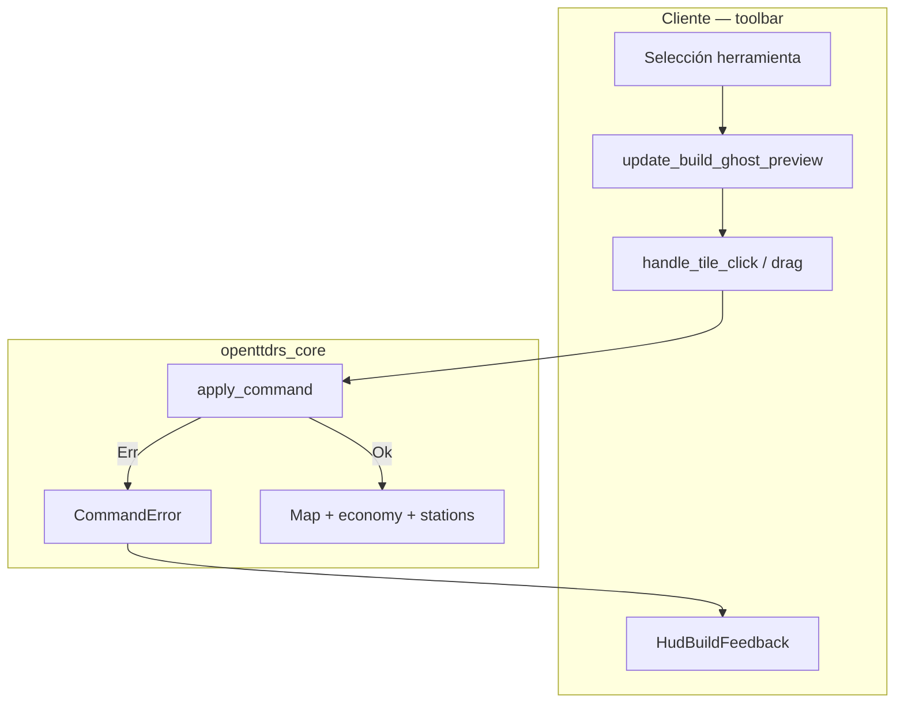
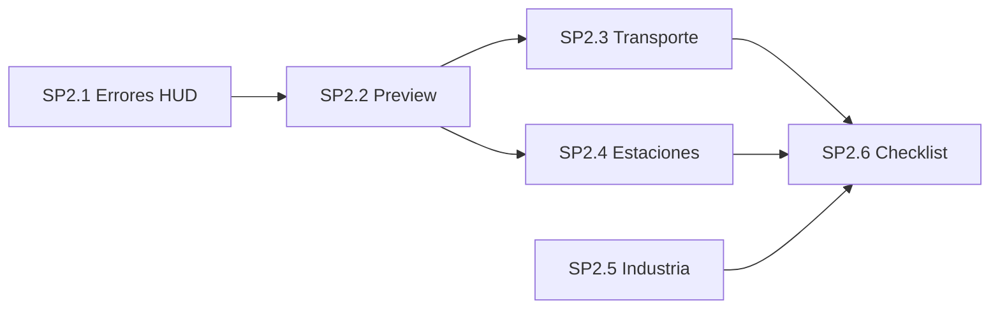

# Plan SP2 — Construcción y herramientas

Documento de planificación tras revisar:

- Cliente: `ui/toolbar/` (`preview/`, `build_input/`, `order_panel/`, `depot_panel/`, `station_panel.rs`).
- Core: `openttdrs_core::command` (`Command`, `CommandError`, `apply_command`).
- Referencia OpenTTD (clon local): `bash scripts/fetch-openttd-reference.sh` → `reference/openttd-upstream/`.

**Prioridad:** alta (hito 0.1 en solitario). **Estado:** **SP2.1–SP2.5 hechos en código/CI**; **SP2.6 pendiente de validación manual** (checklist escrito). Detalle visual de paradas → SP3.

**Documentación asociada**

| Doc | Contenido |
|-----|-----------|
| [SP2_CHECKLIST.md](SP2_CHECKLIST.md) | Checklist manual + automático |
| [SP2_PARADAS_Y_ESTACIONES.md](SP2_PARADAS_Y_ESTACIONES.md) | Bus vs truck vs tren, sprites, conexión carretera |
| [SPRITES_OPENGFX_COMPLETO.md](SPRITES_OPENGFX_COMPLETO.md) §6 | IDs OpenGFX paradas |

---

## 1. Estado real en `main` (post-SP2)

| Área | Estado |
|------|--------|
| Comandos serializables | Hecho |
| Errores tipados + mensajes HUD | Hecho (`command_error_message`, pitido) |
| Preview / ghost | Hecho (`command_would_fail` alineado con `apply_command`) |
| Clic + drag construcción | Hecho |
| Paneles depósito / vehículo / órdenes | Hecho (iniciar, vender, agregar destino, preview ruta) |
| Vía con `TrackBits` al colocar | Hecho |
| Parada bus/camión + boca a carretera | Hecho (`connect_road_stop`) |
| Estación tren (suelo vía + plataforma) | Hecho (gfx 2/3, offsets `station_land.h`) |
| Mapa demo limpio | Hecho (`fill_flat_grass`, `place_clean_demo_transport`, canal puente, túnel) |
| Tests core + cliente preview | Hecho |

**Deuda explícita (SP3, no bloquea SP2)**

- Render `BUILD_A/B/C` en paradas bus/truck → implementado (`PLAN_PARADAS_REMAPCOORDS.md`); validación visual pendiente.
- Pendientes carretera/vía en teselas inclinadas.
- Feedback sonoro/texto: cubierto; pulido UX menor posible en SP4.

---

## 2. Referencia OpenTTD (qué leer, no qué portar entero)

| Herramienta openttdrs | Archivos upstream | Idea portada |
|----------------------|-------------------|---------------|
| Carretera / `RoadBits` | `src/road_cmd.cpp`, `src/road_map.h` | Terreno prohibido, coste, bits en `m5` |
| Vía | `src/rail_cmd.cpp`, `src/rail_map.h` | `TrackBits` en `m5`, refresh vecinos |
| Estación / parada | `src/station_cmd.cpp`, `src/station_map.h` | Adyacencia, tipo, `MakeRoadStop`, plataformas tren |
| Depósito | `src/depot_cmd.cpp` | Orientación, salida a carretera |
| Túnel / puente | `src/tunnelbridge_cmd.cpp` | Eje recto, extremos, coste por tesela |
| Industria | `src/industry_cmd.cpp` | Plantilla / footprint |
| Feedback UI | `src/error.h` | Texto al jugador |

---

## 3. Diagrama — flujo construcción



---

## 4. Tareas escalonadas (resumen de cierre)

| Bloque | Entregable principal | Estado |
|--------|----------------------|--------|
| SP2.1 | Mensajes HUD para todo `CommandError` | Hecho |
| SP2.2 | Preview rojo = `command_would_fail` | Hecho |
| SP2.3 | Carretera, vía, depósito, túnel, puente, demo | Hecho |
| SP2.4 | Paradas, tren, paneles, órdenes | Hecho |
| SP2.5 | Industria preview + errores | Hecho (código + tests colocación) |
| SP2.6 | Checklist + sesión 15 min | Doc hecho; **validación manual pendiente** |

---

## 5. Orden de implementación (histórico)



---

## 6. Comandos útiles

```bash
bash scripts/check.sh ci
cargo run -p openttdrs-client
OTTDMAP_FILE=crates/openttdrs-core/tests/fixtures/sp3_visual_checklist.ottdmap cargo run -p openttdrs-client
OTTDMAP_FILE=tests/fixtures/stationlist-test.ottdmap cargo run -p openttdrs-client
bash scripts/fetch-openttd-reference.sh
```

---

## 7. Criterio de “SP2 hecho”

**Código y CI (SP2.1–SP2.5)**

- [x] Preview coherente (verde/rojo vía `command_would_fail`).
- [x] Mensaje HUD para fallos de `apply_command`.
- [x] Transporte, paradas, tren, industria, paneles de órdenes.
- [x] `bash scripts/check.sh ci` verde.
- [x] Documentación: [SP2_PARADAS_Y_ESTACIONES.md](SP2_PARADAS_Y_ESTACIONES.md), este plan.

**Pendiente para cerrar SP2.6 (no bloquea commits, sí el “SP2 cerrado” formal)**

- [ ] Sesión manual en [SP2_CHECKLIST.md](SP2_CHECKLIST.md) § SP2.6 (procedural + `stationlist-test.ottdmap` + F5/F9).
- [ ] (Opcional) Test de integración preview ↔ `command_would_fail` para industria y resto de herramientas.

Hasta marcar SP2.6, considerar SP2 **casi cerrado**: jugable en desarrollo, falta regresión humana acordada en el plan original.
