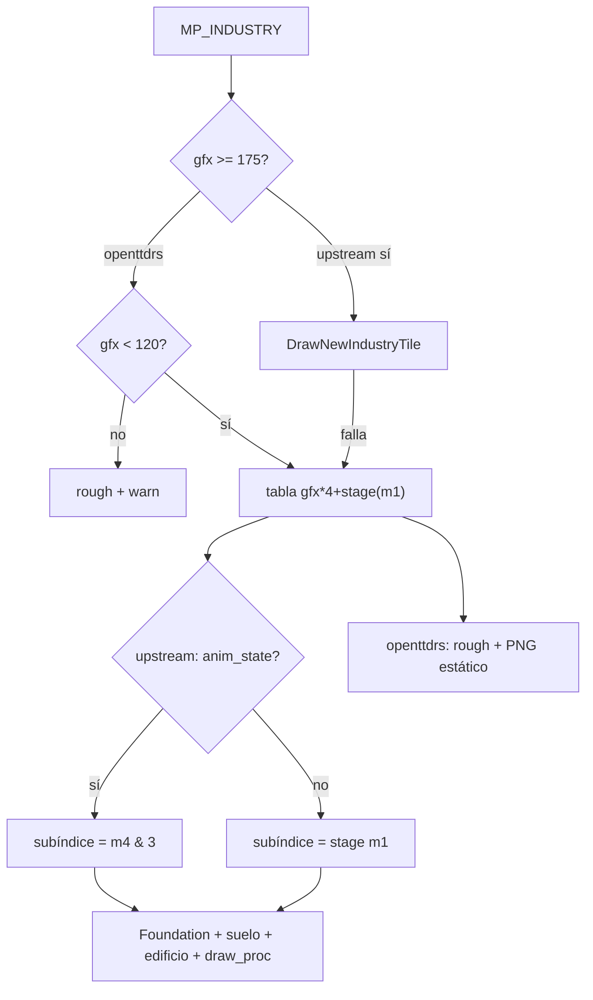

# Roadmap — Paridad 1:1 industrias (OpenTTD → openttdrs)

Documento de **seguimiento** para cerrar la brecha entre el renderer de industrias de
OpenTTD upstream y el cliente Rust. Resume el análisis de `DrawTile_Industry`,
`industry_map.h` e `industry_land.h` frente a `spawn_industry_tile` y `INDUSTRY_GFX_DATA`.

**Estado (2026-05):** paridad **parcial deliberada** en el camino estático
`GetCleanIndustryGfx → _industry_draw_tile_data[gfx*4+stage] → PNG`.
Fuera de alcance inmediato: motor NewGRF completo (`gfx ≥ 175`).

**Relacionado:**

- [archive/PLAN_SP3_CASAS_INDUSTRIAS.md](archive/PLAN_SP3_CASAS_INDUSTRIAS.md) — P1–P6 cerrados (tabla 0–119, estadios obra).
- [INDUSTRIAS_OPENGFX.md](INDUSTRIAS_OPENGFX.md) — rangos gfx y sprites OpenGFX.
- [TILES_Y_SAVEGAMES_OPENTTD.md](TILES_Y_SAVEGAMES_OPENTTD.md) §8 — bytes `m1`–`m6` (revisar nota sobre `m2`).
- [ROADMAP_PARIDAD_VISUAL.md](ROADMAP_PARIDAD_VISUAL.md) — contexto SP3 visual general.
- Upstream: `src/industry_cmd.cpp`, `src/industry_map.h`, `src/table/industry_land.h`
  (copia parcial en `third_party/openttd/industry_land.h`).

---

## 1. Objetivo de paridad

| Nivel | Alcance | Criterio de “hecho” |
|-------|---------|---------------------|
| **A — Vanilla estático** | `gfx 0..174`, tesela terminada, plano, sin `draw_proc` animado | Misma elección de fila + suelo + edificio que OpenTTD en screenshot |
| **B — Vanilla dinámico** | A + `anim_state`, `draw_proc`, fundaciones, agua, paleta | Torres/pozos/chispas/burbujas visibles; pendiente con fundación |
| **C — Datos de mapa** | B + semántica `m2`/`m1`/`m4` alineada con upstream | Agrupación industria y HUD coherentes en saves reales |
| **D — NewGRF** | `gfx ≥ 175`, `DrawNewIndustryTile`, callbacks | Partidas con GRF de industria custom |

Hoy openttdrs está entre **~70 % del nivel A** (solo `gfx 0..119`) y **0 % de D**.

---

## 2. Qué ya coincide

| Pieza | OpenTTD | openttdrs |
|-------|---------|-----------|
| **gfx de tesela (9 bits)** | `GetCleanIndustryGfx`: `m5 \| ((m6>>2)&1)<<8` | Igual en `spawn_industry_tile` / HUD |
| **Etapa de obra** | `m1` bit 7 = terminada; bits 0–1 = stage 0–2 | `industry_construction_stage_from_tile(m1)` |
| **Índice de tabla** | `gfx * 4 + subíndice` | `industry_gfx_draw_index(gfx, stage)` |
| **Capas estáticas** | suelo `s1` + edificio `s2` | `ground_sprite_id` + `sprite_id` |
| **Offsets** | macro `M(dx,dy,sx,sy,...)` | `gen_industry_gfx_data.py` → NFO + PNG |
| **Terminadas gfx 0–119** | fila stage 3 con sprite | **120/120** con sprite en etapa 3 |
| **Sin arte** | omitir capa con `sprite == 0` | omitir capa; rough bajo `MP_INDUSTRY` |
| **Avisos** | (implícito: sin sprite) | `log_industry_gfx_once`, HUD `⚠gfx≥120` / `⚠sin sprite` |

**Nota sobre WARN gfx 14/15:** upstream también usa `s2 = 0` en etapas 0–2 del aserradero
(`industry_land.h` líneas ~108–114). En obra vacía es **paridad correcta**; el WARN
“fallback genérico” solo aparece en builds **debug** al dibujar teselas en construcción.

---

## 3. Pipeline upstream vs cliente

```text
OpenTTD (DrawTile_Industry)
──────────────────────────
  gfx = GetIndustryGfx(tile)          ← traducción NewGRF / subst_id
  if gfx >= 175 → DrawNewIndustryTile (o subst_id → tabla vanilla)
  subíndice = anim_state ? (m4 & 3) : GetIndustryConstructionStage(m1)
  fila = _industry_draw_tile_data[gfx*4 + subíndice]
  DrawFoundation si tileh != FLAT
  suelo (+ agua si SPR_FLAT_WATER + IsTileOnWater)
  suelo/edificio con PaletteTransform + random_colour industria
  if draw_proc 1..5 → overlay animado extra (5 procedimientos)

openttdrs (spawn_industry_tile)
───────────────────────────────
  gfx = GetCleanIndustryGfx (sin traducción)
  if gfx >= 120 → sin fila → rough + warn
  subíndice = solo construction stage desde m1
  rough fijo + 0–2 PNG estáticos si existen
```



---

## 4. Constantes de referencia (upstream)

| Constante | Valor | Significado |
|-----------|-------|-------------|
| `NEW_INDUSTRYTILEOFFSET` | **175** | Primera tesela definida por NewGRF; tabla vanilla = gfx **0..174** |
| `INDUSTRY_COMPLETED` | **3** | Subíndice de fila cuando la obra terminó |
| Filas en `industry_land.h` | **700** | `175 × 4` macros `M()` |
| `INDUSTRY_GFX_TABLE_LEN` (Rust) | **120** | Corte deliberado; **480/700** filas generadas |

**Importante:** el checklist SP3 incluye gfx **120** y **256** a propósito (casos límite).
No son bugs del loader; documentan el hueco entre tabla Rust (120) y upstream (175+).

---

## 5. Campos de mapa — semántica upstream vs openttdrs

Fuente canónica: [OpenTTD `industry_map.h`](https://github.com/OpenTTD/OpenTTD/blob/master/src/industry_map.h).

| Campo | OpenTTD (MP_INDUSTRY) | openttdrs hoy | Gap |
|-------|----------------------|---------------|-----|
| **`m5` + `m6` bit 2** | `GetCleanIndustryGfx` (9 bits) | OK en render | — |
| **`m2`** | **`IndustryID`** (índice de instancia) | Parseado; agrupación usa **`m1`** en bootstrap/panel | **P5** |
| **`m1` bit 7** | obra terminada | OK | — |
| **`m1` bits 0–1** | etapa 0–2 | OK | — |
| **`m1` bits 2–3** | contador construcción (`MakeIndustryTileBigger`) | No simulado | **P6** |
| **`m3`** | random bits (callbacks GRF) | No usado | **P7** |
| **`m4` / `m3hi`** | frame animación (`GetAnimationFrame`) | No usado en índice de tabla | **P2** |
| **`m6` bits 3–5** | triggers random | No usado | **P7** |

La §8 de [TILES_Y_SAVEGAMES_OPENTTD.md](TILES_Y_SAVEGAMES_OPENTTD.md) que atribuye el índice
de industria a **`m1` bits 0–6** está **desactualizada** respecto al upstream actual; conviene
corregirla cuando se implemente **P5**.

---

## 6. Roadmap por prioridad

Orden recomendado: máximo impacto visual / datos con diff acotado primero.

### P1 — Tabla vanilla completa `gfx 0..174` — **pendiente**

**Problema:** faltan **55** tipos de tesela (`gfx 120..174`): trópico, toy factory, toffee,
sugar mine, plastic fountain, etc. El header upstream ya tiene **700** filas `M()`.

**Trabajo:**

1. `scripts/gen_industry_gfx_data.py`: `GFX_COUNT = 175` (o `NEW_INDUSTRYTILEOFFSET`).
2. Regenerar `industry_gfx_data_generated.rs` (**700** entradas).
3. `INDUSTRY_GFX_TABLE_LEN = 175` en `sprites/industry.rs`.
4. Precarga en `render/assets.rs`; auditoría `scripts/audit_sp3_assets.py`.
5. Ampliar fixture checklist y tests (`industry_gfx_status(174)` ≠ OutOfRange).

**Criterio:** gfx 120 del checklist SP3 deja de ser `OutOfRange`; WARN “gfx≥120” solo para
`gfx ≥ 175` o valores NewGRF reales.

**Esfuerzo:** medio (generador + assets PNG faltantes para 120–174).

---

### P2 — Subíndice `anim_state` + frame `m4` — **hecho**

**Problema:** OpenTTD usa `GetAnimationFrame(tile) & 3` cuando `IndustryTileSpec.anim_state`
es true (torres de mina, pozos, chimenea central, etc.). openttdrs siempre usa etapa de obra.

**Trabajo:**

1. Tabla mínima `IndustryTileSpec` (gfx → `anim_state` bool) desde upstream / enum
   `IndustryGraphics` en `industry_map.h`.
2. Leer `m4` (`m3hi` en `.ottdmap`) como frame.
3. Elegir fila: `anim_state ? (m4 & 3) : stage(m1)`.
4. Tests con gfx conocidos (p. ej. `GFX_COAL_MINE_TOWER_ANIMATED = 1`).

**Criterio:** capturas alternan frames en industrias animadas vanilla (sin tile loop aún).

**Esfuerzo:** medio.

---

### P3 — Procedimientos `draw_proc` (1–5) — **hecho**

**Problema:** filas con `p > 0` en `M()` llaman overlays que no están en `s2`.

**Hecho:** `scripts/gen_industry_draw_proc.py` → tablas upstream; spawn +
`IndustryDrawProcPlugin` lee `m3hi` de sim; precarga `INDUSTRY_DRAW_PROC_SPRITE_IDS`.
Sim avanza frames en `advance_industry_tile_animations` (gfx 10/143/162/165/174).

**Criterio:** central gfx 10 muestra chispas; burbujas/toy factory visibles cuando la
tabla gfx ≥175 o tiles en mapa de QA.

**Nota:** tabla `INDUSTRY_GFX` actual = 131 filas; solo gfx **10** tiene `draw_proc`
in-table. Lookup extendido cubre 143/162/165/174.

---

### P4 — Fundaciones, agua, paleta — **pendiente**

**Problema:** upstream antes del suelo:

- `DrawFoundation(FOUNDATION_LEVELED)` en pendiente.
- `DrawWaterClassGround` si suelo base es agua y tesela está en agua.
- `GroundSpritePaletteTransform` / `SpriteLayoutPaletteTransform` con
  `GetColourPalette(ind->random_colour)`.
- Transparencia `TO_INDUSTRIES`.

**Trabajo:** integrar con pipeline de pendiente SP3 (`tileh`, rough slopes) y recolor
industrial (`PALETTE_MODIFIER_COLOUR` en sprites gfx 120+).

**Criterio:** industria en pendiente y oil rig / refinería costera alineadas visualmente.

**Esfuerzo:** medio–alto (acopla SP3 pendiente + paletas 8bpp).

---

### P5 — Semántica `m2` = IndustryID — **hecho**

**Problema:** `place_industries`, panel de industria y docs agrupan por **`m1`**; upstream
usa **`m2`** para el índice de instancia.

**Trabajo:**

1. Agrupar componentes por `m2` (con fallback a `m1` solo si export legacy lo exige).
2. Corregir §8 de `TILES_Y_SAVEGAMES_OPENTTD.md`.
3. Tests con `.ottdmap` real: mismas industrias que OpenTTD tras parse.

**Criterio:** dos plantas adyacentes con distinto `m2` no se fusionan; misma planta sí.

**Esfuerzo:** bajo–medio.

---

### P6 — Simulación de obra en mapa — **pendiente**

**Problema:** upstream avanza obra con `MakeIndustryTileBigger`, contador `m1` bits 2–3,
sonidos y triggers; openttdrs solo **lee** el stage del save.

**Trabajo:** hook en `GameState::step` o comando de construcción de industria sandbox.

**Criterio:** industria construida in-game pasa stages 0→3 en mapa como OpenTTD.

**Esfuerzo:** medio (gameplay SP1/SP2, no solo render).

---

### P7 — Tile loop y animación temporal — **hecho (parcial)**

**Problema:** `AnimateTile_Industry`, `TileLoop_Industry`, mutación de `gfx` en pozos /
plastic fountain, sonidos.

**Hecho:** `advance_industry_tile_animations` en `sim_step` — torres `anim_state` (gfx
1/48/88) ciclan `m3hi & 3`; pozos (gfx 30–32) avanzan frame y rotan gfx. El render lee
`m3hi`/gfx vivo del mapa en `IndustryBuildingAnimPlugin`.

**Pendiente:** `draw_proc` animaciones (P3), fuente plástico (gfx ≥148), sonidos,
`MakeIndustryTileBigger` (P6), burbujas tile loop.

**Criterio:** pozo de petróleo y torre de mina cambian frame con sim en marcha.

**Esfuerzo:** alto (resto en P3/P6).

---

### P8 — NewGRF industria (`gfx ≥ 175`) — **backlog**

**Problema:** rama `DrawNewIndustryTile`, `GetTranslatedIndustryTileID`, `subst_id`,
callbacks (`CBID_INDTILE_DRAW_FOUNDATIONS`, etc.).

**Trabajo:** subconjunto mínimo de `newgrf_industrytiles.h` o rechazo explícito documentado.

**Criterio:** partidas solo-vanilla no necesitan P8; partidas GRF requieren sustituto o
implementación GRF.

**Esfuerzo:** muy alto — fuera del cierre 0.1 salvo objetivo explícito.

---

### P9 — Higiene de logs (opcional, bajo impacto)

**Problema:** WARN “fallback genérico” en debug para gfx 14/15 en obra cuando upstream
también tiene `s2 = 0`.

**Trabajo:** en `log_industry_gfx_once`, no avisar si stage &lt; 3 y fila vacía es la
esperada (sprite 0 en upstream para esa etapa).

**Criterio:** `cargo run` con checklist SP3 sin WARN espurios en aserradero en obra.

**Esfuerzo:** bajo.

---

## 7. Matriz de estado

| ID | Tema | Estado | Bloquea |
|----|------|--------|---------|
| P1 | Tabla 0..174 | pendiente | WARN gfx 120–174, climas extendidos |
| P2 | anim_state + m4 | pendiente | Torres/pozos congelados |
| P3 | draw_proc 1–5 | hecho | gfx≥131: lookup extendido |
| P4 | Fundación/agua/paleta | pendiente | Pendiente/costa |
| P5 | m2 IndustryID | pendiente | Agrupación saves reales |
| P6 | Obra simulada | pendiente | Construcción in-game |
| P7 | Tile loop | parcial | Torres/pozos en sim; P3/P6 resto |
| P8 | NewGRF ≥175 | backlog | GRF custom |
| P9 | Logs obra vacía | opcional | Ruido debug |
| — | Tabla 0..119 + estadios m1 | **hecho** (SP3 P5) | — |
| — | gfx9 + rough + HUD warn | **hecho** (SP3 P3) | — |

---

## 8. Comandos útiles

```bash
# Regenerar tabla (tras cambiar GFX_COUNT)
python3 scripts/gen_industry_gfx_data.py

# Auditoría PNG industria
python3 scripts/audit_sp3_assets.py

# Checklist visual (incluye gfx 120, 256 en y=10)
OTTDMAP_FILE=crates/openttdrs-core/tests/fixtures/sp3_visual_checklist.ottdmap \
  cargo run -p openttdrs-client

# Tests industria en cliente
cargo test -p openttdrs-client industry_gfx
```

---

## 9. Próximo PR sugerido

**P1 — ampliar tabla a gfx 0..174:** un solo eje de cambio (generador + constantes + assets +
tests), cierra la mayoría de WARN del checklist SP3 sin abrir NewGRF.

Después encadenar **P2** (anim_state) y **P5** (m2) en PRs separados reviewables.
