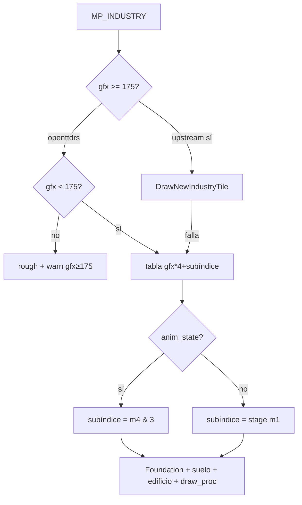

# Roadmap — Paridad 1:1 industrias (OpenTTD → openttdrs)

Documento de **seguimiento** para cerrar la brecha entre el renderer de industrias de
OpenTTD upstream y el cliente Rust. Resume el análisis de `DrawTile_Industry`,
`industry_map.h` e `industry_land.h` frente a `spawn_industry_tile` y `INDUSTRY_GFX_DATA`.

**Estado (2026-07):** nivel **A (vanilla estático)** cerrado para `gfx 0..174`
(`INDUSTRY_GFX_TABLE_LEN = 175`, 700 filas). Fuera de alcance inmediato: motor NewGRF
completo (`gfx ≥ 175`).

**Relacionado:**

- [archive/PLAN_SP3_CASAS_INDUSTRIAS.md](archive/PLAN_SP3_CASAS_INDUSTRIAS.md) — P1–P6 históricos (tabla 0–119 → extendida a 0–174).
- [INDUSTRIAS_OPENGFX.md](INDUSTRIAS_OPENGFX.md) — rangos gfx y sprites OpenGFX.
- [TILES_Y_SAVEGAMES_OPENTTD.md](TILES_Y_SAVEGAMES_OPENTTD.md) §8 — bytes `m1`–`m6`.
- [ROADMAP_PARIDAD_VISUAL.md](ROADMAP_PARIDAD_VISUAL.md) — contexto SP3 visual general.
- Upstream: `src/industry_cmd.cpp`, `src/industry_map.h`, `src/table/industry_land.h`
  (copia parcial en `third_party/openttd/industry_land.h`).

---

## 1. Objetivo de paridad

| Nivel | Alcance | Criterio de “hecho” |
|-------|---------|---------------------|
| **A — Vanilla estático** | `gfx 0..174`, tesela terminada, plano, sin `draw_proc` animado | Misma elección de fila + suelo + edificio que OpenTTD en screenshot |
| **B — Vanilla dinámico** | A + `anim_state`, `draw_proc`, fundaciones, agua, paleta | Torres/pozos/chispas/burbujas visibles; pendiente con fundación |
| **C — Datos de mapa** | B + semántica `m2`/`m1`/`m4` alineada con upstream | Agrupación industria y HUD coherentes en saves reales |
| **D — NewGRF** | `gfx ≥ 175`, `DrawNewIndustryTile`, callbacks | Partidas con GRF de industria custom |

Hoy openttdrs: **nivel A ✅**; **B parcial** (P2/P3/P4 hechos en código); **C/D** pendientes.

---

## 2. Qué ya coincide

| Pieza | OpenTTD | openttdrs |
|-------|---------|-----------|
| **gfx de tesela (9 bits)** | `GetCleanIndustryGfx`: `m5 \| ((m6>>2)&1)<<8` | Igual en `spawn_industry_tile` / HUD |
| **Etapa de obra** | `m1` bit 7 = terminada; bits 0–1 = stage 0–2 | `industry_construction_stage_from_tile(m1)` |
| **Índice de tabla** | `gfx * 4 + subíndice` | `industry_gfx_draw_index(gfx, stage)` |
| **Capas estáticas** | suelo `s1` + edificio `s2` | `ground_sprite_id` + `sprite_id` |
| **Offsets** | macro `M(dx,dy,sx,sy,...)` | `gen_industry_gfx_data.py` → NFO + PNG |
| **Terminadas gfx 0–174** | fila stage 3 | **175** tipos en tabla (`INDUSTRY_GFX_DATA` 700 filas) |
| **Sin arte** | omitir capa con `sprite == 0` | omitir capa; rough bajo `MP_INDUSTRY` |
| **Avisos** | (implícito: sin sprite) | `log_industry_gfx_once`, HUD `⚠gfx≥175` / `⚠sin sprite` |
| **anim_state + m4** | frame animación | `industry_gfx_table_subindex` |
| **draw_proc 1–5** | overlays animados | `IndustryDrawProcPlugin` |

**Nota sobre WARN gfx 14/15:** upstream también usa `s2 = 0` en etapas 0–2 del aserradero
(`industry_land.h`). En obra vacía es **paridad correcta**.

---

## 3. Pipeline upstream vs cliente

```text
OpenTTD (DrawTile_Industry)
──────────────────────────
  gfx = GetIndustryGfx(tile)          ← traducción NewGRF / subst_id
  if gfx >= 175 → DrawNewIndustryTile (o subst_id → tabla vanilla)
  subíndice = anim_state ? (m4 & 3) : GetIndustryConstructionStage(m1)
  fila = _industry_draw_tile_data[gfx*4 + subíndice]
  DrawFoundation si tileh != FLAT
  suelo (+ agua si SPR_FLAT_WATER + IsTileOnWater)
  suelo/edificio con PaletteTransform + random_colour industria
  if draw_proc 1..5 → overlay animado extra (5 procedimientos)

openttdrs (spawn_industry_tile)
───────────────────────────────
  gfx = GetCleanIndustryGfx (sin traducción NewGRF)
  if gfx >= 175 → rough + warn (OutOfRange)
  subíndice = anim_state ? (m4 & 3) : stage(m1)
  rough + PNG estáticos / draw_proc / fundación según fila
```



---

## 4. Constantes de referencia (upstream)

| Constante | Valor | Significado |
|-----------|-------|-------------|
| `NEW_INDUSTRYTILEOFFSET` | **175** | Primera tesela definida por NewGRF; tabla vanilla = gfx **0..174** |
| `INDUSTRY_COMPLETED` | **3** | Subíndice de fila cuando la obra terminó |
| Filas en `industry_land.h` | **700** | `175 × 4` macros `M()` |
| `INDUSTRY_GFX_TABLE_LEN` (Rust) | **175** | Tabla completa vanilla |

El checklist SP3 incluye gfx **120** (en tabla) y **256** (NewGRF / OutOfRange) a propósito.

---

## 5. Campos de mapa — semántica upstream vs openttdrs

Fuente canónica: [OpenTTD `industry_map.h`](https://github.com/OpenTTD/OpenTTD/blob/master/src/industry_map.h).

| Campo | OpenTTD (MP_INDUSTRY) | openttdrs hoy | Gap |
|-------|----------------------|---------------|-----|
| **`m5` + `m6` bit 2** | `GetCleanIndustryGfx` (9 bits) | OK en render | — |
| **`m2`** | **`IndustryID`** (índice de instancia) | Parseado; agrupación usa **`m1`** en bootstrap/panel | **P5** |
| **`m1` bit 7** | obra terminada | OK | — |
| **`m1` bits 0–1** | etapa 0–2 | OK | — |
| **`m1` bits 2–3** | contador construcción (`MakeIndustryTileBigger`) | No simulado | **P6** |
| **`m3`** | random bits (callbacks GRF) | No usado | **P7** |
| **`m4` / `m3hi`** | frame animación (`GetAnimationFrame`) | Usado si `anim_state` | — |
| **`m6` bits 3–5** | triggers random | No usado | **P7** |

---

## 6. Roadmap por prioridad

### P1 — Tabla vanilla completa `gfx 0..174` — **hecho**

`scripts/gen_industry_gfx_data.py` con `GFX_COUNT = 175`; `INDUSTRY_GFX_DATA` 700 entradas;
tests `gfx_120_through_130_in_table`, `sp3_visual_checklist_industry_gfx_in_table`.
HUD: `⚠gfx≥175` solo fuera de tabla.

### P2 — Subíndice `anim_state` + frame `m4` — **hecho**

### P3 — Procedimientos `draw_proc` (1–5) — **hecho**

### P4 — Fundación / agua / paleta — **parcial**

Fundación y agua en `land.rs`; transparencia `TO_INDUSTRIES` / paleta company en gfx altos: polish.

### P5 — `m2` IndustryID — **pendiente**

### P6 — Obra simulada — **pendiente**

### P7 — Tile loop / random — **parcial**

### P8 — NewGRF ≥175 — **backlog**

### P9 — Logs obra vacía — **opcional**

---

## 7. Matriz de estado

| ID | Tema | Estado | Bloquea |
|----|------|--------|---------|
| P1 | Tabla 0..174 | **hecho** | — |
| P2 | anim_state + m4 | **hecho** | — |
| P3 | draw_proc 1–5 | **hecho** | — |
| P4 | Fundación/agua/paleta | parcial | Pendiente/costa edge |
| P5 | m2 IndustryID | pendiente | Agrupación saves reales |
| P6 | Obra simulada | pendiente | Construcción in-game |
| P7 | Tile loop | parcial | Random GRF |
| P8 | NewGRF ≥175 | backlog | GRF custom |
| P9 | Logs obra vacía | opcional | Ruido debug |

---

## 8. Comandos útiles

```bash
# Regenerar tabla (tras cambiar GFX_COUNT)
python3 scripts/gen_industry_gfx_data.py

# Auditoría PNG industria
python3 scripts/audit_sp3_assets.py

# Checklist visual (incluye gfx 120, 256 en y=10)
OTTDMAP_FILE=crates/openttdrs-core/tests/fixtures/sp3_visual_checklist.ottdmap \
  cargo run -p openttdrs-client

# Tests industria en cliente
cargo test -p openttdrs-client industry_gfx
cargo test -p openttdrs-client sp3_visual_checklist_industry_gfx_in_table
```

---

## 9. Próximo PR sugerido

Fuera del cierre SP3 visual: **P5 (`m2` IndustryID)** o polish **waypoints**
([HANDOFF_WAYPOINTS_RAIL.md](HANDOFF_WAYPOINTS_RAIL.md)). NewGRF industrias = P8 backlog.
