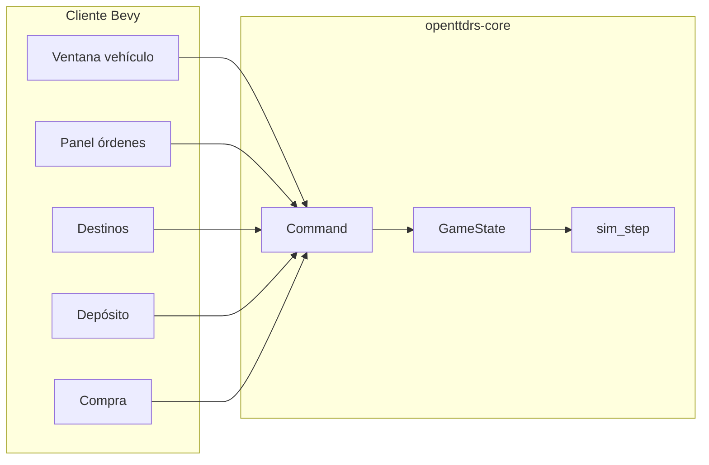

# Menús de flota y UI — handoff para mantenimiento

Documento de referencia para **humanos e IAs** que amplíen la paridad de menús con OpenTTD.
Describe qué está implementado (Sprints A–E parcial), dónde vive el código, qué comandos existen y qué falta.

> **Alcance histórico:** este archivo conserva el detalle técnico de flota.
> La prioridad canónica de toolbar, menús, directorios y todas las familias de
> ventanas está en
> [ROADMAP_PARIDAD_UI_GLOBAL.md](ROADMAP_PARIDAD_UI_GLOBAL.md).
> Ante discrepancias de estado, verificar el código y usar el roadmap global.

**Relacionado:** [PARIDAD_OPENTTD.md](PARIDAD_OPENTTD.md), [FLUJO_MAPA_Y_CLIENTE.md](FLUJO_MAPA_Y_CLIENTE.md), [INFORME_ARQUITECTURA_OPENTTD.md](INFORME_ARQUITECTURA_OPENTTD.md) (widgets originales en `OpenTTD/src/`).

**Última actualización:** junio 2026 — Sprints A–E+ (horario + autoreemplazo).

---

## 1. Resumen ejecutivo

| Área | Paridad vs OpenTTD | Estado |
|------|-------------------|--------|
| Ventana vehículo (clic en tren/bus/camión) | ~65 % | Sprint E |
| Panel de órdenes | ~45 % | Sprint C |
| Ventana depósito | ~50 % | Sprint D + E |
| Ventana compra | ~35 % | previo + preview sprite |
| Ventana destinos | Extra (no existe en OTTD tal cual) | útil para MVP |

**Principio de diseño:** toda acción jugable pasa por `Command` en `openttdrs-core` y `apply_command`. La UI Bevy solo muta `SimWorld.state` vía comandos (salvo centrar cámara, que es cliente puro).

---

## 2. Mapa de archivos (dónde tocar qué)

### Core (`openttdrs-core`)

| Archivo | Responsabilidad |
|---------|-----------------|
| [`vehicle.rs`](../crates/openttdrs-core/src/vehicle.rs) | `Vehicle`, `VehicleOrder`, `display_name()`, `append_order()` |
| [`depot.rs`](../crates/openttdrs-core/src/depot.rs) | `nearest_depot_tile()` — Manhattan, sin pathfinding |
| [`timetable.rs`](../crates/openttdrs-core/src/timetable.rs) | Presets wait/travel, `TimetableMode` |
| [`autoreplace.rs`](../crates/openttdrs-core/src/autoreplace.rs) | Reglas autoreemplazo, `try_autoreplace_vehicle` |
| [`vehicle_group.rs`](../crates/openttdrs-core/src/vehicle_group.rs) | Grupos de flota (F0) |
| [`shared_orders.rs`](../crates/openttdrs-core/src/shared_orders.rs) | Pool órdenes compartidas (F7) |
| [`command/types.rs`](../crates/openttdrs-core/src/command/types.rs) | Enum `Command`, `CommandError` |
| [`command/vehicles.rs`](../crates/openttdrs-core/src/command/vehicles.rs) | Lógica de compra, venta, órdenes, rename, depósito masivo |
| [`command/apply.rs`](../crates/openttdrs-core/src/command/apply.rs) | Enrutado de comandos |
| [`save.rs`](../crates/openttdrs-core/src/save.rs) | JSON versionado — **v7** = horario/autoreemplazo; **v6** = `VehicleOrder::Depot`; **v5** = `Vehicle::name` |
| [`station.rs`](../crates/openttdrs-core/src/station.rs) | `resolve_order_destination()` — destino real de una orden |

### Cliente (`openttdrs-client`)

| Archivo | Responsabilidad |
|---------|-----------------|
| [`ui/vehicle_window.rs`](../crates/openttdrs-client/src/ui/vehicle_window.rs) | Ventana al clic en vehículo del mapa |
| [`ui/toolbar/order_panel/`](../crates/openttdrs-client/src/ui/toolbar/order_panel/) | Panel flotante de órdenes (setup, handlers, sync) |
| [`ui/destination_window.rs`](../crates/openttdrs-client/src/ui/destination_window.rs) | Lista de destinos + «Elegir en mapa» |
| [`ui/toolbar/depot_panel.rs`](../crates/openttdrs-client/src/ui/toolbar/depot_panel.rs) | Ventana depósito |
| [`ui/buy_window.rs`](../crates/openttdrs-client/src/ui/buy_window.rs) | Compra desde depósito |
| [`ui/toolbar/mod.rs`](../crates/openttdrs-client/src/ui/toolbar/mod.rs) | `OrderEditState`, reexportaciones |
| [`ui/toolbar/build_input/click.rs`](../crates/openttdrs-client/src/ui/toolbar/build_input/click.rs) | Clic mapa → vehículo / órdenes |
| [`ui/timetable_window.rs`](../crates/openttdrs-client/src/ui/timetable_window.rs) | Ventana horario (F4) |

### OpenTTD original (referencia)

| Ventana OTTD | Archivos |
|--------------|----------|
| Vehicle view | `OpenTTD/src/vehicle_gui.cpp`, `widgets/vehicle_widget.h` |
| Orders | `OpenTTD/src/order_gui.cpp`, `widgets/order_widget.h` |
| Depot | `OpenTTD/src/depot_gui.cpp` |
| Build vehicle | `OpenTTD/src/build_vehicle_gui.cpp` |

---

## 3. Comandos de flota (API de simulación)

Todos en `Command` — usar siempre `apply_command(&mut state, &cmd)`.

### Órdenes (Sprint A)

| Comando | Efecto | Notas |
|---------|--------|-------|
| `SetVehicleOrderList(id, orders)` | Reemplaza lista completa | **Reinicia** `current_order` a 0 |
| `SetVehicleOrders(id, tiles)` | Legacy: solo teselas | Igual reinicio |
| `RemoveVehicleOrderAt { vehicle_id, index }` | Borra una orden | Ajusta `current_order` |
| `SkipVehicleOrder(id)` | Salta orden actual | Avanza índice circular |
| `ToggleVehicleOrderFullLoad { vehicle_id, index }` | Flag en estación | Error si no es `Station` |
| `ToggleVehicleOrderNoUnload { vehicle_id, index }` | Flag en estación | Idem |

### Flota y depósito (Sprint B)

| Comando | Efecto | Notas |
|---------|--------|-------|
| `AppendGotoNearestDepot(id)` | Añade `VehicleOrder::Tile(depot)` al final | Manhattan; no interrumpe orden actual |
| `RenameVehicle { vehicle_id, name }` | Nombre custom | `None`/vacío quita nombre; máx 32 chars |
| `SetDepotVehiclesRunning { depot_pos, running }` | Parar/arrancar todos en tesela | Solo vehículos con `pos == depot_pos` |

### Refit y detalles (Sprint E)

| Comando | Efecto | Notas |
|---------|--------|-------|
| `RefitVehicle { vehicle_id, cargo }` | Cambia `Vehicle::cargo_type` | Solo en depósito, sin carga a bordo; tipos según motor |

### Horario y autoreemplazo (Sprint E+)

| Comando | Efecto | Notas |
|---------|--------|-------|
| `ToggleVehicleTimetable(id)` | Activa/desactiva horario del vehículo | |
| `CycleVehicleOrderWait { vehicle_id, index }` | Cicla espera en parada (0→30→60→120→300 ticks) | Solo estación/depósito |
| `CycleVehicleOrderTravel { vehicle_id, index }` | Cicla viaje mínimo hacia la orden | Presets en `timetable.rs` |
| `SetAutoReplaceRule { from_engine_id, to_engine_id }` | Regla global en `GameState` | Mismo tipo de vehículo |
| `ClearAutoReplaceRule { from_engine_id }` | Quita regla | |
| `ToggleAutoReplaceRule { from_engine_id }` | Activa/desactiva regla | |

Autoreemplazo automático al parar en depósito (sin carga); respeta fondos y disponibilidad por año.

### Ya existían

| Comando | Uso en UI |
|---------|-----------|
| `ToggleVehicleRunning(id)` | Ventana vehículo, panel órdenes, fila depósito |
| `SellVehicle(id)` | Ventana vehículo, fila depósito (solo en depósito) |
| `BuildVehicleAtDepot(tile, engine_id)` | Ventana compra |
| `CloneVehicleOrders { from, to }` | Copiar órdenes (depósito: origen = seleccionado) |
| `CloneVehicleAtDepot { source_vehicle_id, depot_pos }` | Compra copia (motor + órdenes) |
| `SellAllVehiclesAtDepot(depot_pos)` | Vende todos los vehículos en el depósito |

### Errores nuevos

- `OrderIndexOutOfRange` — índice inválido o sin selección
- `OrderFlagNotApplicable` — flags solo en `VehicleOrder::Station`
- `DepotNotFound` — sin depósito compatible en mapa
- `VehicleNameTooLong` — más de `MAX_VEHICLE_NAME_CHARS` (32)
- `RefitNotAllowed` — no en depósito, carga a bordo o tipo incompatible

---

## 4. Modelo de datos

### `VehicleOrder` (core)

```rust
Station { station, full_load, no_unload }
Waypoint { waypoint }
Tile(TileCoord)  // depósito, tesela suelta
```

La simulación respeta `full_load` / `no_unload` en `sim_step.rs` y `vehicle.rs` (`advance_after_loading`, etc.).

### `Vehicle::name` (save v5)

- Campo opcional `Option<String>`.
- `display_name()` → nombre custom o `"<modelo> #<id>"`.
- Migración v4→v5: no-op (`serde(default)`).

### Estado UI del cliente

| Recurso | Campos clave |
|---------|----------------|
| `OrderEditState` | `vehicle_id`, `orders` (cache UI), `selected_slot`, `picking_destination` |
| `VehicleWindowState` | `vehicle_id`, `rename_editing` |
| `DepotPanelState` | `depot_pos`, `selected_vehicle` |
| `DestinationPickerState` | `open` |

**Importante:** `order_state.orders` es copia local; tras cada comando exitoso conviene `refresh_orders_from_sim()` (ver `handlers.rs`) o `open_order_edit_for_vehicle()`.

---

## 5. UI implementada — detalle por ventana

### 5.1 Ventana vehículo (`FloatingWindowId::Vehicle`)

**Abrir:** clic en vehículo del mapa (no en modo herramienta Órdenes).

| Botón | Acción |
|-------|--------|
| Iniciar/Detener | `ToggleVehicleRunning` |
| Órdenes | Abre panel órdenes |
| Depósito | `AppendGotoNearestDepot` + refresca panel |
| Ir a orden | Centra cámara en destino de orden **actual** (`resolve_order_destination`) |
| Centrar | Centra cámara en posición del vehículo |
| Renombrar | Muestra fila `EditableText`; Guardar / Enter → `RenameVehicle` |
| Vender | `SellVehicle` (solo si está en depósito) |

**Sistemas Bevy:** `handle_vehicle_window_buttons`, `handle_vehicle_rename_buttons`, `vehicle_window_rename_keyboard`, `vehicle_window_rename_editable_keyboard`, `sync_vehicle_window`.

### 5.2 Panel órdenes (`OrderPanelRoot`)

**Abrir:** botón Órdenes en ventana vehículo, fila depósito, herramienta Órdenes del toolbar.

| Control | Acción |
|---------|--------|
| Clic en fila | Selecciona orden (`selected_slot`) — borde azul |
| Fila dorada | Orden **activa** (`vehicle.current_order`) |
| Agregar destino | Abre `destination_window` |
| Saltar | `SkipVehicleOrder` |
| Borrar | `RemoveVehicleOrderAt` en fila seleccionada |
| Carga compl. / No descargar | Toggles en fila seleccionada (solo estación) |
| Quitar última / Vaciar lista | Pop última / `SetVehicleOrders([])` |

**Límite:** 10 filas (`ORDER_PANEL_ROWS`). OpenTTD ~64 con scroll — ver Sprint C.

**Gotcha Bevy:** botones y filas comparten `Button`; handlers usan `Without<OrderPanelRow>` en botones para evitar conflicto de queries.

### 5.3 Ventana destinos

Lista estaciones, waypoints y depósitos de vía + «Elegir en mapa». No es equivalente al dropdown «Ir a» de OpenTTD pero complementa el panel.

### 5.4 Ventana depósito

| Control | Acción |
|---------|--------|
| Fila vehículo | Selecciona + abre panel órdenes |
| Órdenes / Iniciar / Vender | Por fila |
| Nuevos vehículos | Abre compra |
| Clonar | `CloneVehicleAtDepot` (vehículo seleccionado o primero) |
| Vender todo | `SellAllVehiclesAtDepot` |
| Centrar | `tile_camera_world_pos(depot_pos)` — solo cliente |
| Parar todos / Arrancar todos | `SetDepotVehiclesRunning` |

### 5.5 Ventana compra

Lista engines con filtros (bus/camión), orden (nombre/precio/vel./año), preview por locomotora.

---

## 6. Flujo de datos (diagrama)



---

## 7. Paridad OpenTTD — gaps priorizados

### Hecho (Sprints A–E parcial)

- [x] Seleccionar y borrar orden concreta
- [x] Flags carga completa / no descargar (UI)
- [x] Saltar orden
- [x] Vender desde depósito
- [x] Ir a depósito más cercano (añade orden)
- [x] Parar/arrancar todos en depósito
- [x] Renombrar vehículo
- [x] Centrar en depósito / destino de orden actual
- [x] Reordenar órdenes (Subir/Bajar)
- [x] Scroll / hasta 32 órdenes visibles
- [x] Órdenes `VehicleOrder::Depot` con parada al llegar
- [x] Dar la vuelta al tren
- [x] Forzar paso en señal (trenes)
- [x] Clonar vehículo completo en depósito (`CloneVehicleAtDepot`)
- [x] Vender todo en depósito (`SellAllVehiclesAtDepot`)
- [x] Filtros y orden en ventana de compra
- [x] Sprites de locomotora por `train_image_index` (lógica + 5 arrays en Rust)
- [x] **Paridad visual** locomotoras: extraer PNG por grupo OpenGFX (`extract_train_vehicle_sprites.py`)
- [x] **Refit** de tipo de carga en depósito (`RefitVehicle`)
- [x] **Horario** por orden (espera + viaje mínimo, `ToggleVehicleTimetable`)
- [x] **Autoreemplazo** en depósito (`SetAutoReplaceRule` + sim automática)
- [x] **Ventana vehículo** ampliada (detalles: coste, fiabilidad, tipo carga, posición)
- [x] **Copiar órdenes** entre vehículos del depósito (origen = seleccionado)

### Sprint E+ — cerrado (MVP)

- [x] Horario: espera/viaje mínimo, presets, sim básica
- [x] Autoreemplazo global en depósito

Ver [§ Sprints F0–F8](#13-sprints-f0f8--paridad-timetable-y-autoreemplazo) para el resto de paridad.

---

## 13. Sprints F0–F8 — paridad timetable y autoreemplazo

**Orden de ejecución:** F0 → (F1 ∥ F2) → F4 → F5 → F3 → F7 → F6 → F8

| Sprint | Objetivo | Save | Criterio done |
|--------|----------|------|---------------|
| **F0** | Edad vehículo + grupos planos | v8 | `build_tick`, `VehicleGroup`, asignar desde depósito |
| **F1** | Timetable retraso + espera al salir depósito | v8 | `timetable_lateness` visible en panel |
| **F2** | Autorenew + reemplazo masivo depósito | v8 | `only_when_old`, `DepotMassAutoreplace` |
| **F4** | Ventana timetable dedicada | v8 | `timetable_window.rs`, editar wait/travel |
| **F5** | Autofill horario | v8 | Medición de ciclo rellena tiempos |
| **F3** | Autoreemplazo por grupo | v8 | Regla con `group_id` |
| **F7** | Pool órdenes compartidas | v9 | Editar pool actualiza enlazados |
| **F6** | Órdenes condicionales | v10 | Salto por % carga |
| **F8** | Drag/reorden en depósito | — | Reorden visual de filas |

**Archivos previstos:** `vehicle_group.rs`, `shared_orders.rs`, `timetable.rs`, `autoreplace.rs`, `ui/timetable_window.rs`.

**Referencia OpenTTD:** `timetable_gui.cpp`, `autoreplace_gui.cpp`, `group_cmd.cpp`, `order_cmd.cpp`.

---

## 8. Cómo extender sin romper nada

### Añadir un botón de flota

1. Definir `Command` en `command/types.rs` + mensaje en `command_error_message`.
2. Implementar en `command/vehicles.rs` (o módulo adecuado).
3. Registrar en `apply.rs` (`apply_vehicle_command` + `command_modifies_map` si toca mapa).
4. Añadir `None` en `preview.rs` si no necesita preview de construcción.
5. Botón en UI + handler que llame `apply_command`.
6. Test en `command/tests/`.
7. Actualizar **este documento**.

### Preservar `current_order` al editar lista

**No usar** `SetVehicleOrderList` para borrar una orden o togglear flags — usar comandos dedicados (patrón Sprint A) o implementar `replace_vehicle_orders` que preserve índice.

### Centrar cámara

```rust
use crate::camera::tile_camera_world_pos;
let world = tile_camera_world_pos(&sim.state.map, tile);
transform.translation.x = world.x;
transform.translation.y = world.y;
```

### Renombrado con teclado

Patrón copiado de `ui/save_window/systems.rs`: `EditableText` + `vehicle_window_rename_editable_keyboard` (Bevy 0.19 no tiene plugin de input global para UI).

### Límite de sistemas en tupla Bevy

Máx ~20 sistemas por `.add_systems((...))`. Si falla `in_set` / `method not found`, dividir en dos `.add_systems` o fusionar handlers (ej. selección de fila + botones en `handle_order_panel_buttons`).

### Conflictos de query (B0001 / B0002)

- No mezclar `Res` + `ResMut` del mismo recurso en un sistema.
- Dos queries `Interaction` en botones → `ParamSet` o filtros `Without<Component>`.

---

## 9. Tests relevantes

| Test | Archivo |
|------|---------|
| `remove_vehicle_order_at_adjusts_current_order` | `command/tests/rail.rs` |
| `skip_vehicle_order_advances_current` | idem |
| `toggle_full_load_on_station_order` | idem |
| `append_goto_nearest_depot_adds_depot_order` | idem |
| `rename_vehicle_stores_trimmed_name` | idem |
| `set_depot_vehicles_running_toggles_all_in_tile` | idem |
| `move_vehicle_order_swaps_and_tracks_current` | idem |
| `toggle_depot_stop_on_depot_order` | idem |
| `turn_around_vehicle_reverses_train_heading` | idem |
| `clone_vehicle_at_depot_copies_engine_and_orders` | `command/tests/rail.rs` |
| `sell_all_vehicles_at_depot_empties_depot` | idem |
| `engines_for_depot_purchase_filters_by_year_and_kind` | `engine.rs` |
| `nearest_depot_*` | `depot.rs` |
| Save v6 roundtrip + migración v5→v6 depósito | `save.rs` |

Ejecutar: `cargo test -p openttdrs-core` y `cargo clippy -p openttdrs-core -p openttdrs-client -- -D warnings`.

---

## 10. Limitaciones conocidas (intencionales en MVP)

| Tema | Comportamiento actual | OpenTTD |
|------|----------------------|---------|
| Depósito más cercano | Distancia Manhattan en grilla | Pathfinding + tipo de depósito |
| Goto depósito | Añade al **final** de la lista | Puede insertar o mandar ya |
| `SetVehicleOrderList` | Reinicia orden activa a 0 | Preserva contexto con edición fina |
| Renombrar | Solo desde ventana vehículo | También depósito, lista global |
| Clonar | Solo órdenes entre 1.º y 2.º (legacy `CloneVehicleOrders`) | Clon completo con UI dedicada |
| Compra trenes | Sprites distintos por grupo (`train_image_index` → 5 sets OpenGFX) | Uno por engine NewGRF |
| Órdenes máx | 32 visibles con scroll | ~64 |

---

## 11. Checklist para la próxima IA

Antes de cerrar un PR de menús:

- [ ] ¿Nueva acción tiene `Command` + test core?
- [ ] ¿UI solo llama `apply_command` (salvo cámara)?
- [ ] ¿`OrderEditState` se sincroniza tras mutar órdenes?
- [ ] ¿Mensajes de error en español en `command_error_message`?
- [ ] ¿Save version si cambia esquema JSON?
- [ ] ¿Clippy `-D warnings` verde?
- [ ] ¿Actualizada sección correspondiente en **este archivo**?

---

## 12. Historial de sprints UI flota

| Sprint | Entregables | Fecha aprox. |
|--------|-------------|--------------|
| **A** | Selección orden, borrar, flags UI, skip, vender depósito (ya existía) | jun 2026 |
| **B** | Goto depósito, rename, stop/start all, centrar depósito/orden | jun 2026 |
| **C** | Reordenar, scroll 32 órdenes, `Depot`+parada, vuelta tren, forzar paso | jun 2026 |
| **D** | Clonar completo, vender todo, filtros compra, sprites locomotora | jun 2026 |
| **E** | Refit, detalles vehículo, copiar órdenes en depósito | jun 2026 |
| **E+** | Horario MVP + autoreemplazo global | jun 2026 |
| **F0–F8** | Paridad timetable/autoreemplazo/flota avanzada | en curso |
