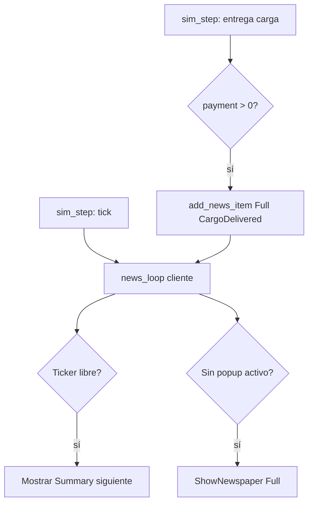

# Roadmap — Barra de estado y noticias (OpenTTD → openttdrs)

Documento de **seguimiento** para la **barra inferior** (fecha, dinero, ticker de noticias)
y el **cartel de noticias** que sube desde abajo con sonido (periódico / ventana completa).

**Estado (2026-06-22):** **N1–N3 implementados**; **N4 parcial** (clic→mapa, avisos de vehículo,
primer vehículo en marcha). Pendiente: historial, edades/purga, estilos Thin/Vehicle, finanzas al
clic en dinero. openttdrs tiene barra inferior Bevy UI, cola `NewsQueue`, ticker Summary, popup
Full animado y hooks en sim (`cargo`, `ToggleVehicleRunning`, `poll_vehicle_advice_news`).

**Relacionado:**

- [PARIDAD_OPENTTD.md](PARIDAD_OPENTTD.md) — gap «noticias / barra de estado» (nuevo §).
- [ROADMAP_SPRINTS.md](ROADMAP_SPRINTS.md) — encaje en S4 (SP1 feedback) y S4 SFX.
- [SIGUIENTES_PASOS.md](SIGUIENTES_PASOS.md) — comandos y audio HUD existente.
- Upstream local: `OpenTTD/src/statusbar_gui.cpp`, `news_gui.cpp`, `news_type.h`,
  `news_func.h`, `news_cmd.h`.
- Referencia arquitectura: [INFORME_ARQUITECTURA_OPENTTD.md](INFORME_ARQUITECTURA_OPENTTD.md).

---

## 1. Qué ve el jugador en OpenTTD

### 1.1 Barra de estado (parte inferior)

Ventana fija `StatusBarWindow` anclada al borde inferior (`statusbar_gui.cpp`):

| Zona | Contenido |
|------|-----------|
| **Izquierda** | Fecha larga de calendario (`STR_JUST_DATE_LONG`) |
| **Centro** | Nombre de la compañía **o** texto del **ticker** desplazándose **o** «Pausado» / «Guardando…» |
| **Derecha** | Dinero de la compañía (clic → finanzas) |

Comportamiento del centro:

- Sin noticias activas → nombre de la compañía.
- Noticia tipo **Summary** → headline en **scroll horizontal** (azul claro), ~15 ms por paso.
- Noticia tipo **Off** → punto rojo «sin leer» (`SPR_UNREAD_NEWS`) unos 1,35 s.
- Clic en el centro → `ShowLastNewsMessage()` (reabre la última noticia).

### 1.2 Cartel / periódico (eventos importantes)

Cuando una noticia tiene display **Full** (`NewsDisplay::Full`):

1. Se crea `NewsWindow` con estilo según `NewsStyle` (Normal, Thin, Small, Vehicle, Company).
2. La ventana **aparece debajo de la pantalla** (`OnInitialPosition`: `y = screen.height`).
3. **Sube lentamente** (`scroll_interval`: ~2 px cada 210 ms / altura de fuente) hasta quedar
   encima de la barra de estado.
4. Permanece visible mientras `NewsWindow::duration > 0` (**~16,65 s** inicial).
5. Al cerrar o agotar tiempo → baja / desaparece; pasa a la siguiente en cola.
6. **Sonido** según tipo: p. ej. `SND_1D_APPLAUSE` (llegada primer vehículo),
   `SND_1E_NEW_ENGINE` (nuevo motor), `SND_BEGIN` (genérico), `SND_16_NEWS_TICKER` (solo ticker).

### 1.3 Cola y prioridad

- Lista `_news` (`std::list`), **más reciente al frente**.
- `NewsLoop()` cada tick de juego:
  - Limpia items viejos (por `age` en días × tipo).
  - Si el ticker terminó → `MoveToNextTickerItem()`.
  - Si no hay periódico abierto → `MoveToNextNewsItem()` → `ShowNewspaper()`.
- Ticker y periódico **no compiten**: primero ticker (Summary), luego Full en ventana aparte.
- Configuración por tipo en `news_display_settings.ini` → `NewsDisplay::{Off, Summary, Full}`.

---

## 2. Qué tiene openttdrs hoy

| Pieza | Estado | Ubicación |
|-------|--------|-----------|
| Fecha simulada (calendario legible) | ✅ barra inferior | `ui/statusbar/`, `news.rs` |
| Dinero compañía | ✅ barra inferior | `ui/statusbar/sync.rs` |
| SFX construcción / error / ingreso / noticias | 🟡 | `ui/hud/sound_ping.rs` (fallbacks; faltan `osfx_16`/`osfx_1D` dedicados) |
| Popup «+$N» en mapa al entregar carga | ✅ | `ui/hud/income_popup.rs` |
| Cola de noticias | ✅ | `core/news.rs` — `NewsQueue`, `add_news_item` |
| Barra inferior UI | ✅ | `ui/statusbar/` |
| Ticker scroll | ✅ | `ui/statusbar/sync.rs` — N2 |
| Ventana periódico animada | ✅ | N3 — slide-up + auto-hide ~10 s |
| `AddNewsItem` desde sim | ✅ | entrega carga, primer vehículo, avisos vehículo |
| Clic noticia / ticker → centrar cámara | ✅ | `camera.rs`, `statusbar/sync.rs` |
| Historial / «Message history» | ❌ | N4 |
| Purga por edad / settings Off·Summary·Full | ❌ | N4–N5 |

**Oportunidad:** reutilizar `PlayHudSfx` / `HudSfxHandles` y el calendario ya derivado del tick;
mover **fecha + dinero** del bloque superior a la barra inferior y dejar arriba solo debug/tooling
(o un HUD compacto opcional).

Constantes de tiempo ya alineadas con OpenTTD:

- `TICKS_PER_TRANSIT_DAY = 74` (`economy.rs`) — mismo orden que `DAY_TICKS` upstream.
- HUD cliente: `SIM_TICKS_PER_DAY` / `SIM_DAYS_PER_YEAR` en `display/mod.rs`.

---

## 3. Objetivo de paridad

| Nivel | Alcance | Criterio de «hecho» |
|-------|---------|---------------------|
| **N1 — Barra** | Fecha + dinero + nombre compañía fijos abajo | Layout Bevy UI pegado al borde inferior |
| **N2 — Ticker** | Scroll de headline + sonido ticker | Una noticia Summary visible ~como OTTD |
| **N3 — Periódico** | Popup sube desde abajo + aplauso + auto-hide | Entrega de carga / primer vehículo dispara cartel |
| **N4 — Paridad** | Tipos, edades, historial, clic→mapa | Comportamiento reconocible vs OpenTTD 15.x |
| **N5 — Settings** | Off / Summary / Full por categoría | Equivalente a `news_display_settings.ini` |

Hoy: **N1–N3 ✅**; **N4 🟡** (~40 %: clic→mapa, `VehicleAdvice`, `FirstVehicleRunning`);
**N5 ❌**.

---

## 4. Modelo de datos propuesto (core)

Nuevo módulo `openttdrs-core/src/news.rs` (serializable en save JSON):

```rust
#[derive(Debug, Clone, Copy, PartialEq, Eq, Hash, Serialize, Deserialize)]
pub enum NewsType {
    FirstVehicleArrived,
    CargoDelivered,
    IndustryOpened,
    IndustryClosed,
    VehicleAdvice,
    // … ampliar según N4
}

#[derive(Debug, Clone, Copy, PartialEq, Eq, Serialize, Deserialize)]
pub enum NewsDisplayMode {
    Off,      // solo reminder
    Summary,  // ticker
    Full,     // periódico
}

#[derive(Debug, Clone, Serialize, Deserialize)]
pub struct NewsItem {
    pub id: u64,
    pub headline: String,
    pub body: Option<String>,       // Full: texto largo; Summary: igual que headline
    pub news_type: NewsType,
    pub display: NewsDisplayMode,
    pub economy_date: u64,          // tick o día económico al crear
    pub calendar_day: u64,          // para mostrar fecha en el cartel
    pub reference: NewsReference,   // tesela / vehículo / estación
}

#[derive(Debug, Clone, Serialize, Deserialize)]
pub enum NewsReference {
    None,
    Tile(TileCoord),
    Vehicle(u32),
    Station(TileCoord),
}

#[derive(Default, Serialize, Deserialize)]
pub struct NewsQueue {
    pub items: VecDeque<NewsItem>,  // front = más reciente (como upstream)
    pub next_id: u64,
    pub unread_reminder: bool,
}
```

En `GameState`:

```rust
pub news: NewsQueue,
pub news_playback: NewsPlaybackState,  // solo runtime UI; opcional no serializar
```

API sim:

```rust
pub fn add_news_item(state: &mut GameState, item: NewsItem);
pub fn news_loop(state: &mut GameState);  // llamar desde sim_step o cliente
```

**Fuentes de eventos (MVP N3):**

| Evento openttdrs | Tipo noticia | Display sugerido |
|------------------|--------------|------------------|
| Primera entrega de carga con pago | `CargoDelivered` | Full + income SFX / aplauso |
| Primer vehículo comprado y en marcha | `FirstVehicleArrived` | Full + aplauso |
| Construcción industria terminada (P6) | `IndustryOpened` | Summary o Full |
| Vehículo sin ruta / sin carga (hoy HUD alert) | `VehicleAdvice` | Summary |
| Error construcción repetido | opcional Off | no duplicar HUD rojo superior |

---

## 5. Fases de implementación

### N1 — Barra de estado (UI shell)

**Objetivo:** barra inferior fija sin noticias aún.

| ID | Tarea | Entregable |
|----|-------|------------|
| N1.1 | `StatusBarPlugin` + nodo Bevy `Node` absolute bottom | `ui/statusbar/mod.rs` |
| N1.2 | Tres paneles: fecha \| centro \| dinero (estilo gris OTTD) | CSS-like Bevy UI |
| N1.3 | Formato fecha legible (`1st Jan 1950` simplificado o `Y1950 D123`) | helper `calendar_from_tick` en core |
| N1.4 | Reducir duplicación en HUD superior (fecha/dinero opcional) | `display/mod.rs` |
| N1.5 | `GlobalZIndex` entre mapa y toolbar; no tapar minimapa | ajuste layout |
| N1.6 | Test: barra visible en 1280×720 y con minimapa | screenshot / test UI |

**Criterio:** barra siempre visible en partida; fecha y dinero coinciden con sim.

**Esfuerzo:** **S** (~1–2 días).

---

### N2 — Ticker + cola básica

**Objetivo:** noticias Summary en scroll central.

| ID | Tarea | Entregable |
|----|-------|------------|
| N2.1 | `NewsQueue` + `add_news_item` en core | `news.rs` |
| N2.2 | `news_loop`: avanzar ticker cuando scroll terminado | cliente o core |
| N2.3 | Widget centro: texto + `ticker_scroll` (offset X decreciente) | inspirado en `TICKER_STOP=1640`, step 2 |
| N2.4 | `HudSfxKind::NewsTicker` → `osfx_16` (mapear en `preparar_sonidos_hud.sh`) | audio |
| N2.5 | Reminder: icono/dot cuando `NewsDisplayMode::Off` | sprite o círculo rojo UI |
| N2.6 | Clic centro → mostrar última noticia (stub Full en N3) | input |
| N2.7 | Tests: encolar 3 items, orden FIFO ticker | `core` tests |

**Criterio:** al producir carga en sim, headline aparece y cruza la barra; suena ticker.

**Esfuerzo:** **S–M** (~2–3 días).

---

### N3 — Ventana periódico (slide-up)

**Objetivo:** cartel Full con animación y cierre automático.

| ID | Tarea | Entregable |
|----|-------|------------|
| N3.1 | `NewsPopupPlugin`: panel blanco + borde negro + caption «News» | Bevy UI |
| N3.2 | Animación: `top` desde `100%` → `100% - height - statusbar` en ~1–2 s | `scroll_interval` equivalente |
| N3.3 | Timer `duration_ms = 16_650` (como upstream) | auto-close |
| N3.4 | `HudSfxKind::NewsApplause` → `osfx_1D` | audio |
| N3.5 | Estilo **Normal** primero (solo texto multilínea + fecha) | sin viewport |
| N3.6 | Clic en cartel → centrar cámara en `NewsReference::Tile` | reutilizar `CameraControl` |
| N3.7 | Una sola ventana activa; cola espera a `duration <= 0` | como `ReadyForNextNewsItem` |
| N3.8 | Integrar en `sim_step`: entrega con pago → `add_news_item` Full | hook en unload |

**Criterio:** entregar carga importante muestra cartel, aplauso, sube, se oculta solo.

**Esfuerzo:** **M** (~3–5 días).

---

### N4 — Tipos y paridad de contenido

**Objetivo:** mensajes reconocibles y historial.

| ID | Tarea | Entregable |
|----|-------|------------|
| N4.1 | Tabla `NEWS_TYPE_META`: age (días), sound, display por defecto | port de `_news_type_data` |
| N4.2 | Headlines en español (MVP) con placeholders `{town}`, `{cargo}` | strings |
| N4.3 | Ventana **Thin** (headline + minimapa estático opcional) | fase 2 visual |
| N4.4 | Historial «Message history» (lista scroll) | menú desde barra |
| N4.5 | Purga mensajes viejos mensual (`RemoveOldNewsItems`) | `news_loop` |
| N4.6 | Pausa congela ticker y timer del cartel | respetar `SimHudControls::paused` |

**Esfuerzo:** **M** (~1 semana).

---

### N5 — Ajustes y pulido

| ID | Tarea |
|----|-------|
| N5.1 | Panel settings: Off/Summary/Full por categoría (JSON prefs) |
| N5.2 | Estilos Vehicle / Company (sprite motor, cara presidente) — baja prioridad |
| N5.3 | Import save: ignorar chunk NEWS o log «not implemented» |
| N5.4 | Doc § noticias en `TILES_Y_SAVEGAMES` o doc dedicado |

**Esfuerzo:** **M–L** (opcional post-0.1).

---

## 6. Diseño UI (Bevy)

```text
┌─────────────────────────────────────────────────────────────┐
│  [toolbar superior — existente]                              │
│                                                              │
│                     MAPA / VIEWPORT                          │
│                                                              │
│  [minimapa]                                                  │
├──────────────┬──────────────────────────────┬───────────────┤
│  1 Jan 1950  │  ◄── First train arrived ──► │  £ 125,430    │  ← N1 barra
└──────────────┴──────────────────────────────┴───────────────┘

     ┌──────────────────────────────────────┐
     │ ■ News                    1 Jan 1950 │  ← N3 sube desde abajo
     │                                      │
     │  First vehicle arrived at            │
     │  Little Frunbridge!                  │
     └──────────────────────────────────────┘
```

**Capas Z (propuesta):**

| Capa | ZIndex |
|------|--------|
| Mapa | 0–100 |
| Barra estado | 2000 |
| Toolbar | 2100 (actual) |
| News popup | 2050 (entre barra y toolbar, o encima de barra) |
| Menú principal | 3000 |

**Animación popup (pseudocódigo):**

```rust
// Cada frame UI (~60 Hz) o timer 15 ms como OTTD
popup.bottom = lerp(start_offscreen, target_above_statusbar, ease);
if elapsed_ms >= 16_650 && !forced_open { despawn_or_slide_down(); }
```

---

## 7. Audio (OpenSFX)

Extender `scripts/preparar_sonidos_hud.sh`:

| Archivo cliente | OpenSFX | Uso |
|-----------------|---------|-----|
| `news_ticker.wav` | osfx_16 | Inicio ticker |
| `news_applause.wav` | osfx_1D | Llegada vehículo / hitos |
| `news_chime.wav` | osfx_00 «Begin» | Noticias genéricas |

Reutilizar volumen `SimHudControls::sfx_volume`.

---

## 8. Integración simulación



Hooks concretos en openttdrs:

| Archivo | Hook |
|---------|------|
| `sim_step.rs` | Tras `cargo_deliveries += 1` y pago |
| `command/vehicles.rs` | Tras `BuildVehicleAtDepot` + primer `ToggleVehicleRunning` |
| `map/industry_construction.rs` | Industria pasa a terminada |
| `sim_step.rs` | Advice: vehículo `no_network_route` N ticks |

---

## 9. Riesgos y decisiones

| Tema | Decisión recomendada |
|------|---------------------|
| HUD superior saturado | Mover fecha/dinero a barra; arriba solo tile debug + alertas |
| `Text2d` vs Bevy UI | Barra y popup **solo UI** (escala con ventana) |
| Viewport en noticia Thin | **N4+**; N3 solo texto |
| Multijugador I8 | `NewsItem` en `Command` o evento derivado del sim determinista |
| Saves JSON | Serializar `news` queue; `playback` no persistir |
| Saves `.sav` import | N5: no importar NEWS chunk inicialmente |

---

## 10. Matriz de estado

| ID | Tema | Estado |
|----|------|--------|
| N1 | Barra inferior fecha/dinero | pendiente |
| N2 | Ticker + cola | pendiente |
| N3 | Popup slide-up + SFX | pendiente |
| N4 | Tipos / historial | pendiente |
| N5 | Settings por categoría | backlog |
| — | Calendario desde tick | **hecho** |
| — | SFX HUD infra | **hecho** (parcial) |
| — | Popup +$ en mapa | **hecho** (distinto sistema) |

---

## 11. Encaje en hito 0.1

| Sprint | Relación |
|--------|----------|
| **S4 SP1** | N1–N3 mejoran feedback («algo pasó») en sesión 15–30 min |
| **S4 SFX** | Encaja con ampliar sonidos HUD |
| **S6 import** | Noticias del save importado = N5+ |

**Recomendación:** **N1 + N2 + N3** en un mismo sprint corto tras SP1 checklist,
empezando por entrega de carga como primer trigger Full (ya hay pago + popup +$).

---

## 12. Comandos útiles (desarrollo)

```bash
# Ver barra/ticker en cliente (tras N1)
cargo run -p openttdrs-client

# Tests cola noticias (tras N2)
cargo test -p openttdrs-core news

# Extraer sonidos noticias (tras N3)
./scripts/descargar_sonidos.sh --opensfx
./scripts/preparar_sonidos_hud.sh   # ampliar con osfx_16, osfx_1D
```

---

## 13. Referencias upstream (lectura obligatoria)

| Archivo | Qué mirar |
|---------|-----------|
| `statusbar_gui.cpp` | Layout 3 paneles, ticker scroll, reminder |
| `news_gui.cpp` | `NewsWindow`, `NewsLoop`, `ShowNewspaper`, `ShowTicker` |
| `news_type.h` | `NewsType`, `NewsDisplay`, `NewsStyle`, `NewsItem` |
| `news_func.h` | `AddNewsItem` |
| `table/settings/news_display_settings.ini` | Defaults Off/Summary/Full |
| `window.cpp` | `PositionNewsMessage` (anclaje sobre statusbar) |

---

*Última actualización: 2026-06-22*
