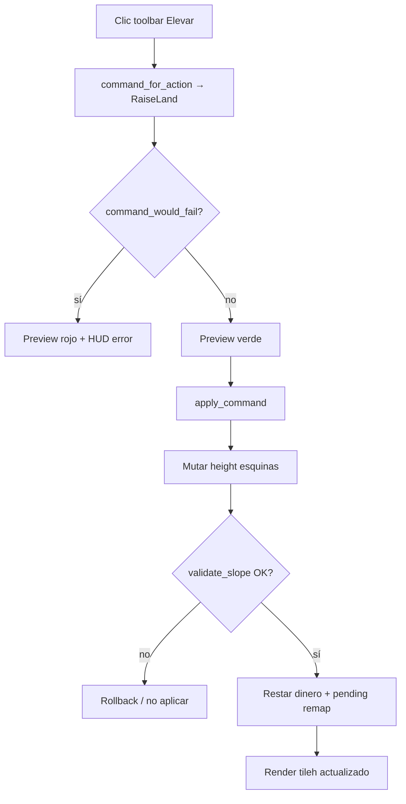

# Roadmap — Terraform / paisaje (OpenTTD → openttdrs)

Documento de **seguimiento** para implementar las herramientas de **elevar**, **bajar/cavar**
y **nivelar** terreno al estilo del panel de paisaje de OpenTTD.

**Estado (2026-06-22):** **no implementado** en simulador ni toolbar. El cliente ya
renderiza pendientes y alturas correctamente; falta el pipeline de comandos, validación
upstream y UI.

**Relacionado:**

- [PARIDAD_OPENTTD.md](PARIDAD_OPENTTD.md) §19 — «Terraform + 4 climas + gen mundo» (coste L).
- [TILES_Y_SAVEGAMES_OPENTTD.md](TILES_Y_SAVEGAMES_OPENTTD.md) §12 — sistema de pendientes (`tileh`).
- [ROADMAP_SPRINTS.md](ROADMAP_SPRINTS.md) — hito 0.1; terraform no bloquea S4 pero mejora SP1.
- [SIGUIENTES_PASOS.md](SIGUIENTES_PASOS.md) — comandos y hallazgos técnicos.
- Upstream: `src/terraform_cmd.cpp`, `src/landscape.h`, `src/tile_map.cpp`
  (`GetTileSlopeGivenHeight`, `GetTileZ`).

---

## 1. Objetivo de paridad

| Nivel | Alcance | Criterio de «hecho» |
|-------|---------|---------------------|
| **T1 — MVP** | Elevar + bajar en hierba/bosque, 1 tesela | Colina/valle manual en partida JSON; preview verde/rojo |
| **T2 — Útil** | Nivelar, drag en área, agua ↔ tierra en costa | Misma jugabilidad básica que panel paisaje vanilla |
| **T3 — Paridad** | Precios, infra encima, autoslope al construir | Comportamiento reconocible vs OpenTTD 15.x en saves |
| **T4 — Mundo** | 4 climas + generación procedural | Fuera de este roadmap; ver PARIDAD §19 |

Hoy openttdrs está en **0 % de T1–T3** (solo datos de altura en mapa importado o demo).

---

## 2. Herramientas en OpenTTD oficial

Panel **Landscape** (`terraform_gui.cpp`, acciones en `terraform_cmd.cpp`):

| Herramienta | Efecto | Notas upstream |
|-------------|--------|------------------|
| **Raise land** | Sube la esquina clicada (+ vértice compartido por hasta 4 teselas) | Coste `PR_TERRAFORM`; SFX «splat» |
| **Lower land** | Baja la esquina | Si llega al nivel del mar → `MP_WATER` |
| **Level land** | Iguala un rectángulo a la altura de la tesela de referencia | Drag; puede crear agua o tierra |
| **Buy land** | Marca tesela como comprada | Sprite `SPR_BOUGHT_LAND`; distinto de terraform |

**No confundir con:**

- **Demoler** (`ClearTile` / dinamita) — ya existe en openttdrs.
- **Autoslope** al colocar vía/carretera — nivelado automático de **una** tesela al construir;
  upstream en `road_cmd.cpp` / `rail_cmd.cpp`; relacionado pero **fase posterior** (T3).

---

## 3. Modelo de altura en openttdrs (ya implementado)

OpenTTD guarda altura por **esquina** en el chunk `MAPH`. Cada tesela `(tx, ty)` aporta
la esquina **norte**; las otras tres esquinas del rombo vienen de vecinos:

```text
hnorth = height(tx,   ty  )
hwest  = height(tx+1, ty  )
heast  = height(tx,   ty+1)
hsouth = height(tx+1, ty+1)

min_h = min(hnorth, hwest, heast, hsouth)
tileh = bitmask de esquinas por encima de min_h  (0..14; 15 = empinada con SLOPE_STEEP)
```

Implementación:

| Pieza | Ubicación |
|-------|-----------|
| `Map::set_height` | `crates/openttdrs-core/src/map/mod.rs` |
| `tile_slope_and_z`, pendientes empinadas | `crates/openttdrs-core/src/map/slope.rs` |
| `compute_tileh` (cliente) | `crates/openttdrs-client/src/iso/slope.rs` |
| Render grass/rough + slopes + cimientos | `render/tiles/land.rs`, `sprites/terrain` |
| Fixtures con pendientes | `scripts/gen_sp3_slope_lab_ottdmap.py`, `gen_sp3_visual_checklist_ottdmap.py` |

**Conclusión:** cambiar `height` vía comando y marcar `pending.pending` en el cliente
debería actualizar el visual sin tocar el pipeline de sprites de terreno.

---

## 4. Qué falta (gap actual)

| Capa | OpenTTD | openttdrs |
|------|---------|------------|
| Comandos `RaiseLand` / `LowerLand` / `LevelLand` | `terraform_cmd.cpp` | ❌ no en `Command` |
| Validación esquinas / pendiente máxima | `TerraformTileHeight` | ❌ |
| Restricción por `TileType` (solo clear, etc.) | sí | ❌ |
| Coste dinero + SFX | `PR_TERRAFORM` | ❌ (SFX preparado en `preparar_sonidos_hud.sh`) |
| Toolbar + iconos GUI | `_nested_build_landscape_widgets` | ❌ |
| Preview fantasma verde/rojo | sí | ❌ |
| Agua ↔ tierra en costa | sí | ❌ |
| Terraform bajo vía/carretera (con coste) | opcional upstream | ❌ |
| Autoslope al construir | sí | ❌ (T3) |

Inventario global: [PARIDAD_OPENTTD.md](PARIDAD_OPENTTD.md) fila 19.

---

## 5. Reglas de validación (referencia upstream)

Resumen para portar a Rust; detalle en `terraform_cmd.cpp` y `tile_map.cpp`.

### 5.1 Altura

- Rango típico **0–15** por esquina (`MAPH`).
- Diferencia entre esquinas adyacentes de teselas vecinas: **≤ 1** (plano o rampa);
  **2** en la misma tesela → pendiente **empinada** (`SLOPE_STEEP`, ya soportada en render).

### 5.2 Esquinas compartidas

Un clic en `(tx, ty)` puede afectar hasta **cuatro teselas** que comparten vértices.
Cualquier comando debe:

1. Calcular el conjunto de esquinas a modificar.
2. Comprobar pendientes válidas **después** del cambio en todas las teselas tocadas.
3. Refrescar visualmente el vecindario (mínimo 3×3).

### 5.3 Tipos de tesela permitidos (MVP → T2)

| Fase | Permitido sin extra |
|------|---------------------|
| **T1** | `TileKind::Grass`, `TileKind::Forest` (como `check_clear_tile`) |
| **T2** | + conversión costa: `Water` con `m5` costa / agua lisa según reglas |
| **T3** | + cobrar extra o rechazar si hay `Road`, `Rail`, `Station`, casas, industrias |

### 5.4 Agua y costa

- **Bajar** hasta nivel del mar (0 en muchos mapas) → tesela pasa a `TileKind::Water`.
- **Elevar** desde agua poco profunda → `Grass` (o `Clear` según clima; MVP: hierba).
- Teselas con **orilla** (`WATER_TILE_COAST` en `m5`) requieren la misma semántica que
  [ROADMAP_PARIDAD_VISUAL.md](ROADMAP_PARIDAD_VISUAL.md) §12 — no inferir costa en saves reales.

### 5.5 Infraestructura encima (T3)

OpenTTD puede:

- rechazar terraform si hay objeto no terraformable, o
- cobrar demolición implícita / fundación.

MVP: **rechazar** con `CommandError::TileNotTerraformable` (nuevo) si `kind != Grass/Forest`.

---

## 6. Fases de implementación

### T1 — MVP jugable (elevar + bajar)

**Objetivo:** terraform manual en partida solitario JSON, sin nivelar ni drag.

| ID | Tarea | Entregable |
|----|-------|------------|
| T1.1 | `Command::RaiseLand(TileCoord)`, `Command::LowerLand(TileCoord)` | `command/types.rs` |
| T1.2 | `terraform.rs`: validación + mutación de esquinas | `openttdrs-core/src/command/` |
| T1.3 | `check_raise_land` / `check_lower_land` en `preview.rs` | Preview HUD |
| T1.4 | `BuildMenuAction::RaiseLand`, `LowerLand` + toolbar (grupo Economía o «Paisaje») | `ui/toolbar/` |
| T1.5 | Preview verde/rojo (válido / `command_would_fail`) | `ui/toolbar/preview/` |
| T1.6 | Coste fijo (p. ej. `$500`) + restar `state.money` | `apply.rs` |
| T1.7 | SFX éxito (`build_ok.wav` / terraform) | ya referenciado en scripts de sonido |
| T1.8 | Tests unitarios: plano → rampa NE; rampa → plano; rechazo en `Road` | `command/tests.rs` |
| T1.9 | Fila en fixture QA: hierba plana + botones elevar/bajar | `gen_*_ottdmap.py` opcional |

**Criterio de cierre T1:**

- Clic elevar en hierba plana crea pendiente visible y coherente con `compute_tileh`.
- Clic bajar revierte sin dejar huecos entre teselas vecinas.
- Carretera/vía/industria → error claro, estado sin cambios.
- `bash scripts/check.sh` verde.

**Esfuerzo:** **S–M** (~2–4 días).

---

### T2 — Paridad útil (nivelar, área, agua)

**Objetivo:** acercarse al panel paisaje vanilla para partidas largas.

| ID | Tarea | Entregable |
|----|-------|------------|
| T2.1 | `Command::LevelLand { origin, corner }` o drag A→B | Igualar rectángulo a `GetTileZ` de referencia |
| T2.2 | Drag terraform (como autorail) en herramientas elevar/bajar | `build_input/drag.rs` |
| T2.3 | Bajar → `Water` al llegar a z=0 (o umbral configurable) | `TileKind` + `mapt`/`m5` mínimos |
| T2.4 | Elevar desde agua lisa → `Grass` | Validar vecinos costa |
| T2.5 | Invalidar rutas vehículo tras terraform (ya ocurre vía `command_modifies_map`) | Verificar túneles/puentes |
| T2.6 | Iconos GUI OpenGFX (`gen_toolbar_*` o reutilizar dinamita/landscape del GRF) | `assets/opengfx/tiles/toolbar_*` |

**Criterio de cierre T2:**

- Nivelar 3×3 en mapa QA deja superficie plana a una altura.
- Cavar foso costero crea agua; rellenar crea hierba sin triángulos flotantes (regresión costa).
- Drag de 5 teselas en línea eleva/baja sin errores intermedios.

**Esfuerzo:** **M** (~1 semana).

---

### T3 — Paridad fina (precios, infra, autoslope)

**Objetivo:** comportamiento reconocible en saves importados y al construir en pendiente.

| ID | Tarea | Entregable |
|----|-------|------------|
| T3.1 | Precio `PR_TERRAFORM` + inflación (tabla economía OpenTTD) | `economy` o constantes |
| T3.2 | Terraform con vía/carretera: rechazar o cobrar + quitar overlay | Política documentada |
| T3.3 | **Autoslope** al `PlaceRoad*` / `PlaceRail*` en tesela inclinada | `transport.rs` |
| T3.4 | **Buy land** (`SPR_BOUGHT_LAND`) — opcional, baja prioridad | Comando + sprite |
| T3.5 | Doc limitaciones en `TILES_Y_SAVEGAMES_OPENTTD.md` § terraform | § nuevo |

**Criterio de cierre T3:**

- Coste por acción coincide ± inflación con OpenTTD en escenario estándar.
- Colocar vía en colina nivela la tesela como upstream (autoslope).
- Tabla PARIDAD §19 pasa de ❌ a 🟡 en «terraform» (climas/gen mundo siguen L).

**Esfuerzo:** **M–L** (~1–2 semanas).

---

## 7. Diseño técnico propuesto

### 7.1 API de comando

```rust
// crates/openttdrs-core/src/command/types.rs (propuesto)
RaiseLand(TileCoord),
LowerLand(TileCoord),
LevelLand {
    from: TileCoord,
    to: TileCoord,
},
```

Serializables con el resto de `Command` (save JSON, futuro I8).

### 7.2 Módulo core

```text
crates/openttdrs-core/src/command/terraform.rs
├── corner_heights(map, tx, ty) -> [u8; 4]   // esquinas del rombo de la tesela
├── try_raise_corner(map, tx, ty, corner) -> Result<(), CommandError>
├── try_lower_corner(...)
├── validate_slope_neighborhood(map, tx, ty)
└── apply_raise_land(state, c) / apply_lower_land(state, c)
```

Reutilizar `tile_slope_and_z` **después** de mutar alturas para comprobar validez.

### 7.3 Cliente

```text
ui/toolbar/layout/sections.rs     → botones Raise / Lower / Level
ui/toolbar/build_input/commands.rs → Command::RaiseLand / LowerLand
ui/toolbar/preview/mod.rs         → tinte verde/rojo según preview
ui/hud/display/labels.rs          → etiquetas HUD
```

Tras `apply_command` OK: `pending.pending = true` (igual que construcción).

### 7.4 Diagrama de flujo (T1)



---

## 8. Riesgos y casos límite

| Riesgo | Mitigación |
|--------|------------|
| Huecos visuales entre teselas | Validar vecindario 3×3; tests con `gen_sp3_slope_lab` |
| Costa: triángulo de hierba flotante | Respetar `m5` costa; tests como `sav_plain_water_near_land_does_not_use_shore` |
| Túneles/puentes invalidados por cambio de z | T1: rechazar si tesela es boca túnel/puente; T2: doc + test |
| Mapas importados `.ottdmap` | Terraform en JSON propio primero; sav importado read-only hasta T2 |
| Pendiente empinada (`SLOPE_STEEP`) | Ya renderizada; validar que upstream permite delta=2 en misma tesela |
| Rendimiento drag grande | Limitar área por tick o batch como autorail |

---

## 9. Tests y QA

### Automáticos

```bash
cargo test -p openttdrs-core terraform
cargo test -p openttdrs-client raise_land   # preview/HUD si aplica
bash scripts/check.sh
```

Casos mínimos:

- Hierba plana `(h=4)` → elevar → `tileh != 0` y vecinos válidos.
- Revertir bajar → vuelve a plano.
- `PlaceRoad` en tesela → `RaiseLand` → `CommandError`.
- (T2) Bajar a z=0 → `TileKind::Water`.

### Manual

```bash
cargo run -p openttdrs-client
# Toolbar → Elevar / Bajar en hierba junto a carretera existente
OTTDMAP_FILE=crates/openttdrs-core/tests/fixtures/sp3_slope_lab.ottdmap \
  cargo run -p openttdrs-client
```

Checklist sugerido (añadir a futuro `TERRAFORM_CHECKLIST.md` si T1 cierra):

- [ ] Elevar 3×3 crea meseta sin escalones imposibles.
- [ ] Bajar valle entre dos colinas no rompe costa en save Nuntburg.
- [ ] Dinero baja; error sin dinero.
- [ ] Guardar F5 / cargar F9 conserva alturas.

---

## 10. Matriz de estado

| ID | Tema | Estado | Bloquea |
|----|------|--------|---------|
| T1 | Elevar + bajar (Grass/Forest) | **pendiente** | Gameplay colinas |
| T2 | Nivelar + drag + agua | **pendiente** | Costas jugables |
| T3 | Precios + infra + autoslope | **pendiente** | Paridad §19 |
| T4 | Buy land | **backlog** | — |
| — | Render `tileh` / slopes | **hecho** | — |
| — | `Map::set_height` | **hecho** | — |
| — | SFX terraform (script) | **hecho** (asset) | — |

---

## 11. Encaje en hito 0.1

| Sprint | Relación |
|--------|----------|
| **S4 SP1** | Terraform **facilita** estaciones en colina y rutas; no es estrictamente requisito del guion 15 min |
| **S3 visual** | Independiente; pendientes ya se ven bien |
| **Post-S6** | T2–T3 encajan en backlog «mundo» junto a 4 climas y gen mapa |

**Recomendación:** implementar **T1** cuando SP1 checklist pida terreno modificable, o en
paralelo si bloquea pruebas de construcción en pendiente.

---

## 12. Comandos útiles (desarrollo)

```bash
# Regenerar fixture de pendientes
python3 scripts/gen_sp3_slope_lab_ottdmap.py

# Cliente con mapa de laboratorio de slopes
OTTDMAP_FILE=crates/openttdrs-core/tests/fixtures/sp3_slope_lab.ottdmap \
  cargo run -p openttdrs-client

# Tras implementar T1
cargo test -p openttdrs-core terraform
```

---

## 13. Referencias upstream (lectura)

| Archivo | Contenido |
|---------|-----------|
| `src/terraform_cmd.cpp` | `CmdTerraformLand`, validación, coste |
| `src/terraform_gui.cpp` | Widgets panel paisaje |
| `src/tile_map.cpp` | `GetTileZ`, `GetTileSlope`, alturas esquina |
| `src/landscape.h` | `RemapCoords`, dibujo parcial altura |
| `src/economy_base.h` | `PR_TERRAFORM` |

Obtener fuente: `bash scripts/fetch-openttd-reference.sh` (si está configurado en el repo).

---

*Última actualización: 2026-06-22*
