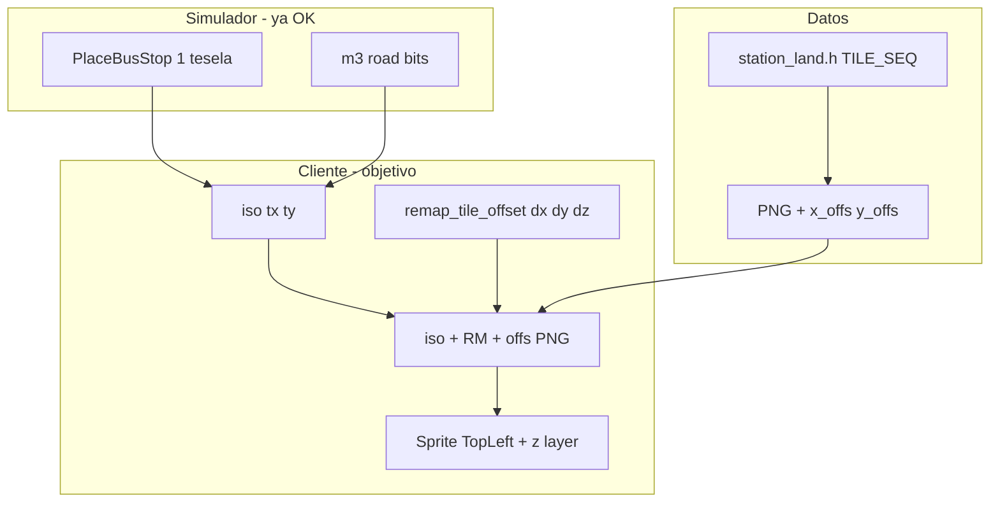

# Plan: paradas bus/camión y `RemapCoords`

Documento técnico y **roadmap de implementación** para pintar las capas `BUILD_A/B/C` de paradas
de carretera con la misma lógica que OpenTTD, sin artefactos en teselas vecinas ni duplicados.

**Estado actual (2026-05):** implementadas fases 1–3 y 5 en código: `remap_tile_offset`,
`road_stop_gfx_data_generated.rs`, `spawn_road_stop_buildings`, preview `spawn_road_stop_preview`.
Validación visual 4 direcciones (fase 4) y captura checklist SP3 pendientes en cliente.

**Relacionado:** [SP2_PARADAS_Y_ESTACIONES.md](SP2_PARADAS_Y_ESTACIONES.md),
[PLAN_SP3_VISUAL.md](PLAN_SP3_VISUAL.md), [../SPRITES_OPENGFX_COMPLETO.md](../SPRITES_OPENGFX_COMPLETO.md) §6,
[TILES_Y_SAVEGAMES_OPENTTD.md](TILES_Y_SAVEGAMES_OPENTTD.md) §15,
[código `crates/openttdrs-client/src/iso/coords.rs`](../crates/openttdrs-client/src/iso/coords.rs).

---

## 1. Resumen ejecutivo

| Pregunta | Respuesta |
|----------|-----------|
| ¿La parada ocupa varias teselas en el simulador? | **No.** `PlaceBusStop` / `PlaceTruckStop` modifican **una** tesela (`command/transport.rs`). |
| ¿Por qué se veía “en dos teselas”? | **Render incorrecto** de `BUILD_*`: offsets mal aplicados o tres sprites apilados en el centro. |
| ¿Qué hace OpenTTD? | `GROUND` + 3 sprites con `TILE_SEQ_LINE` → posición vía **`RemapCoords`** + **`x_offs`/`y_offs`** del `.grf`. |
| ¿Qué hace openttdrs hoy? | **GROUND** + **BUILD_A/B/C** con `RemapCoords` + offsets NFO (`gen_road_stop_gfx_data.py`). |
| ¿Próximo paso? | Validar visual en checklist SP3; ajustar offsets si hace falta (fase 4). |

---

## 2. OpenTTD: `RemapCoords` y ejes

Fuente: `src/landscape.h`, `src/tile_type.h`, `src/zoom_type.h`.

### 2.1 Fórmula (zoom Normal, `ZOOM_BASE = 4`)

```cpp
pt.x = (y - x) * 2 * ZOOM_BASE;   // = (y - x) * 8
pt.y = (y + x - z) * ZOOM_BASE;   // = (y + x - z) * 4
```

Coordenadas **mundo** en la tesela (unidades 0…`TILE_SIZE`, `TILE_SIZE = 16`):

| Eje | Dirección en la vista isométrica |
|-----|----------------------------------|
| **x** | SW (abajo-izquierda en pantalla) |
| **y** | SE (abajo-derecha) |
| **z** | Altura (8 px por nivel en `ZOOM_BASE`, igual que `HEIGHT_PX` en el cliente) |

La esquina **norte** de la tesela en mundo es `(tx * 16, ty * 16, z_relieve)`.

### 2.2 Constantes útiles

| Constante | Valor | Notas |
|-----------|-------|-------|
| `TILE_SIZE` | 16 | Unidades mundo por tesela |
| `TILE_PIXELS` | 32 | Separación entre columnas de teselas (en `ZOOM_BASE`) |
| `TILE_HEIGHT` | 8 | px por nivel de altura |
| `ZOOM_BASE` | 4 | Zoom Normal del viewport |

### 2.3 Cadena de dibujo de una parada bus

Fuente: `src/table/station_land.h`, `src/sprite.cpp`, `src/viewport.cpp`.

**Ejemplo NE** (`_station_display_datas_71`):

```text
TILE_SEQ_LINE( 2,  0, 0, 11, 1, 10, SPR_BUS_STOP_NE_BUILD_A)
TILE_SEQ_LINE(13,  0, 0,  3, 16, 10, SPR_BUS_STOP_NE_BUILD_B)
TILE_SEQ_LINE( 0, 13, 0, 13,  3, 10, SPR_BUS_STOP_NE_BUILD_C)
```

Cada línea define un `DrawTileSeqStruct`:

| Campo | Rol |
|-------|-----|
| `dx, dy, dz` | Origen del **bounding box** en la tesela (no el centro del PNG) |
| `sx, sy, sz` | Extensión del bbox 3D (orden Z / clipping; **no** sustituye el tamaño del PNG) |
| sprite | `BUILD_A`, `B` o `C` |

**Orden de pintado:** `GROUND` (2692…) → `BUILD_A` → `BUILD_B` → `BUILD_C` → (opcional) tramo carretera en la tesela.

**Colocación en pantalla** (`AddSortableSpriteToDraw`):

1. `x += bounds.origin.x` (dx), igual para y, z.
2. `pt = RemapCoords(x + offset.x, y + offset.y, z + offset.z)`.
3. Posición final del bitmap: `pt + sprite->x_offs`, `pt + sprite->y_offs` (**esquina superior izquierda** del sprite, no el centro).
4. El bbox `(sx,sy,sz)` amplía el rectángulo de ordenación; no centra el arte.

**Importante:** las piezas pueden **dibujarse fuera del rombo** de la tesela vecina en pantalla, pero siguen perteneciendo a **una** tesela lógica.

---

## 3. openttdrs: sistema de coordenadas

### 3.1 `iso()` — esquina de referencia de la tesela

```rust
// crates/openttdrs-client/src/iso/coords.rs
iso(tx, ty) → x = (ty - tx) * ISO_HW,  y = -(tx + ty) * ISO_QH
// ISO_HW = 32, ISO_QH = 16  → rombo ~64×31 px
```

Es la proyección de la **esquina norte** del rombo (equivalente a `RemapCoords` de la tesela con `z` absorbido en el relieve vía `tile_pos` / `HEIGHT_PX`).

### 3.2 `rail_station_overlay_rel` — solo tren

```rust
// crates/openttdrs-client/src/sprites/station.rs
xrel = 2.0 * (dy - dx) * STATION_SEQ_UNIT;  // UNIT = 2 → ×4 por unidad
yrel = (dx + dy) * STATION_SEQ_UNIT;        // ×2 por unidad
```

Coincide con **la mitad** del delta lineal de `RemapCoords` en la escala de sprites del cliente (plataformas 1069–1074). Se usa con `overlay_pos` (ancla **centro** + `w`/`h` del NFO de industria/tren).

**No aplicar tal cual a paradas bus:** allí OpenTTD usa sprites **padre** con bbox `TILE_SEQ`, no overlays centrados.

### 3.3 `overlay_pos` — industrias y casas

Industrias: `xrel`/`yrel`/`w`/`h` precalibrados en `industry_gfx_data_generated.rs` desde `industry_land.h`.

Casas: `HOUSE_DRAW_DATA` con la misma idea.

Paradas: **no hay** tabla equivalente con offsets PNG hoy.

### 3.4 Delta local propuesto (escala openttdrs)

Para un offset `(dx, dy, dz)` dentro de la tesela (valores 0…16 de `station_land.h`):

```text
Δx = (dy - dx) * 4.0
Δy = -(dx + dy - dz) * 2.0    // Bevy Y-up; OpenTTD Y hacia abajo
```

Relación con `rail_station_overlay_rel`: misma parte lineal de `RemapCoords`, con `STATION_SEQ_UNIT = 2` ya aplicado en X; en Y hace falta el signo Bevy y el término `dz`.

**Posición del sprite (ancla top-left, como OpenTTD):**

```text
world_xy = iso(tx, ty) + (Δx + x_offs, Δy - y_offs)
world_z  = orden por capa (p. ej. 0.05, 0.06, 0.07) + término (tx+ty) y base_z
```

Sin `x_offs`/`y_offs` del PNG el refugio queda desfasado aunque `Δx/Δy` sean correctos.

---

## 4. Historial de intentos y por qué fallaron

| Intento | Síntoma | Causa raíz |
|---------|---------|------------|
| `overlay_pos` + `rail_station_overlay_rel` + tablas `w/h` | Muro/refugio en **tesela vecina** | Ancla **centro** + `w/h` no calibrados; confundir bbox `TILE_SEQ` con tamaño PNG |
| Apilar A/B/C en `tile_pos` (centro) | **Doble refugio**, aspecto roto | Tres piezas completas en el mismo punto + `GROUND` que ya incluye parte del suelo |
| Preview con BUILD + halo cobertura | Fantasma en **varias teselas** | Cobertura 9×9 + sprites grandes; corregido en preview (solo GROUND, 1×1) |
| Solo GROUND (actual) | Parada “vacía” vs OpenTTD | Correcto como paso intermedio; falta edificio |

**Conclusión:** el simulador estaba bien; había que arreglar **pipeline de dibujo**, no `PlaceBusStop`.

---

## 5. Estado del código (referencia)

| Componente | Archivo | Estado |
|------------|---------|--------|
| Colocación 1×1 | `openttdrs-core/.../transport.rs` | OK (`station_placement_on_tile`, `connect_road_stop`) |
| Preview | `ui/toolbar/preview/mod.rs` | Solo GROUND, 1 tesela, sin halo cobertura bus/truck |
| Render mapa | `render/tiles/objects.rs` | `spawn_stop_ground_sprite` + `spawn_road_stop_link` |
| Tablas TILE_SEQ | `sprites/station.rs` | **Eliminadas** (comentario + tests rail) |
| Precarga BUILD | `render/assets.rs` | **Eliminada** |
| Assets PNG | `assets/opengfx/tiles/bus_stop_*`, `truck_stop_*` | Presentes vía `descargar_graficos.sh` |

---

## 6. Roadmap de implementación

Prioridad: **fidelidad visual OpenTTD** en **1×1**, sin regresión SP2 (colocación, `m3`, pathfinder).

### Fase 0 — Criterios de aceptación (definir antes de codear)

- [ ] Parada bus y camión en tesela plana con carretera: **un** rombo de estación, sin sprites huérfanos en vecinas.
- [ ] Comparación lado a lado con OpenTTD 14.x + OpenGFX (misma dirección NE/SE/SW/NW).
- [ ] Checklist SP2 §paradas sigue verde (`./scripts/check.sh ci`).
- [ ] Entrada en [SP3_AUDIT_SUMMARY.md](SP3_AUDIT_SUMMARY.md) o fila en checklist visual SP3.

### Fase 1 — Metadatos de sprite (`x_offs`, `y_offs`, tamaño)

**Objetivo:** tabla estática por PNG, como industrias.

| Tarea | Detalle | Entregable |
|-------|---------|------------|
| 1.1 | Extender script de export (p. ej. `scripts/descargar_graficos.sh` o nuevo `scripts/gen_road_stop_sprite_meta.py`) para leer offsets del `.grf`/NFO o medir desde PNG transparente | JSON o `.rs` generado |
| 1.2 | Definir struct `RoadStopSpriteMeta { x_offs, y_offs, width, height }` | `sprites/station.rs` o `road_stop_meta_generated.rs` |
| 1.3 | Cubrir 24 PNG: 4 dirs × (A,B,C) × (bus + truck) | Archivo generado versionado |
| 1.4 | Test unitario: NE build A tiene offsets no cero y dentro de rangos razonables | `station.rs` tests |

**Riesgo:** offsets incorrectos en export → calibrar una pieza manualmente contra captura OpenTTD.

### Fase 2 — `remap_tile_offset` en el cliente

**Objetivo:** función única y documentada, reutilizable por preview y mapa.

| Tarea | Detalle | Entregable |
|-------|---------|------------|
| 2.1 | `pub fn remap_tile_offset(dx: f32, dy: f32, dz: f32) -> Vec2` en `iso/coords.rs` | Implementación + doc |
| 2.2 | Restaurar tablas `TILE_SEQ` en `station.rs` (desde `station_land.h` §71–74 bus, §67–70 truck) | `road_stop_build_layers()` |
| 2.3 | Tests: NE build A `(2,0,0) → Δx=-8, Δy=-4`; consistencia con `rail_station_overlay_rel(0,11)` | `coords.rs` o `station.rs` |
| 2.4 | Documentar en [TILES_Y_SAVEGAMES_OPENTTD.md](TILES_Y_SAVEGAMES_OPENTTD.md) §15 un párrafo “offsets locales TILE_SEQ” | Doc |

### Fase 3 — Spawn con ancla top-left

**Objetivo:** `spawn_road_stop_buildings` correcto.

| Tarea | Detalle | Entregable |
|-------|---------|------------|
| 3.1 | Reintroducir precarga `bus_stop_builds` / `truck_stop_builds` en `render/assets.rs` | Handles |
| 3.2 | `road_stop_sprite_translation(tx, ty, base_z, layer, spec, meta) -> Vec3` | `render/tiles/objects.rs` o `sprites/station.rs` |
| 3.3 | Bevy: `Sprite { anchor: Anchor::TopLeft, .. }` (o `custom_anchor` equivalente) | Sin `w/2`, `h/2` |
| 3.4 | Orden Z: `spec.z` (0.05–0.07) + término `(tx+ty)` como hoy | Sin parpadeo |
| 3.5 | Integrar en `spawn_station_tile` tras `spawn_stop_ground_sprite` | Render completo |

**Prueba manual mínima:** una dirección (NE) bus stop en mapa vacío del checklist SP3.

### Fase 4 — Cuatro direcciones + camión

| Tarea | Detalle |
|-------|---------|
| 4.1 | Validar SE, SW, NW bus contra OpenTTD |
| 4.2 | Repetir para `truck_stop_*` (índices `m5` 0..3) |
| 4.3 | Pendiente / `tileh != 0`: decidir si solo GROUND en pendiente (como hoy) o bbox con altura |

### Fase 5 — Preview (opcional)

| Tarea | Detalle |
|-------|---------|
| 5.1 | Preview construcción: GROUND + BUILD con misma función que mapa (evitar divergencia) |
| 5.2 | Mantener 1 tesela y sin halo 9×9 en bus/truck |
| 5.3 | Tint verde/rojo sobre todas las capas |

### Fase 6 — Cierre documentación y SP3

| Tarea | Detalle |
|-------|---------|
| 6.1 | Actualizar [SP2_PARADAS_Y_ESTACIONES.md](SP2_PARADAS_Y_ESTACIONES.md) §3 y §render |
| 6.2 | Marcar ítem en [PLAN_SP3_VISUAL.md](PLAN_SP3_VISUAL.md) y [PLAN_SP2_CONSTRUCCION.md](PLAN_SP2_CONSTRUCCION.md) |
| 6.3 | Captura checklist `sp3_visual_checklist.ottdmap` fila paradas |
| 6.4 | Entrada en [SPRITES_OPENGFX_COMPLETO.md](SPRITES_OPENGFX_COMPLETO.md) §6 |

---

## 7. Diagrama de flujo objetivo



---

## 8. Estimación y orden recomendado

| Fase | Esfuerzo orientativo | Dependencias |
|------|----------------------|--------------|
| 0 | 30 min | — |
| 1 | 2–4 h | script gráficos / NFO |
| 2 | 1–2 h | — |
| 3 | 2–3 h | 1 + 2 |
| 4 | 2–3 h | 3 |
| 5 | 1–2 h | 3 |
| 6 | 1 h | 4 |

**Orden:** 0 → 1 → 2 → 3 → prueba NE → 4 → 5 → 6.

**No hacer antes de Fase 1:** reactivar `overlay_pos` con `w/h` inventados o apilar BUILD en el centro.

---

## 9. Referencias upstream (lectura rápida)

| Tema | Ruta OpenTTD |
|------|----------------|
| `RemapCoords` | `src/landscape.h` |
| `TILE_SEQ_LINE` paradas bus 71–74 | `src/table/station_land.h` |
| Dibujo secuencia | `src/sprite.cpp` (`DrawCommonTileSeq`) |
| Posición final sprite | `src/viewport.cpp` (`AddSortableSpriteToDraw`) |
| Colocación lógica | `src/station_cmd.cpp` (`MakeRoadStop`) |
| Constantes tesela | `src/tile_type.h` |

En el repo: `reference/openttd-upstream/` si está clonado; si no, GitHub `OpenTTD/OpenTTD` rama `master`.

---

## 10. Changelog del documento

| Fecha | Cambio |
|-------|--------|
| 2026-05-22 | Creación tras investigación RemapCoords, retirada temporal de BUILD en render |
