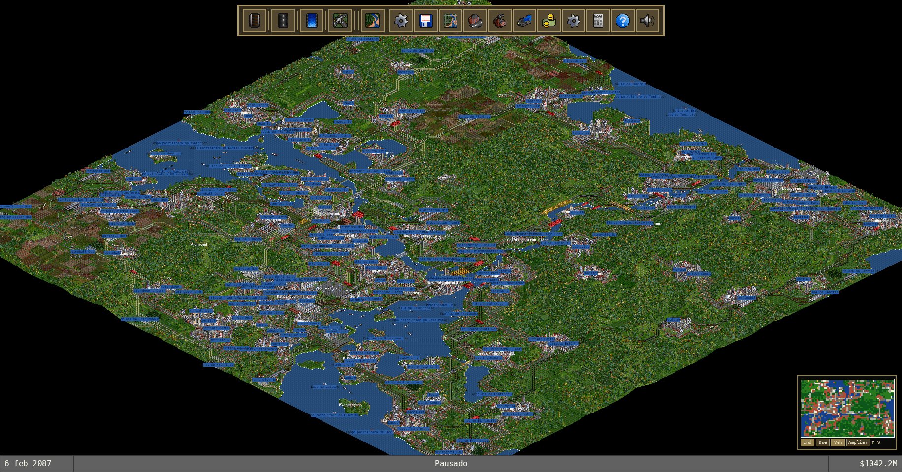

# Zoom máximo y etiquetas del mapa

## Estado tras la corrección de zoom máximo

Cuando el viewport materializado no supera 512×512 teselas, el cliente conserva
el render detallado en `Out4x` y `Out8x`, igual que OpenTTD: siguen presentes
rutas, vías, edificios, puentes, vehículos y el terreno completo. Es un
presupuesto del recorte visible, no del mapa entero; por eso también preserva
detalle al alejar un mapa de 512×512 o mayor si ese recorte cabe en el límite.
La captura de `Kale_TitleGame.sav` se ejecuta por este camino; antes de la
corrección se sustituía por rombos agregados y quedaban grietas negras entre
bloques.

Para viewports que superan ese presupuesto se mantiene un camino de protección:
`Out4x` resume bloques de 4×4 y `Out8x` bloques de 8×8 por mayoría de teselas
(agua tiene prioridad en empate, bosque exige mayoría estricta) y altura media.
Ese modo evita crear cientos de miles de entidades al encuadrar una región
demasiado amplia, pero todavía omite las capas detalladas de infraestructura y
vehículos; no se debe presentar como paridad raster completa. Cada bloque usa
el rombo lógico de 64×32 píxeles y un respaldo opaco del color del terreno: así
las esquinas transparentes del sprite OpenGFX no abren grietas negras entre
bloques ampliados.

El cambio de representación también es explícito: al cruzar el umbral entre
detalle y overview (o entre `Out4x` y `Out8x`) el cliente descarta la capa
anterior y reconstruye la nueva. Antes sólo cambiaba el `scale` y los chunks
seguían marcados como cargados, por lo que una sesión que se alejaba y volvía a
acercar podía conservar rombos agregados o dejar franjas negras. La regresión
`render::world::tests::setup_and_apply_remap_covers_multiple_fixed_zoom_levels`
mantiene además el smoke de los seis niveles `0,25×`, `0,5×`, `1×`, `2×`,
`4×` y `8×` después de cada rebuild. La cámara comprueba por separado que la
magnificación del HUD sea la inversa de esas escalas y que cada paso fijo avance
exactamente al siguiente nivel OpenTTD.

Las etiquetas compensan la escala ortográfica para seguir siendo legibles y se
componen en el mismo orden de OpenTTD: pueblos → carteles → estaciones. No se
eliminan por colisión; el viewport oficial agrega todos los signos dentro del
rectángulo y por eso pueden superponerse densamente en `Out8x`, como en la
captura de referencia.

El cliente mantiene `MapLabelSpatialIndex`, un índice por celdas de 32×32
teselas. Al panear consulta sólo las celdas que cruzan el viewport ampliado por
el margen del cartel y vuelve a filtrar el ancla dentro de ese rectángulo; no
recorre linealmente los pools completos ni agrega etiquetas de una celda vecina
que no intersecten. El resultado se estabiliza por orden de pool y se dibuja
por capas canónicas. Las preferencias separan pueblos, estaciones, waypoints y
competidores. Los carteles y estaciones locales usan el color de su compañía,
los `OWNER_NONE` se mantienen en gris, y los carteles `OWNER_DEITY` no reciben
marco, igual que `ViewportAddKdtreeSigns`.

Las anotaciones textuales de carga sobre vehículos no forman parte del viewport
de OpenTTD y ya no se crean normalmente. Quedan disponibles sólo para
diagnóstico con `OPENTTDRS_DEBUG_VEHICLE_CARGO_LABELS=1`, para que no compitan
con las etiquetas del mapa en la comparación raster.

La captura candidata se tomó con `Kale_TitleGame.sav`, 1832×960, centro
`128,128`, OpenGFX 8bpp, UI visible y `OPENTTDRS_MAP_SHOT_SCALE=8`.

Antes del port, el valor solicitado se acotaba dentro del cliente por
`clamp_ortho_scale`: para 1832×960 el presupuesto de spawn
(`MAX_SPAWN_SPAN_TILES=192`) dejaba una escala máxima aproximada de 2,66 y el
modo fijo sólo alcanzaba `Out2x`. OpenTTD mantiene los seis niveles hasta
`Out8x`; el render detallado para viewports dentro del presupuesto y el camino
agregado para recortes mayores eliminan ese límite sin volver a materializar el
mapa completo de 4096×4096.

## Comprobación reproducible

La matriz aleatoria de 1024×1024 con semilla `1331024978` conserva el contrato
`world-raw` tesela a tesela frente al generador de OpenTTD: `tiles=0` y
`blocks4=0/65536`. Sobre ese mismo `.sav`, las capturas limpias a 1280×720 en
`Out1x`, `Out2x`, `Out4x` y `Out8x`, y la captura con UI/labels a 1832×960 en
`Out8x`, conservaron sprites detallados y no mostraron huecos diagonales. La
revisión adicional de `Kale_TitleGame.sav` en los seis zooms confirmó que no
se reintroducen textos de carga ni fondos verdes genéricos. La captura de
OpenTTD a `Out1x` se generó con el mismo centro para comprobar la selección,
color y orden de los carteles de estación.

Esto verifica el camino del cliente, pero no certifica composición raster
global: el sorter final de parent sprites sigue siendo una entrega separada
(`#323` → `#322` → `#326`). Tampoco inventa pools ausentes del `.sav`: los
carteles nativos `SIGN` y sus propietarios continúan en el alcance de
compatibilidad `.sav`, no de este renderer.

La imagen original de `Out8x` es la captura aportada por el usuario en la
solicitud del issue. El cliente no expone esa imagen del chat como un archivo
local reutilizable; el issue conserva la descripción y esta candidata
versionada para que la referencia se adjunte allí sin inventar una captura
distinta.

## Matriz de validación vigente

| Escala ortográfica | HUD | Camino esperado en mapa grande |
|---:|---:|---|
| `0,25` | `4×` | detalle |
| `0,50` | `2×` | detalle |
| `1` | `1×` | detalle |
| `2` | `0,50×` | detalle |
| `4` | `0,25×` | detalle u overview 4×4 según el viewport |
| `8` | `0,125×` (título redondeado `0,12×`) | detalle u overview 8×8 según el viewport |

La validación automatizada es reproducible con `./scripts/check.sh zoom-smoke`.
Las capturas del cliente sólo son evidencia raster cuando se ejecutan bajo una
superficie WGPU presentable (Weston headless o GPU real); un Xvfb sin adaptador
puede iniciar la ventana pero no demuestra que la composición visual sea válida.
